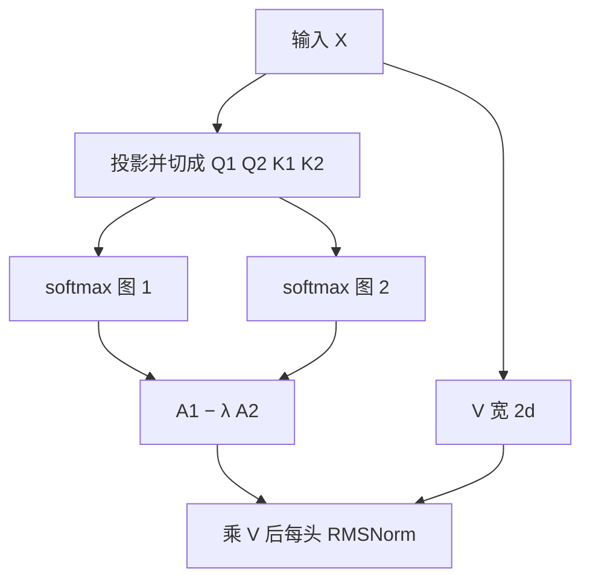

# Differential Attention

    
两组 softmax 注意力图相减，以抵消共同的注意力噪声，促使稀疏模式出现。

    <footer>—— Ye, Dong, Xia, Sun, Zhu, Huang, Wei, Differential Transformer, 2024</footer>

[SDPA](/llm/sdpa) 把相容性收成一张非负、行和为 1 的表。非负是资产，也是漏洞：无关上下文仍分到不可忽略的质量，关键跨度被稀释。Ye 等人把查询、键各切成两路，算两张 softmax 图再相减，类比差分放大器与主动降噪耳机。宏观仍是预 RMSNorm + SwiGLU 的解码器，换的是打分层。它不改连通性稀疏，也不换线性核；稀疏是分数相减之后学出来的，不是掩码画出来的。

## 问题

检索与针测显示，标准 Transformer 会把大量归一化质量分给无关段落。作者把这些多余分数叫做注意力噪声。softmax 没有「负贡献」：不能对某段上下文减分，只能把质量在正数单纯形上重分配。头数再多，每头仍是一张非负图，噪声可以在头之间共振。

目标不是再发明一种核特征或块选择，而是在同一套 $QK^\top$ 接口上提高信噪比。约束是参数量与 FLOPs 与对照 Transformer 对齐，以便缩放曲线可比；并尽量复用 FlashAttention，而不是从零写核。

这里的「稀疏」指分数集中在少数相关位置，不是 BigBird 式固定边集，也不是 NSA/DSA 的硬选择。可视化更尖，不等于复杂度从二次降下来。计算仍是两路 softmax。

### 头数减半是为了对齐 FLOPs

查询、键投影扩到 $2d$，值也扩到 $2d$，再沿通道切开做两路。为对齐计算，Diff 的头数取对照的一半（对照 16 头则 Diff 8 头，头维 $d$ 相同）。作者建议总头数不要太少，以免「半头」伤表达。后处理用每头 RMSNorm（实现里写成 GroupNorm）再乘固定系数 $(1-\lambda_{\mathrm{init}})$，用来对齐梯度尺度，从而能继承相近的学习率。

## 方法

差分注意力写为

$$
\mathrm{DiffAttn}(X)=\Bigl(\mathrm{softmax}\frac{Q_1K_1^\top}{\sqrt{d}}-\lambda\,\mathrm{softmax}\frac{Q_2K_2^\top}{\sqrt{d}}\Bigr)V,
$$

其中 $[Q_1;Q_2]=XW^Q$，$[K_1;K_2]=XW^K$，$V=XW^V$。$\lambda$ 可学习，重参数为

$$
\lambda=\exp(\lambda_{q_1}\cdot\lambda_{k_1})-\exp(\lambda_{q_2}\cdot\lambda_{k_2})+\lambda_{\mathrm{init}}.
$$

默认 $\lambda_{\mathrm{init}}=0.8-0.6\exp(-0.3(l-1))$，浅层更接近 0.8。消融显示各层共用常数（如 0.8）也大致稳健。多头时 $\lambda$ 层内共享。每头归一后拼接、再输出投影。FlashAttention 可分别跑两路再减；值维是头维两倍时，需要支持不同 QK/V 维的实现，或走作者提供的第二种拼法。

3B 级实验：隐 3072，28 层，头维 128，Diff 12 头对对照 24 头，约 28 亿参数，上下文 4096，批 4M token，训 1T。数据与设定跟 StableLM-3B-4E1T 同类。Eval Harness 平均 60.6，高于同预算量级的 OpenLLaMA-3B-v2（57.5）与 StableLM-base-alpha-3B-v2（56.8）。

## 机制

### 相减取消的是共模，不是随机噪声

两路若学到相似的无关峰值，减法把它们压下去；对只在一路尖的相关跨度，差分为正。$\lambda$ 不是固定的 1，避免两路塌成同一张图导致输出近零。初始化随层递减，深层允许更强的差分。Naderi 等人的分析被作者引来说明差分让注意力矩阵谱更均衡、缓解秩崩塌——这是线性代数侧的配套叙事，主证据仍是检索与缩放。

缩放：830M 到 13.1B，拟合后约 68 亿参数的 Diff 达到约 110 亿对照的验证损失（约 62% 参数）；3B 模型上约 1600 亿 token 的 Diff 打平约 2510 亿 token 的对照（约 64% token）。作者概括为「约 65% 的模型或数据」。64K 续训后，书本上的累积 NLL 随长度下降更快。多针检索在 4K 上 $N=6,R=2$ 时 0.85 对 0.55；64K 上当针在前半段、尤其 25% 深度时，差距可达约 76 个百分点。注意力质量分析：Diff 分给答案跨度约 0.27–0.40，噪声约 0.01–0.02；对照答案约 0.03–0.09，噪声约 0.5。

许多样本 ICL 从 1-shot 加到 64K，平均准确率提升约 5.2 到 21.6 个百分点；打乱示范顺序时，最好与最差之间的缝更窄。这支持「少被无关 token 带跑」，不是只支持针测这一种检索。

### 异常值与量化是附带性质

差分让激活更少极端值，作者认为对量化友好。这不是量化论文，不要写成已经在生产里低比特达标。幻觉评测（问答与摘要）上的改进，解释仍是「少看无关上下文」，与噪声定义一致。数学推理有报增益，但主叙事应落在上下文信噪比，以免变成又一张综合榜。

## 边界与工程取舍

两路 softmax 几乎是两倍注意力 FLOPs，靠减头对齐后，墙钟仍可能差一截，取决于核是否真融合。解码期 KV 仍按序列线性增长；差分不解决缓存。$\lambda$ 学崩或两路高度相关时，有效注意力变弱，需要看层间 $\lambda$ 与两路 KL。每头 RMSNorm 在后续 V2 讨论里被指可能不利于超大规模后期稳定——若只复现 2024 原文，保留它；若跟生产改法，应读 UniLM 的 Diff-Transformer-V2（额外 $Q_2$、去掉每头 RMSNorm、token 相关 $\lambda$）。

不要把差分写成稀疏注意力加速器，也不要写成线性 RNN。它与 [FlexAttention](/llm/flex-attention) 的关系是：分数修改可以表达 $\mathrm{A}_1-\lambda\mathrm{A}_2$，但官方 Flex 论文明确说差分这类换范式的变体不在 score_mod 合同内。实现上应走两路 FA 或专用核。

3B / 1T 与 13B 缩放相对开源对照有力，相对同期最强稠密模型不是直接替代声明。头数过少时「半头」代价会被低估。幻觉与摘要上的增益同样来自信噪比：模型少把质量摊给无关句，抄错上下文的机会下降。这不能替代事实核查或检索增强，只说明注意力噪声会表现为「看起来像幻觉的上下文串扰」。量化实验若只报异常值直方图，还缺校准后的下游；把「更少 outlier」写成已经能 4-bit 无损，超出原文。

相减后的权重不必非负、行和也不必为 1。可视化时不要再用「概率」去读。真正进入残差的是加权后的值；与 SDPA 一样，看权重不等于看贡献。

## 小结

- Differential Attention 用两路 softmax 图的差作为分数，抵消共模噪声，让相关跨度更尖。
- $\lambda$ 可学习并随层初始化；每头归一与 $(1-\lambda_{\mathrm{init}})$ 用来对齐梯度。
- 对齐参数与 FLOPs 时头数减半；缩放上约用 65% 的模型或 token 打平对照损失。
- 多针检索、长上下文 NLL、多示范 ICL 与顺序稳健是主证据。
- 计算仍是二次，只是信噪比变了；不是块稀疏，也不是线性状态。
- 生产级改法（V2）与原文的每头 RMSNorm、参数对齐策略不同，复现要对版本。
- 出处：Ye et al.，*Differential Transformer*，arXiv:2410.05258，2024。
