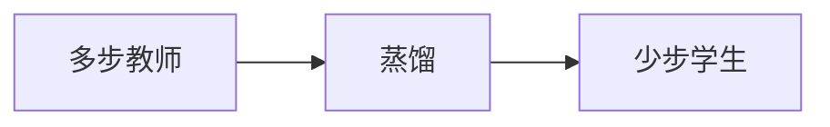

# 扩散蒸馏与少步

多步采样买的是沿向量场慢慢走。蒸馏把多步教师压成少步学生，用质量换延迟。

<footer>—— Salimans, Ho, Progressive Distillation；Song 等 Consistency Models</footer>

[上一课](/llm/transfusion)仍可能对图像槽走完整扩散链。[DDPM](/llm/ddpm) 的 $T$ 是税。缺口是少步：推理要 1–8 步而不是 50–1000。后课视频默认：每帧再乘时间，少步从可选变成必要。

## 问题

逐步去噪或 ODE 积分在每步调用同一骨干。交互式文生图、统一模型里的「边说边画」负担不起。渐进蒸馏：把 $N$ 步教师蒸馏成 $N/2$ 步学生，反复直到很少步。一致性模型学从任意 $t$ 一步（或少步）映射到数据，自洽于教师轨迹。还有分布匹配蒸馏（学生样本匹配教师分布）等变体。

少步不是新的物理：是用额外训练把轨迹缩短。教师若本身贴不住条件，学生会把 CFG 伪影一起学会。

1 步生成接近 GAN 的延迟，也接近 GAN 的失败：模式崩、过饱和。少步模型要单独评，不能只报教师 FID。

## 方法

先训好多步教师（可含 [CFG](/llm/cfg-image)），再按选定蒸馏目标训学生。推理固定步数与日程。验收：FID、条件遵守、文字，以及步数–质量曲线。不要用理解基准（VQA）代替生成少步评测。

## 机制

教师轨迹定义从噪声到数据的曲线。学生若只拟合端点，中间可走歪；一致性则约束任意时刻输出一致。渐进蒸馏保持逐步语义，每代步数减半，误差会累积，所以教师要够强、日程要对齐。

## 边界

蒸馏不提高 VAE 重构上限。下一课把生成从单帧扩到时空，步数与记忆同时涨。

## 小结

- 少步靠蒸馏或一致性，不是改一句采样器配置。
- 学生会继承教师的 CFG 与伪影。
- 必须单独报步数–质量，不能只抄教师 FID。
- 出处：Salimans & Ho Progressive Distillation；Song 等 Consistency Models。
