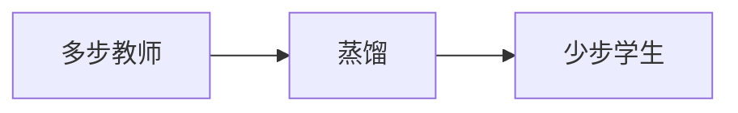

# 扩散蒸馏与少步

多步采样买的是沿向量场慢慢走。蒸馏把多步教师压成少步学生，用质量换延迟。

<footer>—— Salimans, Ho, Progressive Distillation；Song 等 Consistency Models</footer>

[上一课](/llm/transfusion)仍可能对图像槽走完整扩散链。[DDPM](/llm/ddpm) 的 $T$ 是税。缺口是少步：推理要 1–8 步而不是 50–1000。后课视频默认：每帧再乘时间，少步从可选变成必要。

## 问题

逐步去噪或 ODE 积分在每步调用同一骨干。交互式文生图、统一模型里的「边说边画」负担不起。少步有三条主要路线，约束各不相同，选型即选约束。

渐进蒸馏沿轨迹做减半。学生从教师初始化，学会用一步复现教师相邻两步的结果：对同一 $x_t$，教师连走两个半步到 $x_{t-2}$，学生在 $v$-参数化下回归这个终点（$v$-参数化在两端噪声水平上都数值稳定）。每轮把学生日程步数减半，反复 $\log_2$ 轮，1024 步教师可压到 4 步。为什么逐代减半而不是直接教一步：一步跨越的区间太大，教师的局部曲率信息一次性丢光，学生学不动；减半让每代的回归区间都落在教师尚准确的范围内。误差会逐代累积：每代只对齐日程上的离散点，中途轨迹偏差被下一代当真值继承，所以教师要够强、两代日程要对齐。

一致性模型换一条约束：学自映射 $f_\theta(x_t,t)$，把同一条轨迹上任意 $t$ 的点映到同一端点，即同一轨迹上 $f_\theta(x_t,t)=f_\theta(x_{t'},t')$；损失比较相邻两段映射的差，目标侧用停梯度的 EMA 参数。轨迹端点条件（$t$ 趋近 $0$ 时映射退化为恒等）由参数化强制，否则自洽约束没有锚点、平凡满足。它不要求教师逐步对齐，一步即可出图，代价是训练对超参、日程与数据顺序更敏感。

分布匹配蒸馏不给配对目标，在分布层面拉近：冻结两个得分网络，一个给真实数据打分，一个给学生样本打分，两者之差在学生样本处给出「往哪挪能涨教师似然」的方向，一步学生生成器按它回归，等价于最小化与教师分布的 KL。直观：学生不再抄轨迹，只被要求样本落进教师分布的高概率区；教师的 CFG 伪影与数据缺陷也经这个分布差传过来。

少步不是新的物理：是用额外训练把轨迹缩短。教师若本身贴不住条件，学生会把 CFG 伪影一起学会。

1 步生成接近 GAN 的延迟，也接近 GAN 的失败：模式崩、过饱和。少步模型要单独评，不能只报教师 FID。

## 方法

先训好多步教师（可含 [CFG](/llm/cfg-image)），再按选定蒸馏目标训学生：要延迟下限选一致性或分布匹配，要稳与可控选渐进蒸馏。推理固定步数与日程——蒸馏出的学生换日程即失效，因为每代的回归区间按原日程标定，日程是训练合同的一部分。验收：FID、条件遵守、文字，以及完整的步数–质量曲线：路线不同曲线形状不同，1 步与 8 步的表现不是一条平滑线的两端。不要用理解基准（VQA）代替生成少步评测。

```mermaid
flowchart LR
  TCH["多步教师"] --> DST["蒸馏"]
  DST --> STU["少步学生"]
```

## 机制

教师轨迹定义从噪声到数据的曲线。学生若只拟合端点，中间可走歪：两端正确、中途穿出数据流形，一步采样恰好把中途的偏差暴露在输出里——这是纯端点回归做不成一步生成的原因。一致性把「中间必须落在轨迹上」写成任意时刻的自洽约束，一步输出才立得住。渐进蒸馏保持逐步语义，每代步数减半，误差会累积，所以教师要够强、日程要对齐；分布匹配则放弃轨迹、只锁分布，换来对采样器细节的自由，也换来对教师分布缺陷的全盘继承。

## 边界

蒸馏不提高 VAE 重构上限，也不修复教师的条件失败。下一课把生成从单帧扩到时空，步数与记忆同时涨。

## 小结

- 少步靠蒸馏或一致性，不是改一句采样器配置。
- 渐进蒸馏逐代减半、一致性自洽于轨迹、分布匹配只对齐分布。
- 学生会继承教师的 CFG 与伪影。
- 必须单独报步数–质量，不能只抄教师 FID。
- 出处：Salimans & Ho Progressive Distillation；Song 等 Consistency Models；Yin 等分布匹配蒸馏。
