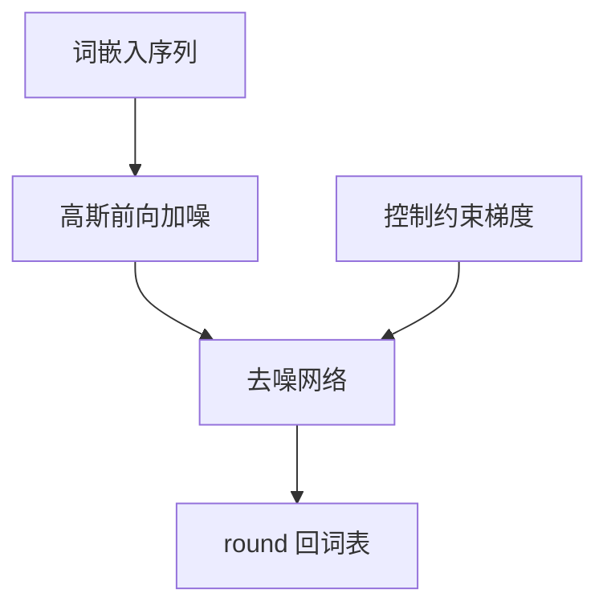

# Diffusion LM 论文

在词嵌入空间做连续扩散，再 round 回离散词，使可控生成能把全局约束写成对嵌入的梯度，而不必从左到右撞墙。

<footer>—— Li, Thickstun, Gulrajani, Liang, Hashimoto, Diffusion-LM Improves Controllable Text Generation</footer>

[z-loss 对照](/llm/z-loss-paper) 结束 MoE 数值链。本篇换生成范式：Li、Thickstun、Gulrajani、Liang、Hashimoto 的 **Diffusion-LM**。主干 [离散扩散](/llm/discrete-diffusion-lm) 已覆盖掩码吸收等离散核；原文主路径是 **连续嵌入上的高斯扩散 + rounding**，用控制当卖点。附录钉这篇，避免与图像扩散或后世掩码 LM 扩散混名。

## 问题

自回归可控生成（指定句长、指定要出现的词、句法）很难在已写下的前缀上插入约束。作者把句子表示为词嵌入序列，定义连续前向加噪，训练去噪网络预测干净嵌入，再投影回词表。控制时在连续空间对约束求梯度，更新嵌入再 round。

问题不是「打败 LM perplexity」，而是控制满足率与流畅度的权衡。似然不是主表。

### Rounding 是离散接口

连续状态必须变成词。Rounding 不可微，控制循环是「更新连续向量 → 投影」。这与后来直接在词表上定义离散转移的工作不同。作者 Xiang Lisa Li、John Thickstun、Ishaan Gulrajani、Percy Liang、Tatsunori Hashimoto。会议 NeurIPS 2022。引用题名 *Diffusion-LM Improves Controllable Text Generation*。

## 方法

### 嵌入加噪、去噪与控制梯度

对嵌入序列 $e(x)$ 加高斯噪声，时间步 $t$ 日程与连续扩散同类。网络 $\epsilon_\theta$ 或 $x_\theta$ 预测。训练目标为嵌入上的回归，不是 token CE 为主（投影后可辅以 CE）。推理从噪声走 $T$ 步，每步可加控制梯度。词表与嵌入维是超参：维太低表达差，太高扩散更难。

## 机制

全局约束在连续空间可写为能量，对所有位置同时作用，这是相对 AR 的结构优势。步数 $T$ 用全序列前向换取可控。流畅度取决于 rounding 是否稳定、嵌入是否与 LM 先验一致。他们常借预训练表示，而不是从零训一个与 GPT 同级的无条件 LM——读实验时要看基座。

与主干离散扩散课的关系：掩码吸收核没有 rounding，控制改成对 logits 的约束。不要用本篇的控制数字证明掩码扩散，也不要反过来。

论文时代的模型尺度远小于当代 AR 推理模型。附录对照的是问题与方法，不是「扩散已在语言上全面优于 AR」。

### 对照链往后

ReAct / Toolformer 回到智能体与工具，与扩散无直接继承。本篇在「机制课序对照」里的位置是生成过程：并行去噪 vs 从左到右。读完应能分清 Diffusion-LM 的连续嵌入路径。

## 边界与工程取舍

似然、KV 缓存、流式解码均不占优。产品主对话仍是 AR。Diffusion-LM 适合作为可控生成与编辑的研究原型。嵌入空间扩散对 codec 码的残差层结构无先验，多模态码应走主干课写的结构加噪，而不是直接套本篇。

复现要锁嵌入是否冻结、控制如何施加、词表。缺一项，满足率不可比。

不要把 Stable Diffusion 的 U-Net 图像栈叫做 Diffusion-LM。状态是文本嵌入序列，不是潜图像。

## 小结

- 原文在词嵌入上连续扩散，round 回词，服务可控生成。
- 主表是控制满足，不是 perplexity 战胜 AR。
- Rounding 与后世离散掩码扩散是不同前向核。
- 尺度与产品位置：研究原型，不是对话默认。
- 出处：Li 等，Diffusion-LM，NeurIPS 2022。
