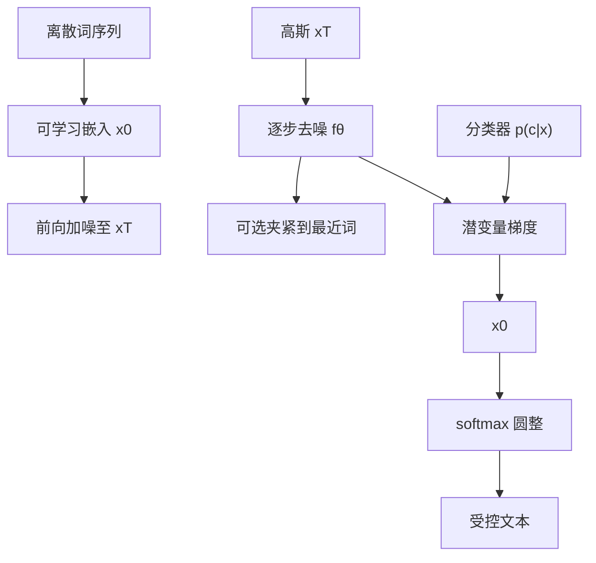

# Diffusion-LM

    
从高斯向量序列逐步去噪成词向量，中间连续潜变量让我们可以用梯度去同时满足流畅与控制。

    <footer>—— Li et al., Diffusion-LM Improves Controllable Text Generation, NeurIPS 2022</footer>

自回归语言模型生成质量高，但控制往往要为每个约束微调，且左到右的顺序让句法树、填空、左右文同时成立这类全局约束很难修。Li、Thickstun、Gulrajani、Liang 与 Hashimoto 把连续扩散接到文本上：先把词嵌进连续空间，再对整句潜变量逐步去噪，最后圆整回词表。中间层 $x_T,\ldots,x_0$ 都可微，分类器或解析器的梯度可以直接打在潜变量上，语言模型本身冻结。这是连续扩散语言模型的早期完整方案，代码在 XiangLi1999/Diffusion-LM。后面的 [SEDD](/llm/sedd-diffusion-lm)、[MDLM](/llm/mdlm) 改走离散状态，控制故事不同，不要混成一篇。

## 问题

即插即用控制希望：$p(w\mid c)\propto p_{\mathrm{lm}}(w)\,p(c\mid w)$。PPLM 在自回归隐状态上做梯度，只能影响「下一个词」，前面写错的结构难以回补，复杂句法几乎失败。FUDGE、GeDi 在每步词表上重加权，对情感、主题够用，对整句句法树或语义槽位不够。微调能学条件分布，却不能组合多个未一起训练的分类器，也不是即插即用。

文本是离散的，标准高斯扩散定义在 $\mathbb{R}^d$。把词当成离散状态做吸收或均匀扩散，当时还没有后来 SEDD 那样能打 GPT-2 的似然。Diffusion-LM 的选择是：把离散序列嵌进连续空间，让视觉里已经成熟的去噪与梯度引导可以直接用。

### 嵌入与圆整不是可选项

没有嵌入，就没有对 $x_0$ 的高斯前向。没有圆整，$x_0$ 落不回词。随机高斯嵌入或冻结的预训练词向量，在原文的初步实验里都弱于端到端学习嵌入。训练目标必须同时学扩散网络与 $\mathrm{Emb}(\cdot)$。圆整若只在最后一步 $\mathrm{argmax}$，模型常常给出不肯贴住某个词向量的 $x_0$，解码发糊。

原文明确写：据他们所知这是连续扩散用于文本的首次完整探索。D3PM 一类离散扩散是相关工作，不是本方法的前向过程。评测主目标是可控生成成功率与教师 LM 的 lm-score，不是大规模困惑度竞赛；附录里固定单纯形嵌入对 held-out 困惑度更友好，与主文的生成质量叙事分开。

## 方法

前向在词 $w$ 与 $x_0$ 之间加一步 $q_\phi(x_0\mid w)=\mathcal{N}(\mathrm{Emb}(w),\sigma_0 I)$，再按标准逐步加噪到 $x_T$。反向每步是高斯 $p_\theta(x_{t-1}\mid x_t)$，最后 $p_\theta(w\mid x_0)$ 是逐位置 softmax。端到端 simplified 目标在 $\mathcal{L}_{\mathrm{simple}}$ 之外加上 $\|\mathrm{Emb}(w)-\mu_\theta(x_1,1)\|^2$ 与圆整交叉熵，嵌入用重参数技巧反传。

为强调 $x_0$ 必须贴住词向量，他们把逐步预测均值改成逐步预测 $x_0$：$f_\theta(x_t,t)\approx x_0$。解码时的夹紧技巧把 $f_\theta$ 先映射到最近的词嵌入再进入下一步噪声公式，减少中途漂移。网络是约 $80$M 的 Transformer，句长 $n=64$，扩散步 $T=2000$，平方根噪声日程。嵌入维在 E2E 上 $d=16$，在 ROCStories 上 $d=128$。E2E 约 $50$K 餐厅评论，ROCStories 约 $98$K 五句故事、词表约 $11$K。

### 分类器引导在潜变量上走多步梯度

控制不直接改离散词，而分解为每步 $p(x_{t-1}\mid x_t,c)\propto p(x_{t-1}\mid x_t)\,p(c\mid x_{t-1})$。分类器建在扩散潜变量上。更新是 $\nabla_{x_{t-1}}\log p(x_{t-1}\mid x_t)+\nabla_{x_{t-1}}\log p(c\mid x_{t-1})$，并加流畅正则 $\lambda\log p(x_{t-1}\mid x_t)$。每步扩散做三次 Adagrad，步数从 $2000$ 抽到 $200$。长度与填空可以不靠分类器：长度当分类器无关约束，填空用左右文锚定。需要单条高质量输出时，用 MBR 在样本集上按期望风险（如负 BLEU）挑一条。

## 机制

连续层次潜变量让全局分类器——句法分析器、语义槽分类器——的梯度能同时碰到句中所有位置。自回归解码没有对称的「整句可微草稿」。组合控制就是把多个 $\log p(c_i\mid x_{t-1})$ 加进同一梯度。六项任务覆盖语义内容、词性序列、句法树、句法跨度、长度、填空。相对先前即插即用，控制成功率几乎翻倍，并在分类器引导任务上赶上或超过为该任务微调的 GPT-2。填空上与从零训的自回归填空模型相当。解码 $200$ 步仍比自回归慢约 $7$ 倍；可控生成比 FUDGE 慢约 $1.5$ 倍，比 PPLM 快约 $60$ 倍。

学到的嵌入按词性成团，说明连续空间里句法角色有几何。夹紧把预测拉回词表流形，否则 $x_0$-参数化仍可能停在词与词之间。$\lambda$ 过大则控制失效，过小则句子不通；这是采样与最大化之间的折中，类似低温采样，不是另训一个条件 LM。

PPLM 基线在原文里只接到语义内容，因为其分类器没有位置信息，不能公平地打到词性或句法树。不要把「PPLM 没做句法」写成 PPLM 论文自己的主张。微调预言机（FT-sample / FT-search）不是即插即用，只提供上限。

### 为什么后来离散扩散仍要另起炉灶

连续空间要圆整，似然与词表规模、嵌入几何纠缠，规模化到 GPT-2 级时被 SEDD、MDLM 用离散吸收过程超过。Diffusion-LM 的遗产是：非自回归草稿 + 可微中间态 + 梯度控制。离散方法用比率或掩码交叉熵做似然，用重掩码或概率速度做采样，控制接口变成「任意位置条件」而不是分类器反传。读 2022 年这篇，应把它当可控生成的连续解，而不是 2024 年离散扩散的实现说明书。

## 边界与工程取舍

数据是 E2E 与 ROCStories，不是网页级预训练。句长 $64$、两千步扩散，服务延迟与自回归不在同一档。圆整误差、嵌入维度、噪声日程都敏感。复杂控制依赖分类器质量：句法树 F1 受分析器限制。组合控制成功，不表示任意多个分类器都能无损相加。

不要把 Diffusion-LM 写成「文本版 DDPM 直接把 one-hot 当连续向量」。前向从嵌入高斯开始。也不要把后来的掩码扩散目标写回这篇的 $\mathcal{L}_{\mathrm{simple}}$。教师 lm-score 用的是微调 GPT-2，因为生成含 UNK，对不上原版 GPT 词表。

出处：Xiang Lisa Li, John Thickstun, Ishaan Gulrajani, Percy Liang, Tatsunori B. Hashimoto，*Diffusion-LM Improves Controllable Text Generation*，NeurIPS 2022（arXiv:2205.14217）。连续扩散背景引用 Ho et al. 2020 与 Song et al.；即插即用对照含 PPLM 与 FUDGE。

## 小结

- Diffusion-LM 在词嵌入空间做连续扩散，用可学习嵌入与圆整把离散文本接到高斯去噪链上。
- $x_0$ 参数化与夹紧降低圆整误差；控制是对中间潜变量的带流畅正则的梯度更新。
- 六项细粒度控制上即插即用成功率大幅高于自回归基线，并可组合多个分类器。
- 代价是解码步数与似然规模化；后续离散扩散从另一条路追自回归困惑度。
- 评测集是 E2E 与 ROCStories，不是通用大模型。
- 出处：Li et al.，*Diffusion-LM Improves Controllable Text Generation*，NeurIPS 2022（arXiv:2205.14217）。
