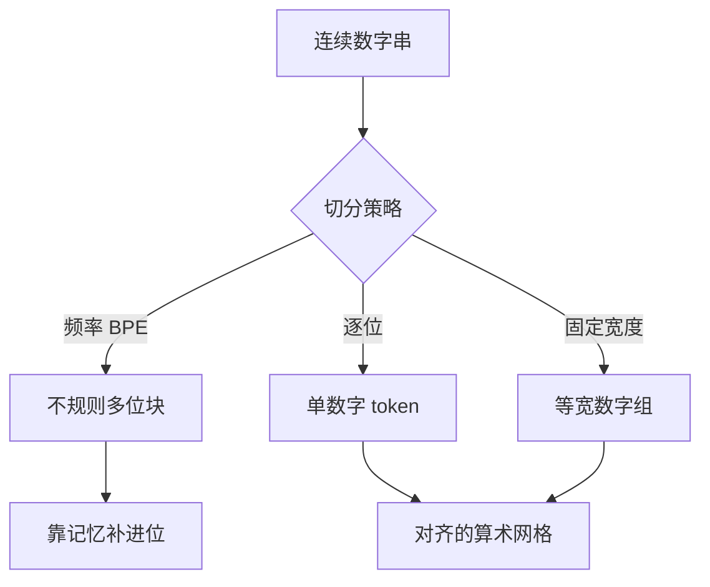

# 数字切分

把每个数位收成单独的 token，算术任务才不必在「2024」有时是一块、有时是三块之间猜测对齐。

<footer>—— 据 Nogueira, Jiang, Lin 对 Transformer 算术限制的讨论；对照 Llama 3 报告中的数位切分整理</footer>

[上一课](/llm/byte-fallback)保证未见字符能拆成字节，数字本身却几乎总在词表里。`0`–`9` 作为字符或字节都覆盖得到，BPE 仍会按频率把 `19`、`202`、`000` 焊成不规则块。本课不重讲回退，也不重讲 [BPE 合并](/llm/bpe-merge-rule) 的计数规则。缺口是：频率目标与「这是一个十进制整数」的任务目标不一致时，切分必须被显式约束。后课的特殊 token 默认数字已经按位切开或按固定粒度切开。

## 问题

[预分词正则](/llm/pretokenization-regex)若用 `\p{N}+` 把连续数字收成一块，块内 BPE 会把高频年号、百分数、代码里的 `1024` 焊成若干碎片，且碎片边界随词表而变。`2024` 与 `2025` 可能共享 `202` 再各跟一个尾数，也可能完全不同。模型要做进位、比大小、抄写长数字时，对齐关系每次都在变。Nogueira 等人指出，即便是小学算术，切分方式也会让 Transformer 显得「不会算」——先修不是注意力公式，而是离散序列有没有把数位对齐。

纯字节回退帮不上忙：数字字符都在表内，根本不会落到 `<0x3x>`。需要一条独立规则：在合并之前或合并表里，禁止把数位焊成多位原子，或只允许固定宽度（如三位一组）的焊法。

### 频率焊数是压缩，不是计数

电话号、年份、金额、IP、超参里的 `3e-4`，在网页里极高频。BPE 把它们当成普通字母串压缩，是算法正确、任务错误。压缩率会略降，因为 `2024` 从 1 个 token 变成 4 个；上下文窗口里数字变贵。这是用长度换可组合的计数原语。

科学计数法、小数点、千分位逗号、全角数字，都不是「一个整数」。切分规则必须声明：只约束 ASCII 十进制数位，还是连 `\p{N}` 的其他码点一起切。含糊的规则会在评测集上制造不可复现的分数。

## 方法

实践里常见三种约束。第一，预分词把每个 ASCII 数位切成单字符块，合并表根本看不见相邻数位对——Llama 3 一类 128k tiktoken 词表公开采用单数字切分。第二，允许固定块（每三位），迁就千分位阅读习惯，但对齐仍比纯频率焊好。第三，在已有 BPE 表上后处理：匹配到最长数字跨度后再强制按位切开，代价是与训练时切分必须一致，否则是另一种换词表。

训练新词表时，第一种最干净：正则里把 `\p{N}+` 改成逐位，或在合并时把数位对的频次置零。不要指望「多喂数学语料」让频率自己焊出正确的数位原子——频率会焊出 `100`、`999` 这种块，而不是通用的进位结构。

### 与 Unigram 的关系

[Unigram 切分](/llm/unigram-segmentation)按似然挑分割，数字串上往往仍偏好整块，因为整块在词表里概率不低。要稳定的数位对齐，不能靠采样正则化，必须在候选词表里删掉多位数字符号，或给它们 −∞ 的 logit。子词正则化可以继续作用在字母上，数字路径保持确定。

代码里的十六进制 `0xff`、版本号 `1.2.3`、张量形状 `1024` 会同时变长。词表训练语料若含大量代码，应在 fertility 报表里单独列数字 token 占比，否则会误判「代码配比过高」。

## 机制

逐位切分让加法、比较在 token 网格上对齐到十进制位：个位总与个位相邻（中间或有分隔符）。嵌入只需要学 10 个数位符号的算术角色，而不是学一份「哪些多位块曾经一起出现」的查找表。Wallace 等人对 NLP 模型是否「理解数字」的探测，也依赖数字被表示成可组合的单元；焊死的多位块把探测变成记忆。

代价落在序列长度与位置编码上。同一上下文窗口能放下的数字变少；长表、账本、竞赛题更容易截断。这与长文档上采样是同一条账，只是本课先把切分固定下来。

## 边界

逐位切分不自动教会进位；它只提供对齐。小数、分数、不同进制仍要靠后续层。也不要在聊天模板里把用户 ID、时间戳按位切开却在工具调用的 JSON 里用另一套规则——特殊 token 课会要求控制符与正文切分隔离，数字规则必须两边一致。

若产品几乎不做算术、却大量抄写长 ID，逐位会浪费窗口。此时可对「看起来像标识符的数字」保留整块，但必须有可测试的判定，不能靠另一张小 BPE 表偷偷合并。默认预训练词表应在算术可组合与压缩之间取明确的一点，并写进词表卡片。

## 小结

- 本课不重讲字节回退；数字已在表内，缺的是禁止频率乱焊。
- 逐位切分让数位在序列上对齐，是算术任务的前置约束，不是额外数据能替代的。
- Unigram 不会自动切对数字，候选里要删掉多位数字符号。
- 长度变贵；代码与表格的 fertility 会上升。
- 控制符与 JSON 必须共用同一数字规则。
- 出处：Nogueira, Jiang, Lin, 2021；Wallace et al., EMNLP 2019；Llama 3 技术报告中的 128k 词表与数位切分；Radford et al., GPT-2, 2019。
