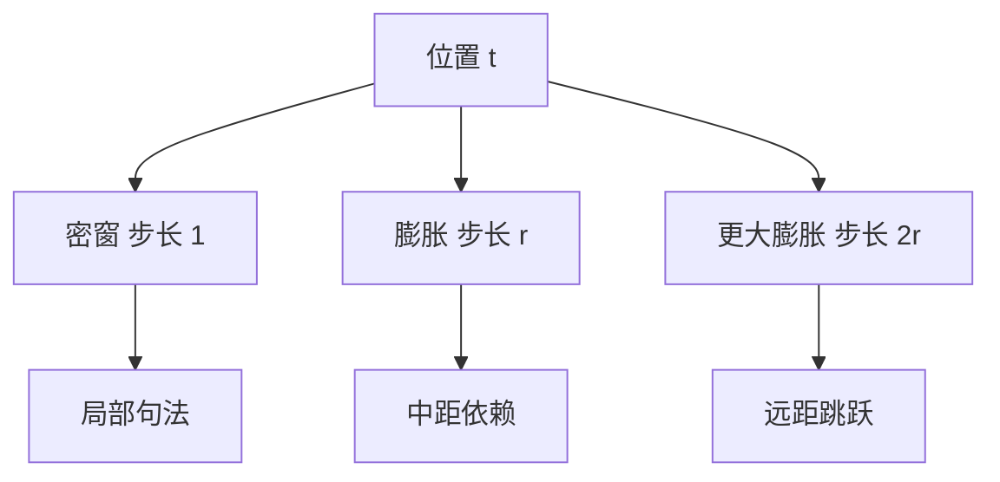

# Dilated Attention

不必连着看完整个邻域；隔固定步长取点，用同样的边数覆盖更远的距离。

<footer>—— Rewon Child 等, Sparse Transformer, 2019</footer>

滑动窗口解决的是「只看近邻」，感受野仍要靠深度一层层爬。膨胀注意力改的是取样步长：窗口内不再连号，而是每隔 $r$ 个标记连一条边，用同等预算够到更远。Child、Gray、Radford 与 Sutskever 2019 年的 Sparse Transformer 用跨步（strided）模式做这件事；Beltagy 等人 2020 年的 Longformer 把膨胀滑窗分给不同头。本篇只讲「步长」这一根轴，连续滑窗见 [Sliding Window Attention](/llm/sliding-window-attention)，把局部与全局拼成一张图见 [BigBird / Longformer 稀疏模式](/llm/sparse-attention-patterns)。

## 问题

固定窗口 $w$ 时，位置 $t$ 的最远可见点是 $t-w+1$。若 $w$ 受显存限制不能加大，远距离只能等深层接力，信号衰减。卷积网络用膨胀卷积在同样核大小下扩大感受野，注意力可以做类比：把可见集从连续带改成带孔的栅。形式上一层仍是 $O(n\cdot |S|)$，$|S|$ 是每个位置连接的键数量。膨胀把可见集写成步长为 $r$ 的格点：

$$
\mathcal{S}_r(t)=\{t-ir \mid i=0,1,\ldots,w-1\}\cap\{1,\ldots,t\}
$$

覆盖半径变成约 $w\cdot r$，边数仍约为 $w$。

代价立刻出现：孔里的标记本层完全看不见，局部句法可能被跳过。若所有头共用同一 $r$，会留下系统性盲区。因此膨胀几乎从不单独使用，而是与 $r=1$ 的密窗、或多组不同 $r$ 的头搭配。问题是设计一张「有孔但可覆盖」的图，而不是把注意力变成随机下采样。

## 方法

### 步长如何扩大感受野

取步长 $r$，位置 $t$ 连接 $j=t, t-r, t-2r,\ldots$，直到超出窗口或序列。Child 等人的跨步稀疏沿序列维按固定周期取样，再与另一组沿另一因子分解的模式交替，使两层复合后能覆盖更大区块。单层的最远跳是 $r$ 的倍数，复合后的覆盖取决于模式是否互素、是否在层间错开相位。膨胀和池化不同。池化先聚合再注意，孔里的信息以压缩形式还在；膨胀是硬丢掉孔里的边，那些 token 只能等其他头或其他层来补。评测盲区时必须按「哪一类位置永远连不上」来查，而不是只看平均长度。

Longformer 的膨胀滑窗更接近卷积：在宽度 $w$ 的窗里以 $r$ 取样，并且允许不同头用不同 $r$。部分头负责密局部，部分头负责稀长程，参数量不变，图的并集更密。这比所有头同一 $r$ 更不容易留下固定盲区。

### 与滑窗的组合

纯膨胀没有局部边，对相邻 token 的拷贝与括号匹配不友好。实务图几乎总是「密窗 ∪ 膨胀」。密窗保证 $r=1$ 的近邻，膨胀提供跳跃边。层间还可以错开膨胀相位，使第 $\ell$ 层的孔被第 $\ell+1$ 层的边补上，类似奇偶层交错。微软 2023 年的 LongNet 把多组指数增长的膨胀率叠在一起，使覆盖随段长指数上升，而计算仍接近线性；其名字就叫 Dilated Attention，但思想与 2019 年的跨步稀疏一脉。

训练掩码必须写出并集。若实现时先做密窗再「随机跳」，与固定 $r$ 的膨胀不是同一张图，也无法复现论文里对覆盖半径的分析。

### 硬件上的不规则访存

密窗是带状，FlashAttention 很好写。膨胀的索引是算术序列，表面上规则，但 $r$ 与块大小不对齐时，GPU 上会变成跨步加载，缓存行浪费。$r$ 取 2 的幂、并与内核 tile 对齐，比取 3、5 这类「理论覆盖更好」的奇数更常赢。这也是后来硬件对齐稀疏（如 NSA 的块选择）要解决的问题：逻辑上漂亮的膨胀，物理上可能比稍密一点的块稀疏更慢。

因果约束下，膨胀只能向左跳，不能跳到未来。相位若对所有位置相同，序列开头的可用键更少，开头附近的膨胀头会退化成更短的密连接。实现需要在边界把越界下标丢掉，而不是取模——取模会把末尾键绕到开头，破坏因果。取模在卷积里常见，在因果注意力里是泄漏。一旦未来键绕到可见集，训练损失会虚低，生成却对不齐。边界检查应写成下标算术，而不是环形缓冲那套取模。

## 机制

注意力权重仍是可见集上的 softmax。膨胀改变的是竞争者名单：远距离的某个 token 若落在栅格上，可以和近邻直接比分；落在孔里，本层分数为零。信息几何上，膨胀边是捷径，缩短了依赖的层数。若任务的关键键恰好落在栅格上，膨胀会明显优于同预算的密窗；若关键键总在孔里，膨胀会系统性失败。多头多 $r$ 的意义就是把栅格错开，使任意位置都有某个头能直接够到。

与线性注意力相比，膨胀仍是选择有限个原始 token 做 softmax，保留尖峰权重的能力；线性路线用核把所有位置揉进状态，尖峰更难。与随机稀疏相比，膨胀是确定性图，便于分析感受野，也便于把掩码写进内核，但缺少 BigBird 那种「随机边提高连通性」的理论备用。

## 边界与工程取舍

膨胀对周期结构（诗行、表格列、固定帧率音视频）特别友好，因为栅格与数据周期可能对齐；对随机出现的针则不友好，除非 $r$ 很小或头足够多。不要在针测上用单一 $r$ 的膨胀当长上下文方案。另一边界是位置编码：RoPE 按真实下标旋转，膨胀边连接的是远距离下标，相对角度很大，可能落在旋转外推不稳的区域。这时失败看起来像「膨胀不行」，其实是位置外推，应与 [位置插值与外推失败模式](/llm/position-extrapolation) 分开诊断。

工程上，若内核没有跨步掩码，膨胀会退化成物化稀疏掩码，二次空间又回来。能落地的膨胀，必须能在分块注意力里用下标算术跳过孔，而不是先算全矩阵再乘掩码。取舍建议：把 $r=1$ 的滑窗当必选底盘；膨胀只加在少数头或少数层；$r$ 选 2 的幂并对齐 tile。需要任意位置精确检索时，膨胀不如全局 token 或可学习选择。膨胀的感受野数字很好看：步长 8、窗 512，半径一下子到四千。数字背后是孔。产品评测必须包含「答案落在孔里」的用例，否则会把纸面感受野当成真实长程。

## 小结

- 膨胀用步长 $r$ 在边数不变时放大覆盖半径，代价是孔状盲区。
- 几乎必须与密窗、多 $r$ 或多头相位错开联用，单独使用会留下周期空洞。
- Child 2019 的跨步因子分解与 Longformer 的膨胀滑窗是同一思想的两种图。
- GPU 上跨步加载可能比逻辑更密的块稀疏更慢，$r$ 应对齐硬件。
- 因果下禁止取模绕回；RoPE 大跨度边要单独检查外推。
- 精确针测不是膨胀的主场，它更适合有结构的长程。
- 出处：Child et al., *Generating Long Sequences with Sparse Transformers*, 2019；Beltagy et al., *Longformer*, 2020；微软 LongNet / Dilated Attention, 2023。
