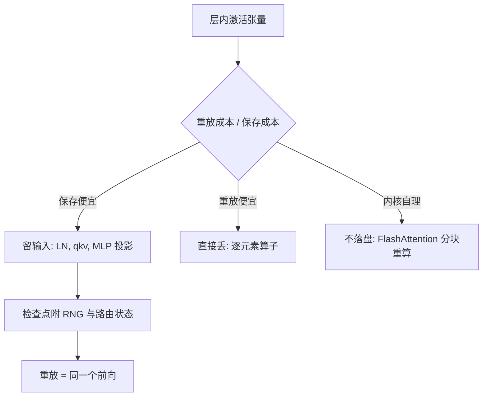

# 激活重计算

重计算是用算力买显存的汇率；汇率取决于重放的那个内核是算力受限还是带宽受限，不看名义 FLOPs。

<footer>—— 据 Chen 等 2016 与 Korthikanti 等 2022 整理</footer>

[上一课](/llm/dist-zero-stages)把参数侧的持久状态切成档，序列一长，显存墙就移到激活侧。主干课的[激活重计算](/llm/activation-checkpointing)给了分段检查点的思想与「满层重计算约增三成 FLOPs」的口径；本课深钻工程里的三个问题：保存什么、重放什么、以及重计算在时间线上与通信重叠的冲突。不重讲分段原理。

## 问题

「开重计算」不是一个布尔。满层重计算、只存大 GEMM 输入的选择性重计算、以及细到算子的粒度，FLOPs 增量能差出数倍；而墙上时间的增量还要再乘一个系数：重放路径上的内核若是带宽受限，它重放所花的时间占比远高于它的 FLOPs 占比。第二类缺口是正确性：重放必须复现同一个前向，随机状态、MoE 路由结果、 dropout 掩码没进检查点，反向拿到的就是另一个函数的梯度。第三类是冲突：反向被拉长后，原计划排在反向里的梯度通信窗口跟着变，重叠计划的粒度不改就会露底。

### 保存什么、重放什么

按「重放成本除以保存成本」给算子排序。保存便宜的存输入：LayerNorm、注意力的 qkv 投影这类小张量输入直接留；重放便宜的直接丢：逐元素的激活函数、bias 加法，反向从检查点两三步就能算回。结构性的是中间那档：注意力内部的大矩阵不再保存——FlashAttention 的在线 softmax 本来就不落整块矩阵，反向沿分块重算，这一段的重放由内核自身承担，不再算进框架的重计算预算。选择性口径由此而来：框架只负责存每层两三个 GEMM 输入，其余交给内核与分段。

满层重计算的名义增量约 +33%（每层多做一次前向，前向约占整步的三分之一）；选择性口径在长序列下常把这个数字压到一成多，差距全在「哪些张量没进检查点」。报重计算开销时只给一个百分比、不写粒度，别人无法复现你的 step time。

## 方法

落地按三步。第一步定粒度：按 Transformer 块设检查点，块内存 qkv 与 MLP 上投影的输入，这是默认档。第二步对长序列加序列并行：TP 组内把 Norm 与 Dropout 的激活沿序列维切开，这部分激活被分散而不被重算——省显存与省重计算是同一刀的两面。第三步校验数值路径：重放时 RNG 状态要回卷到与前向一致，MoE 的路由决定要缓存而不能重抽样，FP8 的 amax 统计与缩放缓存按同一前向口径读。三步做完，重放才是同一个函数的反向。

## 机制

为什么墙上时间增量可能偏离名义比例：算力受限的 GEMM 重放接近线性加时；带宽受限的逐元素算子 FLOPs 占比极低、时间占比却不低，满层重计算把大量这类小内核塞回时间线。所以选择性的收益不只是少算 GEMM，更是把小内核挡在重放路径外。与重叠的冲突是时间线问题：反向拉长后，梯度桶的就绪节奏变了，按旧节奏排的通信要么提前空等、要么挤到步末；重计算粒度每改一次，重叠计划要跟着对一遍，这对账归下一课。

## 边界

不重讲 $O(\sqrt{n})$ 的分段检查点与随机种子机制（Chen 2016 的原始口径，主干课已引）。重计算不省通信也不省优化器状态；瓶颈在参数侧时去加深重计算是花算力买不需要的东西。重放路径上不得引入新的数值分支：检查点前后的内核版本、精度策略必须钉死，否则「重放即漂移」，这类漂移在多卡上表现为难以归因的 loss 毛刺。反向被拉长之后通信怎么排，是下一课的入口。

## 小结

- 重计算粒度是连续谱：满层、选择性、内核自理，FLOPs 增量差数倍，报口径必须带粒度。
- 汇率由内核类型决定：带宽受限算子的重放时间占比远高于 FLOPs 占比。
- 重放必须复现同一前向：RNG 回卷、路由缓存、amax 口径一起进检查点。
- 序列并行与重计算是同一刀的两面：激活先分散、剩下才谈重算。
- 出处：Chen 等，Training Deep Nets with Sublinear Memory Cost，2016；Korthikanti 等，Reducing Activation Recomputation in Large Transformer Models，2022。
