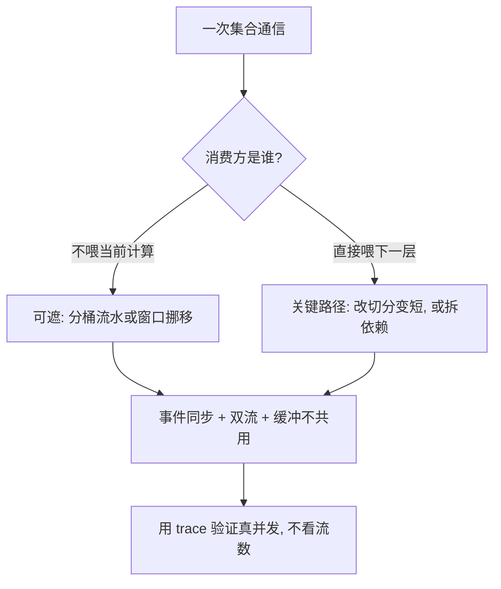

# 通信原语与 overlap

重叠不减少一个字节，它只把加法改成取 max；合法性由依赖图决定，不由 stream 的数量决定。

<footer>—— 据 NVIDIA NCCL 文档与 Megatron-LM 的重叠实践整理</footer>

[上一课](/llm/dist-activation-recompute)把反向拉长了，也把反向里可以排通信的窗口拉长。本课从原语出发把通信说全：每种原语对应哪种并行的哪次交换、哪些对在关键路径上、哪些能被挪走。主干课的 [TP 通信重叠](/llm/tp-comm-overlap)与[计算通信重叠](/llm/comp-comm-overlap)写了两个具体场景；本课给一张全图，并把「合法重叠」的判据说清。不重讲 ring 与 tree 的内部实现。

## 问题

通信写进 step time 有两种方式：关键路径上的等待，与可以遮住却没遮住的暴露。分不清这两者，优化就打偏：给已经重叠的 DP 梯度换更快的算法，收益接近零；放着层内关键路径上的 All-Reduce 不动去调桶大小，也是白忙。第二类错是假重叠：计算流与通信流都建了，内核却因争抢同一份缓冲或同一组 SM 串行了，trace 上看两个 kernel「都在跑」，step time 一毫秒没降。第三类错是非法重叠：通信开始读一块计算还没写完的数据，结果静默错——它不报错，只在 loss 曲线上留毛刺。

### 原语到并行的映射

承接第一课的表，给通信侧视图：DP 梯度走 All-Reduce，或 ZeRO 二三档的 Reduce-Scatter 加 All-Gather；TP 每层正反向各一次 All-Reduce，序列并行后拆成 RS 加 AG 的对；PP 走点对点；EP 走两次 All-to-All；CP 按 Ulysses 走 All-to-All、按 Ring 走点对点；Broadcast 只出现在初始化与元数据。判「能不能遮」的第一性依据是：这次交换的消费方是谁——DP 的梯度平均不喂任何当前计算，天生可遮；TP 的层内 All-Reduce 直接喂下一层，天生在关键路径上，只能靠改切分把它变短。

通信 dtype 是时序的一部分：梯度以 BF16 通信字节数减半，FP8 再减一半，但缩放协议要在所有副本对齐。同样的 overlap 计划换 dtype 后，桶边界与就绪时刻都变，要重排而不是照搬。

## 方法

合法重叠只有四类结构。其一是分桶流水：梯度按桶切，前几个桶算完就发，反向继续算——DP 与 ZeRO 的默认形态。其二是窗口挪移：把可遮通信挪到没有依赖的时段，例如 PP 在算当前 microbatch 时递交上一阶段的激活。其三是拆依赖：序列并行把 Norm 后的激活切开，让 AG 的 g 区与 RS 部分先走，把不可遮部分压缩成每层一次的纯 AR。其四是异步分档：优化器分片的更新与下一步的前向重叠，前提是读的参数是上一步版本。四类之外的「重叠」都要先过依赖审查：被挪的通信不得消费未就绪数据，跨流同步用事件写明，CUDA Graph 必须把通信流一起收进去。

## 机制

收益的解析式：理想重叠下 $T \approx \max(T_{\mathrm{comp}}, T_{\mathrm{comm}})$，部分重叠是两者之间的插值，插值系数由被遮住的字节数比例决定。桶大小是插值的旋钮：桶大，启动开销摊得薄，但暴露窗口来得晚，步末堆积；桶小，遮得早，启动次数把延迟项抬起来。最优桶与单桶计算时间同量级，且随 dtype 变。TP 层内通信为什么难遮：它的消费方是紧接着的 GEMM；序列并行之所以有效，是把那次 All-Reduce 拆成「可提前的 RS 加不可提前的 AG」，把可遮部分剥出去——重叠上限是被依赖结构决定的，不是被算法选择决定的。

## 边界

ring 与 tree 的选择、算法与协议的匹配、自定义 allreduce 的阈值，见 [Ring / Tree allreduce](/llm/ring-tree-allreduce)、[NCCL 算法选择](/llm/nccl-algorithms)与[自定义 allreduce](/llm/custom-allreduce)，本课不重复；调参口径见 [NCCL 调优](/llm/nccl-tuning)。非法重叠不能靠功能测试兜住：数值错不立即显形，要在小规模上做「关重叠对拍」。判真并发的标准是 trace 上计算与通信的核占用不互相挤兑，而不是两条流存在。桶与 dtype 每改一次，重叠计划重排一次——它们是同一个时间线上的变量。

## 小结

- 原语到并行的映射固定：AR 与 RS/AG 归 DP 侧，层内 AR 归 TP，P2P 归 PP，A2A 归 EP 与 CP。
- 可遮性由依赖结构决定：不喂当前计算的通信天生可遮，喂下一层的只能靠改切分变短。
- 合法重叠四类：分桶流水、窗口挪移、拆依赖、异步分档；其余先过依赖审查。
- 桶大小与通信 dtype 是同一时间线的旋钮，改一个要重排另一个。
- 假重叠与非法重叠都要靠 trace 与对拍抓，不看流是否存在。
- 出处：NCCL 公开文档；Shoeybi 等 Megatron-LM 的序列并行与重叠口径。
