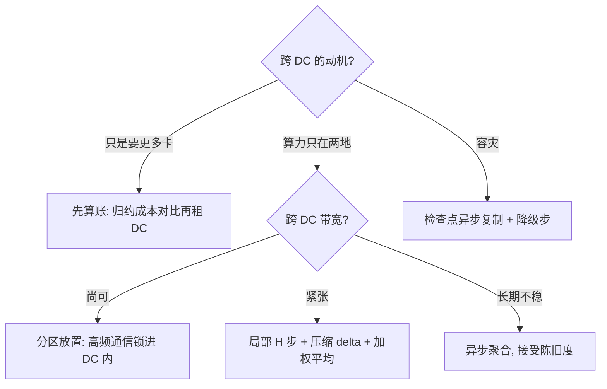

# 跨数据中心训练

同步 SGD 假设带宽免费；跨数据中心的墙上，一步全局归约的账单比一步计算贵出几个量级。

<footer>—— 据 McMahan 等 2017 与 Douillard 等 2023 整理</footer>

[上一课](/llm/dist-heterogeneous-parallel)在集群内部按能力配比；跨数据中心时，「集群内部」这个前提本身没了：数据中心之间的广域带宽通常比 DC 内低一到两个数量级，延迟高两个量级以上，且常按字节计费。本课写跨 DC 训练：什么动机值得付这笔钱，通信结构要怎么改，代价是什么。

## 问题

把同步 SGD 原样搬到广域上，每步的全局归约段支配 step time：跨 DC 段的延迟与带宽让所有重叠技巧失效，因为归约本身就是被等待的消费方。但真实动机常常不是「网不够快」：单个 DC 租不满整机柜、想合并两地的空闲算力、或为容灾把训练摊在两地。动机不同，答案不同——这正是本课要先分类的原因。混淆动机的典型错误：为容灾把训练摊开，却继续做每步同步，结果吞吐掉一个量级，容灾也没得到（训练在一个 DC 掉线时照样全局停摆）。

### 三种结构

按通信频率从高到低排。第一种，分区放置：训练逻辑上仍是一个同步作业，但放置时把高频通信（TP、PP 段间）全部锁进 DC 内，跨 DC 只承担 DP 归约中能层次化、能稀疏化的部分——DC 内先归约，跨 DC 走每 DC 一份的体积。这是改动最小的一种，也只在跨 DC 带宽不太差时可行。第二种，局部更新：每个 DC 内跑多步局部 SGD，隔一段外层步才跨 DC 平均一次参数；联邦平均与 DiLoCo 是这条线的两个锚点，差别在局部步数与传输的 delta 形态（低秩、稀疏或量化压缩）。第三种，异步聚合：参数服务器或去中心化的周期性平均，彻底放弃同步语义，用陈旧梯度换带宽。

局部 $H$ 步再平均，等价于外层步作用在 $H$ 步梯度的加权组合上；局部步数越大越省通信，但外层步的「真实方向」偏差随 $H$ 与各 DC 数据异构度涨。$H$ 是用收敛税买带宽的汇率，不是免费旋钮。

## 方法

选型的决策序：先问动机。若只是想要更多卡，先算一笔账——跨 DC 归约的每字节成本加吞吐损失，对比「再租半个 DC」的差价，多数时候后者赢；若确要跨 DC（算力只在两地、或容灾硬需求），按带宽预算选结构：带宽尚可走分区放置，带宽紧张走局部更新，两地长期不稳走异步聚合。局部更新路线要定三件事：局部步数 $H$、传输的 delta 形态、以及聚合时的权重（按各 DC 的 token 量加权，不按台数）。容灾诉求单独处理：检查点跨 DC 异步复制（口径同检查点课），掉线方退出后其余 DC 走降级步，而不是全组等待。

## 机制

用 $\alpha$-$\beta$ 模型读 WAN：延迟项 $\alpha$ 是几十毫秒量级，任何「多次小交换」的结构在广域上都被延迟项杀死，所以跨 DC 结构一律要求「大而少」的交换——层次化到每 DC 一份、外层步拉长、delta 压缩，都是在把交换变大变少。局部更新的收敛税来自两处：局部方向的漂移（各 DC 数据分布不同则更疼）与外层步的等效学习率偏移，补偿手段是把外层步的学习率与聚合权重一起调，并用小规模两地实验标定 $H$。异步聚合把税变成陈旧度：参数版本差随网络抖动漂，动量与归一化统计对陈旧度的敏感度比同步 SGD 高，监控要盯版本差分布而不是平均吞吐。

## 边界

本课不写联邦学习的隐私协议与非 IID 统计理论，那是另一门课的域；也不给任何「某公司跨 DC 训练了 X 万卡」的具体数字——公开可考的大规模预训练仍以单 DC 为主，跨 DC 同步训练是前沿而非默认配置。分区放置的 DC 内映射按上一课处理；跨 DC 的检查点与丢失窗口口径归容错课。判定收尾：跨 DC 训练值得做，只在「动机成立且结构选对」同时满足时成立。

## 小结

- 跨 DC 的墙是带宽与延迟的量级差；先问动机，再选结构，不混淆容灾与扩容。
- 三种结构：分区放置（高频通信锁 DC 内）、局部更新（$H$ 步加压缩 delta）、异步聚合（放弃同步语义）。
- 广域上交换要大而少：层次化到每 DC 一份、外层步拉长都是同一原则。
- $H$ 与陈旧度是用收敛税买带宽的汇率，按两地小规模实验标定。
- 出处：McMahan 等，Communication-Efficient Learning of Deep Networks（FedAvg），2017；Douillard 等，DiLoCo，2023。
