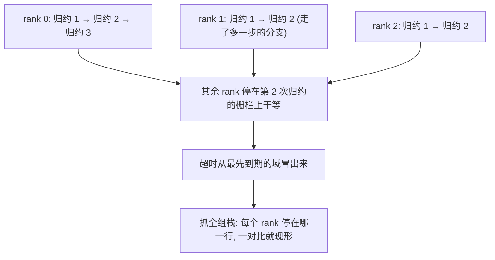
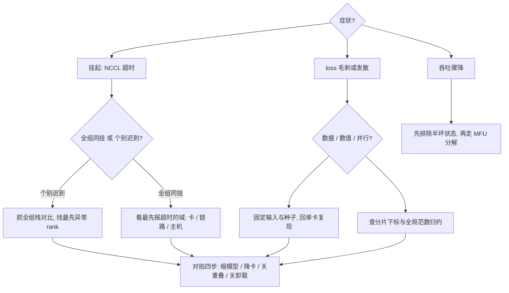

# 分布式训练的调试

分布式 bug 的难点不在多机，在于你只有全局状态的一万份残影；调试就是把残影拼回时间线。

<footer>—— 据 NCCL 调试口径与 PyTorch 分布式工具链整理</footer>

[上一课](/llm/dist-memory-budget)的清单拦住配置错误；跑起来之后的三类病——挂起、loss 异常、吞吐骤降——各有各的定位法。本课写分布式训练的调试：症状到二分到工具，以及为什么单卡直觉在多卡上系统性失效。

## 问题

三类症状经常互相伪装。挂起的表象是 NCCL 超时，根因可能是某 rank 崩了、某条链路降速、或某 rank 走了一条别人没走的代码分支；loss 毛刺与发散的来源有三处——数据、数值、并行配置——表象却都是曲线难看；吞吐骤降可能是故障链路的前奏，也可能只是落后者。单卡直觉失效的根因：错误是跨进程的时序现象，你手里的栈回溯只是一个 rank 的残影；重跑常常不可复现，因为时序本身参与因果。

### 三分法

挂起先分「全组同挂」还是「个别 rank 迟到」：全组同挂看最先报超时的域，个别迟到抓全组栈对比——每个 rank 停在哪一行，一对比就现形。头号根因是集体调用不对称：某 rank 因数据条件分支多调或少调了一次集合通信，其余全体等它。loss 异常按三处归因：数据处查分片内容与顺序（可复现性靠数据内排序键，口径见[分布式清洗](/llm/distributed-clean)）；数值处看梯度范数序列与异常值统计，并回单卡复现同一段数据；并行配置处查分片下标、全局范数归约是否漏做、RNG 是否各 rank 一致。吞吐骤降先过容错课的检测链路排除半坏状态，再走 MFU 课的分解。

对拍协议是分布式调试的主力工具：缩小模型、降到 2 到 8 卡、关 overlap、关卸载，四步各做一次，看异常何时消失——消失的那一步就是嫌疑域。大多数跨卡问题在小规模上保持复现，不用回千卡验证假设。

## 方法

调试的固定动作序：第一步固定输入（同分片、同顺序、同种子），把「变量」压到只剩并行结构；第二步降规模复现，用对拍协议找嫌疑域；第三步在嫌疑域内上工具——挂起用调试级日志加全组栈采样，数值用逐层范数与逐张量校验和对照，通信用带宽曲线对照第 4 课的时序计划；第四步把根因写进固定字段（症状、嫌疑域、复现配置、修复、回归测试），进实验台账。工具的版本差异大，记方法不记逐版本命令：栈采样、分域超时、内存快照、通信 trace 四件套的语义各框架通用。

固定输入这一步的价值常被低估：多卡上各 rank 的数据分片顺序、dropout 的随机种子都可能不一样——不先把这些钉死，你对比的两个实验根本不是同一个实验，看出的「差异」只是噪声。

## 机制

为什么集体通信把局部错误放大成全局挂起：集合通信是全组合同，任一成员不到场，其余全体阻塞在栅栏——这决定了挂起调试的第一动作永远是「找最先异常的那一个 rank」，而不是看超时报告的第一行。为什么数值 bug 要回单卡复现：并行的数值差异主要来自归约顺序与分片切法，单卡跑同一段数据能把「数值本身的病」与「并行引入的病」分开；两者都病，先治单卡。为什么确定性重放有上限：数据与种子可复现，时钟与网络不可复现，所以调试协议追求「复现到嫌疑域」而不是「逐比特重放」。

集合通信（collective）就是全组一起参加的通信操作，少了谁都不行；栅栏可以想象成考场的进场铃——所有人到齐门才开，一个人没来，全考场都堵在门口。这就是「一个 rank 多调一次归约、全体陪它挂起」的原因。

## 边界

单卡数值调试与异常值机理归数值课程；故障的检测与退役归容错课，本课只接「已挂起之后」的定位；性能类问题归 MFU 与建模课。调试不等于监控：生产上的指标与告警让故障被看见，调试让根因被找到，两者共用台账但不是一套东西。最后一条纪律：调试结论没有回归测试兜底就不算关闭——集合通信的不对称 bug 修完不补一个「分支不对称即报错」的断言，下次换个人照样踩。

「根因写进固定字段」听起来像官僚流程，在分布式里其实是刚需：时序类 bug 常常几周后换个集群又复发，台账里的复现配置与回归断言，是那时唯一能让你十分钟收工而不是重新查三天的东西。

## 小结

- 三类症状互相伪装，先分类再动手：挂起找最先异常的 rank，loss 走数据/数值/并行三分，吞吐先排故障再走分解。
- 集体通信是全组合同，局部错误放大成全局挂起；调试第一动作是找最先异常者。
- 对拍四步（缩模型、降卡、关重叠、关卸载）是主力工具，多数问题在小规模复现。
- 数值 bug 回单卡复现，把数值病与并行病分开治；确定性重放只到嫌疑域为止。
- 出处：NCCL 调试口径；PyTorch 分布式工具链；可复现数据口径见[分布式清洗](/llm/distributed-clean)。
