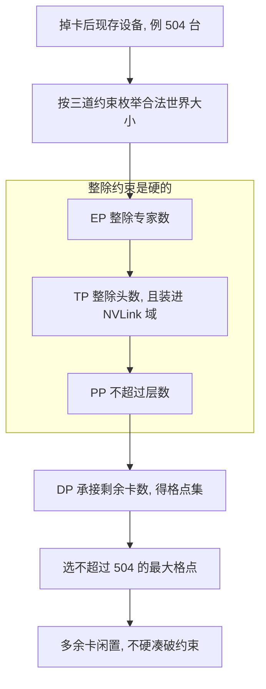
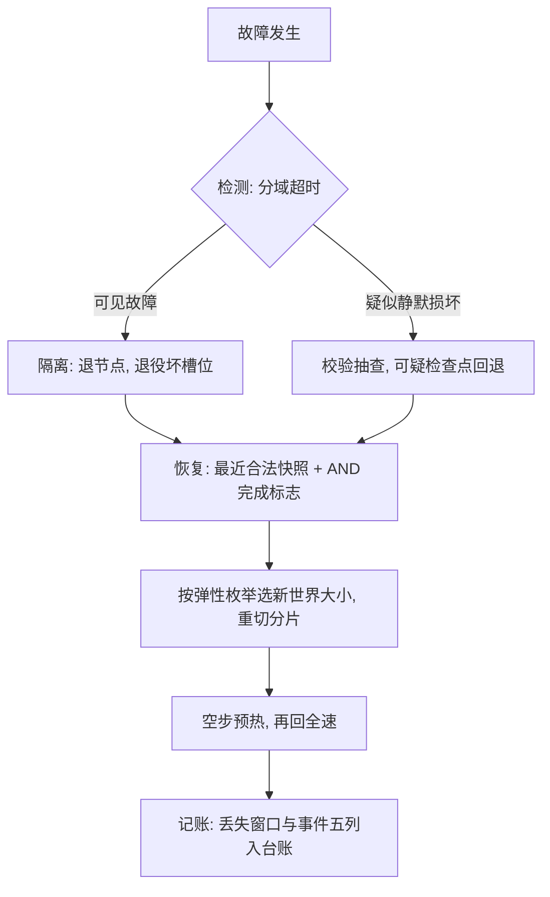

# 容错与弹性训练

万卡规模下，故障是期望事件而不是事故；容错设计的产出物是恢复时间，不是「我们没坏」。

<footer>—— 据 Athlur 等 2022 与 Jiang 等 2024 整理</footer>

[上一课](/llm/dist-cross-dc)把训练摊到广域，故障域随之变大。主干课的[万卡训练的故障率](/llm/large-scale-failure-rate)给了 MTBF、MTTR 与丢失窗口的账，[弹性训练与掉卡](/llm/elastic-training)给了掉卡后的计划选择；本课深钻整条容错链路：检测、隔离、恢复、记账四段怎么接，以及弹性枚举的约束。不重讲检查点格式。

## 问题

单点故障经集体通信放大成全组挂起：一张卡的 ECC 错、一条链路的抖动、一个主机的内存故障，表象都是 NCCL 超时与全组 hang。恢复的每一秒都是丢掉的有效算力，而恢复本身有自己的坑：状态没对齐（数据游标、RNG、学习率调度器各回各的家）、按新世界大小重切分片出错、恢复后头几分钟利用率骤降（页缓存冷、通信库冷启动、文件系统缓存重建）。容错不是「有检查点」一句话，是四段链路每一段都有明确产物。

两个缩写先翻译：MTBF 是平均无故障时间——两次故障之间平均撑多久；MTTR 是平均恢复时间——从坏到好平均要多久。万卡规模下 MTBF 常常以小时计，所以「一天修几次」是排班里的常规项，不是事故。

### 四段链路

检测：按域分层设超时——进程组级、节点级、交换机级——把「谁先超时」变成定位信息而不是噪音；可见故障与静默损坏分开走，静默损坏靠校验和抽查与可疑检查点回退，不能指望 ECC 抓住一切。隔离：坏节点退出，进程组按新世界大小重建，坏槽位登记退役，防止同槽位反复咬人。恢复：从最近合法快照起，快照必须同时含参数、优化器状态与数据游标，全局完成标志是各分片的 AND——缺一个就整体作废；按新网格重切分片时按弹性枚举选最大可行世界。记账：token 游标对齐、丢失窗口入账、事件进故障台账，让下一次 MTBF 的估计有数据。

「全局完成标志是各分片的 AND」意思是：每个分片都写完，快照才算合法，缺一个就整体作废。初学者容易看到主分片文件在就拿来恢复——恢复到一半发现缺片，损失的时间比不做恢复还多。

期望丢失约等于检查点间隔的一半加检测时间加恢复时间。间隔加密，丢失少了，但 I/O 与让路保存吃掉吞吐；间隔放疏，一次故障吃掉半天。最优间隔是有效算力的极大值点，随 MTBF 与存储带宽移动，不是拍脑袋的固定值。

## 方法

弹性枚举是链路的约束层：合法世界大小是离散集——EP 整除专家数优先，TP 整除头数且要装得进 NVLink 域，PP 不超过层数，DP 承接剩余——掉卡后从集合里选不超过现存设备的最大值，而不是恢复原配置硬等。恢复后的冷启动要专门处理：先跑几个空步或小步让缓存与通信路径热起来，再回到全速，否则恢复后的利用率曲线会让人误判二次故障。事件语义要写进日志的固定字段：时间、域、根因分类、丢失窗口、新世界大小——这五列齐了，故障率课的账才算得动。

## 机制

为什么丢失窗口由检查点间隔决定：故障在两次快照之间均匀发生时，期望回退是间隔的一半，加上检测与恢复的固定时间，构成一次故障的总损失；损失率乘上故障频率，就是有效算力的折损项。保存频率加密的代价不止 I/O：同步保存会在 step 边界插出停顿，异步保存（口径见[异步检查点](/llm/async-checkpointing)）把刷盘挪出关键路径，但进行中的保存不可无界堆积。为什么弹性枚举是离散的：每一维并行的整除约束是硬的，世界大小只能落在格点上；掉卡发生在格点之间时，宁可让一部分卡闲置，也不让整除约束破产。

代个数字感受量级：检查点间隔 30 分钟，期望回退就是 15 分钟；加上检测 5 分钟、恢复 10 分钟，一次故障平均吃掉全组约 30 分钟算力。若故障平均一天两次，等于每天蒸发一小时的整机时——这就是为什么间隔值得精算而不是拍脑袋。

## 边界

检查点 I/O 与分片写读的工程见 [检查点 I/O 带宽](/llm/checkpoint-io-bandwidth)；静默损坏的机理与 Xid 口径见 [GPU 故障模式](/llm/gpu-failure-modes)；活着的尾延迟归性能课，本课只管「从坏到好」。弹性不是免费：每次重配置的吞吐代价与数值路径重验都要入账，频繁弹性说明故障率估计本身错了。账目化的最后一件小事：恢复演练要定期做——没有演练过的恢复流程，按未经验证的代码算。

## 小结

- 容错是四段链路：检测（分域超时）、隔离（退役坏槽）、恢复（AND 快照加重切）、记账（五列入台账）。
- 丢失窗口由检查点间隔决定；最优间隔是有效算力的极大值点，随 MTBF 与存储带宽移动。
- 弹性世界大小是离散集：EP、TP、PP 的整除约束定格点，选最大可行值，宁可闲置不可破约束。
- 恢复后先预热再全速，否则利用率曲线误报二次故障。
- 出处：Athlur 等，Varuna，EuroSys 2022；Jiang 等，MegaScale，2024；PyTorch Elastic 的重启语义。
