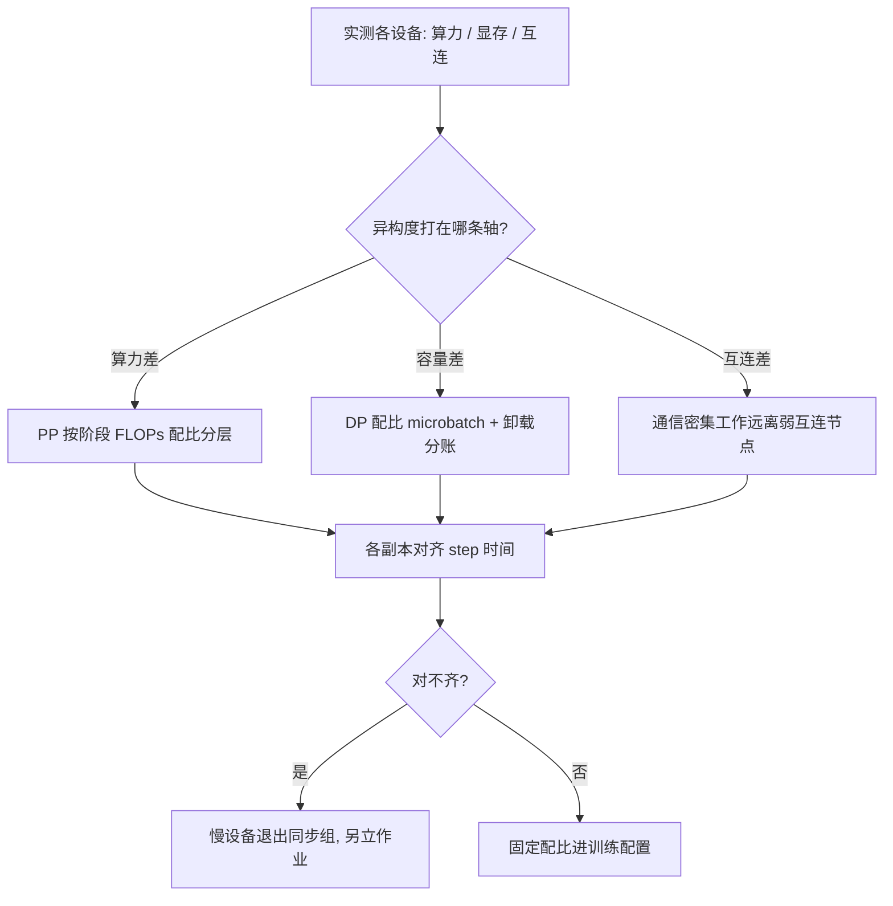
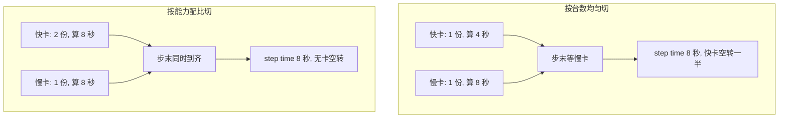

# 异构并行

同质集群里的「每卡」是近似，异构集群里它连近似都不是；并行方案要按设备的能力分账，而不是按台数平分。

<footer>—— 据 Rajbhandari 等 2021 与 Zheng 等 2022 整理</footer>

[上一课](/llm/dist-topology-aware)把逻辑组映射到同质的物理网格；真实集群常常不同质：两代卡混布、互连带宽不同、显存容量悬殊，CPU 与 NVMe 也作为存储与计算层参与训练。本课写异构下的并行：能力不齐时，切分与放置按什么配比走。不重讲 offload 的存储层级本身。

## 问题

均匀切分在异构集群退化为「最慢设备定义 step time」：同步语义下，每一步都要等最慢的参与者，快卡算得再快也只是空转。异构有三个来源，各自破坏不同的假设——算力差（同槽位插两代卡）破坏「每步等长时间」的假设；互连差（有的节点只有 PCIe）破坏「TP 住 NVLink 域」的放置前提；容量差（同集群 80GB 与 40GB 混布）破坏「每卡放同一份分片」的均匀切分前提。三类错法对应三处：按台数均匀切 DP 让快卡陪跑，把层内高频通信放到弱互连节点，按最大显存给每卡配分片让小卡必爆。

同步语义可以想象成划桨船：船速由最慢的桨手决定，其他人划得再快也只是空行程。这就是「按台数每卡一份」在异构集群失效的根源——计时的不是平均速度，是最慢的那张卡。

### 按能力分账

补偿的第一手是按能力配比切分。PP 按各阶段的 FLOPs 配比分层：慢卡所在的阶段分到更少的层，使各阶段的计算时间对齐；DP 按容量与算力配 microbatch 或梯度累积步数——全局 batch 不变，各副本按自己的消化能力上量，步末归约时大家同时到齐。第二手是按亲和放置：计算通信比高的工作（大 GEMM 密集的阶段）放在弱互连但算力尚可的设备，通信密集的工作绝不放。第三手是把存储层级当成异构的一部分：优化器状态放 CPU、参数放 NVMe，本质是把「内存容量」也纳入分账，ZeRO 系列的卸载口径就是这套账的特例。

拿 DP 配比代个例子：快卡算力是慢卡的 2 倍，就让快副本每个外层步吃 2 个 microbatch、慢副本吃 1 个。全局 batch 不变，两个副本步内耗时一样长，步末归约同时到齐——快卡的算力真正进了吞吐，而不是烧在空转上。

Alpa 的做法把这件事交给搜索：intra-op 切分与 inter-op 调度在异构设备图上联合优化，代价是搜索本身要时间与算力预算。手写配比在两三种设备时够用，设备种类一多，手写组合数就压过了搜索成本。

## 方法

落地次序：先量账——每类设备的算力、显存、互连带宽实测，不抄规格表；再选轴——异构度主要打在哪条轴上（算力差先动 PP 配比，容量差先动 DP 配比与卸载，互连差先动放置）；最后定合同——慢设备要么按配比进入同步组并对齐时间，要么整体退出同步组另立作业，没有中间态。特别是一张「慢副本」混进同步 DP 组的方案要警惕：它每步都把全组按到自己的 step time，名义上多了算力，实际上少了吞吐。

## 机制

同步语义下 step time 等于各副本时间的 max，配比的作用是把 max 拉平：配比正确的标准是各副本的步内时间差落在噪声带内，而不是「大致均衡」。数值一致性是异构特有的第二层账：不同代卡的 kernel 实现与精度路径不保证逐位一致，混合集群里的对拍要按设备分层做，把「卡型差异」与「并行差异」分开归因，否则调 debugging 时两个变量一起动。弹性与异构叠加时账更碎：新加入的设备与现存配比不齐，要么重配比，要么按上一课的口径在重放置时重验映射。

混合集群对拍时，初学者常把两代卡跑出的微小 loss 差直接当 bug 报；实际不同代卡的 kernel 与精度路径本就不保证逐位一致。先按设备分层对拍，把「卡型差」和「并行差」分开，再下结论。

## 边界

本课不写 offload 的内部分级与瓦片调度（[ZeRO-Offload](/llm/zero-offload)、[ZeRO-Infinity](/llm/zero-infinity) 已给），不写推理侧的异构服务；MIG 一类切片管理是运维课题。能换卡时先换卡：异构补偿是「不能换」时的次优解，配比、放置、对拍的持续维护成本不低。搜索类方案（Alpa 一类）的搜索成本要计入项目预算，小集群手写更便宜。跨设备类型的数值差异在本课只作归因规则，数值协议本身归低精度与数值课程。

## 小结

- 异构三来源：算力差、互连差、容量差；各自破坏一个均匀切分的前提。
- 补偿三手：按能力配比切 PP 与 DP、按亲和放置、把存储层级计入分账。
- 同步组内没有中间态：按配比对齐时间，或整体退出同步组；慢副本陪跑是负收益。
- 对拍按设备分层归因，把卡型差异与并行差异分开。
- 出处：Rajbhandari 等，ZeRO-Infinity，2021 的存储分账；Zheng 等，Alpa，2022 的异构联合切分。
