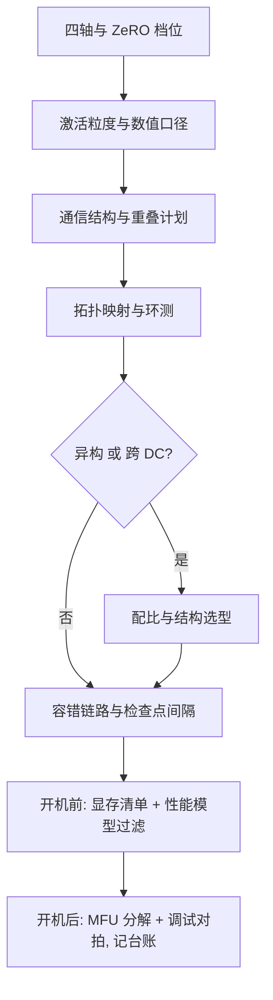
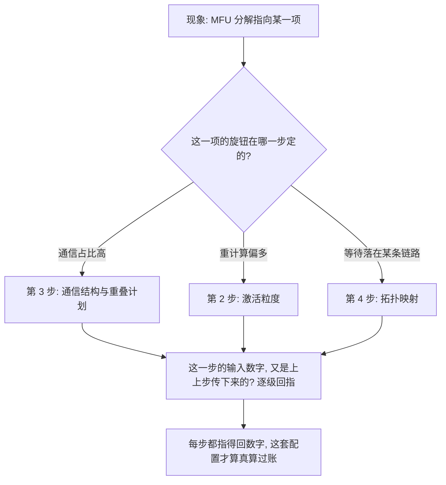

# 分布式训练收束

并行的本质是记账：谁持有什么状态、每步为同步付多少字节、谁在等谁、坏了丢多少——这门课教的是把这本账读全。

<footer>—— 据本课程十三课整理</footer>

[上一课](/llm/dist-performance-modeling)把单项机制合成能算的模型，分布式训练深入的课程到此收束。十二课从四轴对照走到配置搜索，本课不添新内容，把决策收成一张单：新训练按单走一遍，老训练拿单来对账。

## 问题

分布式训练的事故很少是「算法不对」，多数是账没记全。四类账对应四类现场事故：状态账没记全——参数、梯度、激活谁在哪份分片上说不清，于是峰值 OOM 与检查点恢复失败；通信账没记全——每步谁付什么字节、付在关键路径还是可遮，于是 MFU 卡在四成找不到刀口；时间账没记全——谁在等谁、等待落在哪条链路，于是映射与重叠白做；故障账没记全——丢了多少窗口、事件没入台账，于是同样的坏槽位反复咬人。收束课的任务是把每类事故倒推回它该被拦住的那一课。

MFU（模型浮点利用率）＝实际用掉的算力 ÷ 硬件理论峰值算力，可以理解成 GPU 的「有效出勤率」：0.5 就是 GPU 只有一半时间在真正算数，另一半花在等通信、搬数据和等待其他卡上。

### 决策单

八步按依赖排。第一步定四轴与档位，对照表在[DP/PP/TP/EP 深入对照](/llm/dist-parallel-deep-comparison)，DP 冗余的切法在[ZeRO 的各阶段](/llm/dist-zero-stages)。第二步定激活策略，粒度与数值口径在[激活重计算](/llm/dist-activation-recompute)。第三步定通信结构与重叠计划，四类合法结构在[通信原语与 overlap](/llm/dist-comm-overlap)。第四步做拓扑映射，装填次序与环测在[拓扑感知的并行](/llm/dist-topology-aware)。第五步判异构：只有多代卡或弱互连节点时按[异构并行](/llm/dist-heterogeneous-parallel)配比，否则跳过。第六步判跨 DC：动机不成立就不开，结构选型在[跨数据中心训练](/llm/dist-cross-dc)。第七步定容错链路与检查点间隔，四段链路在[容错与弹性训练](/llm/dist-fault-elastic)。第八步开机前用[内存预算的完整清单](/llm/dist-memory-budget)与[性能建模](/llm/dist-performance-modeling)过滤，开机后用[MFU 优化案例](/llm/dist-mfu-case)的分解与[分布式训练的调试](/llm/dist-debugging)的对拍归因。

## 方法

三条不变量横贯八步。第一条：同步组是合同——任何 rank 的任何分支偏离，都是全组等它；放之从进程组设计到调试的第一动作。第二条：峰值决定生死——显存与 step time 都按峰值记账，不按总和与均值。第三条：恢复时间是有效算力的一部分——检查点间隔、弹性枚举、恢复演练都是吞吐问题，不是运维点缀。高频拦错事四件：拿公式当峰值、拿均值当 P99、拿口径不一的 MFU 当排名、拿没演练过的恢复当容错。这四件在十二课里各占一课的份量，收束时并成一排。

「峰值决定生死」是最容易吃亏的一条：显存按总和看还有富余，但只要某一步的峰值顶到上限就 OOM；step time 看平均很快，尾部最慢的那一步才是真实节奏。所以两本账都要按峰值记，均值只用来发现异常。

对账前先验账本：同一配置重跑两次，step time 差异应落在噪声带内；超了说明有游标或干扰之类的账外变量，账不齐时一切比较皆噪音。

## 机制

为什么按「四本账、八步单、三不变量」收，而不是按章节复述：课程里的具体数字会过时——卡型换代、互连换代、框架换代——但账本关系稳定得久：同步组是合同不随硬件变，峰值决定生死不随框架变，恢复时间进有效算力不随规模变。八步的依赖顺序就是事故的传播路径：第一步的分片下标错了，第四步的映射怎么调都在给错误的状态分布还债；第七步的检查点间隔定了，第八步的模型里丢失窗口才有数。对账因此从后往前问：MFU 分解指到哪一项、那一项的旋钮在哪一步定的、那一步的输入又是从哪一步传下来的——每一步都能指回上一步的数字，这套配置才算真的算过账。

八步的依赖关系像装修水电：先走管线再铺地板，地板出了问题，砸开的往往不是地板那层。第一步分片下标错了，后面映射调得再好，都是在给错误的状态分布还债——所以对账要能从后往前指回去。

## 边界

本课程没写的：训练循环与实验管理的日常，归训练基础设施课程；RL 循环里的 rollout 与奖励服务把这套并行账再叠加一层时序账，归下一课程；数据侧的清洗与配比已有专门课程。具体框架的旋钮名与默认值不在收束单里——它们是各课口径在某一代实现上的投影，换投影不换账。对账的最后一条纪律：单子里每一步要么有数字、要么有「为什么此步跳过」的理由，空白步不算走过。

## 小结

- 四本账：状态（谁持有什么）、通信（每步付什么字节）、时间（谁在等谁）、故障（坏了丢多少）。
- 决策单八步按依赖排：轴与档位、激活、重叠、映射、异构、跨 DC、容错、前后验证。
- 三条不变量：同步组是合同、峰值决定生死、恢复时间是有效算力的一部分。
- 四件高频拦错事：公式当峰值、均值当 P99、口径不一的 MFU 当排名、没演练的恢复当容错。
- 出处：按本课程十三课整理；各项机制口径见各课出处行。
