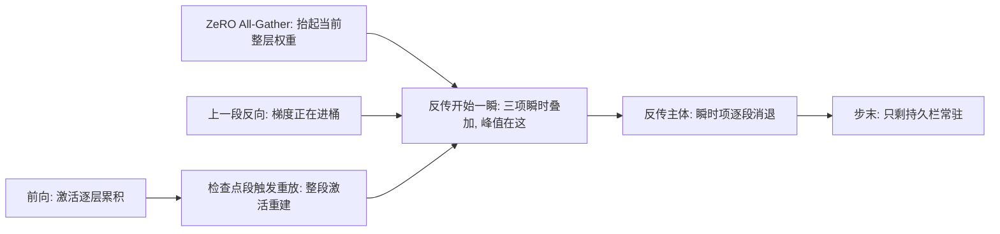
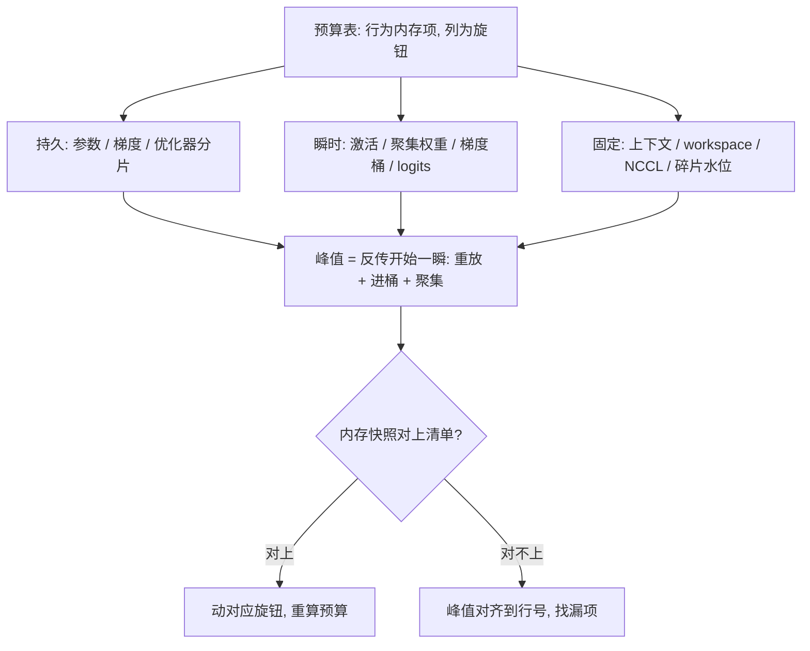

# 内存预算的完整清单

显存爆在峰值而不是总和；预算清单要按「什么时刻、谁还活着」记账，不按配置项罗列。

<footer>—— 据 Rajbhandari 等 ZeRO 系列与 Korthikanti 等 2022 的显存分析整理</footer>

[上一课](/llm/dist-mfu-case)管的是时间账；本课管空间账。前面分别切了参数侧（ZeRO 课）与激活侧（重计算课），本课把一次 step 的全部内存项合成一张完整清单：每一项多大、在哪个时刻活着、被哪个旋钮影响。清单的用途是预算——在开跑之前判断配置会不会 OOM。

## 问题

OOM 的三项高频根因都不在参数：峰值激活（微批数乘序列长）、瞬时缓冲（某层权重被聚集齐的一瞬、梯度桶将满的一瞬）、以及公式外的固定项（通信库缓冲、CUDA 上下文、框架 workspace、碎片）。逐项清单缺失时，调显存变成盲试：关一个重计算、降一档序列长，撞运气。第二类错是把持久账当峰值账：$16\Phi/N$ 算出来放得下，跑起来在反传开始那一瞬爆掉——那一瞬检查点重放、整层聚集权重、梯度桶三者叠加。

瞬时缓冲可以想象成厨房高峰期的料理台：食材平时放在仓库（常驻显存），但出菜那一瞬必须全部摆上台面——台面（峰值显存）不够，仓库再大也得停摆。

### 两栏清单

持久栏：参数（$\Phi$ 乘精度字节数）、梯度（同阶，注意 FP32 累积会翻倍）、优化器状态（Adam 按 $12\Phi/N$ 分片）。瞬时栏：激活——层数、微批、序列长与每层系数的乘积，重计算把「层数」换成「检查点段间隔」；当前层聚集权重——ZeRO 三档每层 All-Gather 抬起的整层（或 TP 分片后的）参数；梯度桶——通信缓冲，随桶大小与 dtype 变；大词表 logits——词表乘批乘序列的 fp32 softmax 中间量，长序列下经常超过激活本体。固定栏：CUDA 上下文每卡数百 MB 级、cuDNN workspace、NCCL 通道缓冲、碎片水位（按实测预留一成量级）。

拿 7B 模型代一下持久栏：fp16 参数约 14 GB、梯度约 14 GB，Adam 状态按 $12\Phi/N$ 分片到 8 卡每卡约 10.5 GB——持久栏合计每卡 38 GB 上下，还没算激活与固定项。80 GB 的卡看着宽裕，实际一步不慎就爆。

大词表 logits 是清单里最常漏的一项：$V$ 乘 $b$ 乘 $s$ 的 fp32 中间量在五万词表、长序列下轻松超过全部激活。切分 softmax 或流式算 loss 前，先把它从「激活」里单列出来，否则重计算调半天找错了门。

## 方法

清单的用法是矩阵：行是内存项，列是旋钮（TP、PP、ZeRO 档、重计算粒度、微批、序列长、桶与 dtype、卸载），每格标方向与量级——比如重计算行只作用于激活行，ZeRO 三档作用于参数与优化器行但抬高瞬时栏的聚集项，桶大小作用于梯度缓冲行。建表一次、标定一次（用自己框架的实际系数，不抄论文常数），以后新配置先过表再开跑。实测对账用框架的内存快照：把峰值时刻对齐到具体行号，确认爆的是清单里哪一项，再动对应旋钮——顺序是「先定位后拧」，与 MFU 课的分解同构。

## 机制

为什么峰值出现在反传开始：检查点重放把检查点之间的激活整段重建，同时上一段反向的梯度正在进桶，ZeRO 三档还在为当前层抬权重——三个瞬时项在同一时刻相加，这就是「总和放得下、峰值爆」的机制。为什么碎片能杀死「够用」的配置：分配与释放的模式是周期性的，周期性分配在内存里锯出洞，总空闲够、连续块不够；缓解靠分段分配与虚拟内存手段，预算上把碎片水位当固定项预留。卸载时账本要跨设备合：CPU 侧的 pinned 内存与 NVMe 带宽进同一张表，PCIe 的搬运时间同时是内存账与时间账的项。

初学者容易把碎片当成「显存不够」的同义词：其实总空闲是够的，只是连续块不够——像停车场总空位够、但零散在角落，一辆大卡车停不进去。预算里预留一成碎片水位，就是把这件事制度化。

## 边界

本课给静态账：运行时的水位告警与 OOM 回退是服务化课题。激活系数随实现与精度策略变，用自己栈的快照标定，不通用。清单不含 host 侧的常规内存，除非开了卸载。与时间账的交点只有两处：桶大小与卸载带宽——它们同时出现在两张表里，改任何一个要两张表一起复算。预算表是文档资产：换框架、换精度、换并行配置时增量维护，不推倒重写。

## 小结

- 清单分三栏：持久（参数、梯度、优化器分片）、瞬时（激活、聚集权重、梯度桶、大词表 logits）、固定（上下文、缓冲、碎片水位）。
- 峰值在反传开始：重放、进桶、聚集三瞬时项相加，$16\Phi/N$ 管不住它。
- 用「项乘旋钮」的矩阵做预算，系数用自己框架标定一次，长期复用。
- 实测对账用内存快照把峰值对齐到行号，先定位后拧旋钮。
- 出处：Rajbhandari 等，ZeRO 系列；Korthikanti 等 2022 的激活显存分析；口径与各档公式见本课程 ZeRO 与重计算两课。
