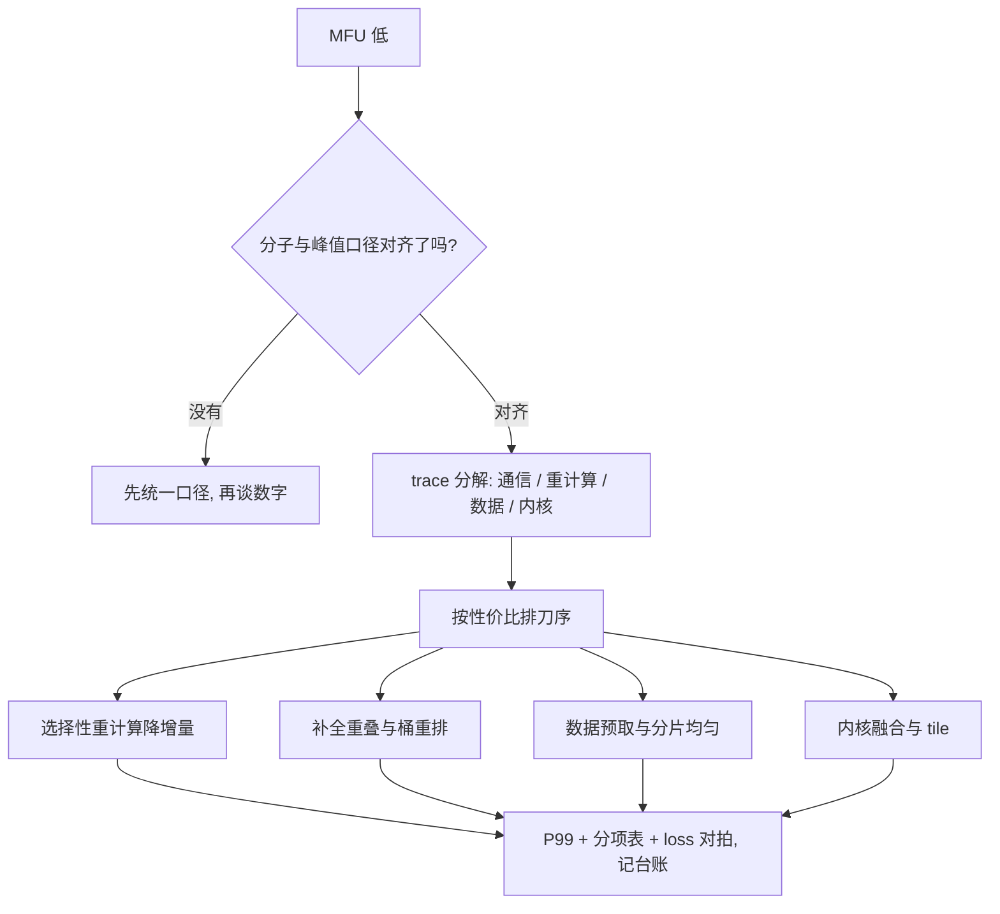

# MFU 优化案例

MFU 是把 step time 分解到不能再分解之后的余数，不是可以直接拧的旋钮；能拧的是通信、重计算、内核与重叠。

<footer>—— 据 Korthikanti 等 2022 与 Jiang 等 2024 的报告口径整理</footer>

[上一课](/llm/dist-fault-elastic)把故障当常态管起来；假设机器都在跑，step time 里有多少是白付的，就是本课的问题。本课用一个案例走一遍 MFU 优化的完整路径：从定义的口径坑，到分解清单，到按性价比排刀序。前面各课是零件，这里组装。

## 问题

MFU 等于模型 FLOPs 除以「卡数乘峰值 FLOPs 乘 step time」。它的分母里藏着全部浪费，但分子先有口径坑：模型 FLOPs 算不算注意力的二次项、算不算重计算的增量，各报告不一致——满层重计算让真实计算多三成，名义 MFU 却把它算成自己的成绩。跨报告比较前先对齐两件事：分子口径（哪些项计入）与峰值口径（ dense 还是稀疏）。口径不齐时，55 与 40 两个数字没有可比性。

### 案例走一遍

设定：70B 模型，两千卡，MFU 四成出头，目标是五成。第一步不是调参，是分解：拿一小时的 trace 把 step time 拆成四份——通信暴露、重计算增量、数据等待、内核低效。假设拆出来是：通信暴露 8%，重计算增量折合 12%，数据等待 3%，剩余是有效计算。排刀序按性价比：先把重计算从满层降到选择性（上一课的口径，长序列下常省一半增量），成本只是改配置；再把 DP 梯度归约与反向的重叠补全、桶大小按 trace 重排（重叠课的四类结构逐一对）；数据等待看 dataloader 预取深度与分片均匀度；最后才动内核——融合与 tile 是上游库的事，自己改的维护成本最高。

公开报告的高位口径：MegaScale 在千卡级报过五成五的量级，Llama 3 在 H100 上报过四成量级——两者分子口径不同，直接比数字没有意义。同一集群内的纵向比较才是 MFU 的正当用法。

## 方法

把分解做成固定动作：每次优化候选先回答「省的是哪一项、预期多少、怎么验证」。验证用三个数：P99 step time（不是均值）、MFU 分项表（通信、重计算、数据、内核各占多少）、以及 loss 曲线对拍（确认优化没改变数值语义）。改重叠与改重计算的验证成本低，当周可做；改内核与切分的验证成本高，排进版本计划。每一次改动记进实验台账：假设、改动、三个验证数、回退条件——这与实验管理课的台账是同一本。

## 机制

为什么 MFU 有上限：气泡与不可重叠的层内通信是结构性的，TP 的关键路径交换、PP 的残余空拍，都只能压缩不能消除；公开报告的高位停在五成到六成之间，逼近上限的过程是边际收益递减——从四成到四成五改配置，从五成五往上动内核。为什么 MFU 不该当唯一目标：它不度量损失质量与成本，一个把全局 batch 推到 roofline 拐点之外（口径见[批大小与 roofline 拐点](/llm/batch-roofline-knee)）的配置可以抬 MFU 却伤收敛步数；MoE 负载不均时，热专家把全组按住，平均 MFU 看不见，要看 P99（落后者的分解见[落后者缓解](/llm/straggler-mitigation)）。

## 边界

本课不重讲各项的机制：通信暴露见重叠课，重计算见上一课，内核层的基础见 [Megatron-Core](/llm/megatron-core) 与内核工程课程，FP8 带来的算力分母变化见 [FP8 训练（Transformer Engine）](/llm/fp8-training)。MFU 不度量故障与恢复的折损，那在容错课的账里。跨代硬件比较 MFU 前先确认峰值口径与带宽比，否则第一课的「带宽换算」就把结论带偏。案例的数字是示例路径，不是配额。

## 小结

- MFU 的分子与峰值各有口径坑；跨报告比较前先对齐，同集群纵向比较才是正当用法。
- 优化从分解开始：trace 拆成通信暴露、重计算增量、数据等待、内核低效四份。
- 刀序按性价比：先配置（重计算粒度、重叠、数据），后内核；每刀带假设、验证数与回退条件。
- 验证看 P99 step time、MFU 分项表、loss 对拍三个数，不只看均值。
- 出处：Korthikanti 等 2022 的重计算口径；Jiang 等，MegaScale，2024；Llama 3 技术报告的吞吐口径。
