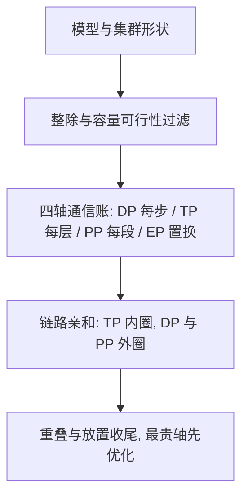
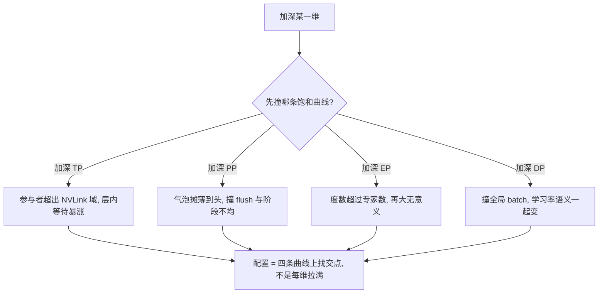

# DP/PP/TP/EP 深入对照

四种并行不是四个开关，而是切四种不同状态的轴：批、层深、矩阵宽、专家路由；对照的意义是看清每一轴每步在搬什么字节。

<footer>—— 据 Shoeybi 等 2019 与 Narayanan 等 2021 整理</footer>

[上一课](/llm/ti-map)把训练基础设施收成九步决策单与三条不变量：轨迹契约、指纹唯一、账随时可查，管的是 step 骨架与账本。骨架立好之后，算力超出单机：状态怎么切、每步付什么字节、谁在等谁、坏了丢多少，是本课程的问题。本课程是「分布式训练深入」的第一课。主干课分别写过[数据并行与 ZeRO](/llm/data-parallel-zero)、[张量并行](/llm/tensor-parallel)、[流水线并行](/llm/pipeline-parallel)与 [Expert Parallelism](/llm/expert-parallelism)；本课不再逐个入门，而是把四轴放进同一张对照表：切什么状态、每步交换什么、落在哪条链路、坏了是什么症状。后课默认已经读完这张表。

## 问题

选并行配置时缺的不是各轴的知识，而是同一坐标系里的读法。每份框架文档都会提醒 TP 度别超过 8、PP 别太深；真正决定配置的是四轴在五列上的取值：状态切分、通信原语、通信体积、链路亲和、失败症状。四轴几乎总是混用，还必须知道哪些列相加、哪些列取 max。没有这张表，配置讨论会退化成口号：「MoE 用 EP」「大模型加 TP」，而不知道代价落在哪一列。

一个直觉读法：DP 是「每人做不同的题，考前对答案」，TP 是「一道题拆给几个人合算」，PP 是「流水线，每人负责几道工序」，EP 是「不同题型分给不同的专家组」。切的东西不同，每步付的通信费也不同。

### 五列对照

DP 切数据：参数、梯度、优化器状态全复制，每步一次 All-Reduce 族交换，体积与参数量同阶；消息大、频率低，能容忍跨节点，重叠之后多落在带宽区。症状是 step 均匀变长，没有局部热点。TP 切单层矩阵宽：每层正反向各一次 All-Reduce 量级，体积 $\propto bsd$ 乘层数，高频短消息，延迟敏感，必须待在 NVLink 域；症状是跨节点后层内等待把利用率拖垮。PP 切层深：阶段间点对点递激活，体积 $\propto bsh$，频率按段；怕气泡与阶段不均，症状是稳定段之间的空拍与周期性 flush。EP 切专家路由：两次 All-to-All 是置换，没有可聚合的中间结果，跨节点最难层次化；症状是热专家既是计算热点又是网络热点。

四轴的缩放极限不同：TP 受头数整除与 NVLink 域大小限制，PP 受层数与气泡限制，EP 受专家数限制，DP 受全局 batch 与学习率语义限制。配置搜索先撞到的那个极限，就是该换轴的信号。

## 方法

把对照表用成约束满足问题：先按模型形状排除不可行项（头数除不尽、层太浅、专家数不够），再按「通信频率乘体积」把各轴排进链路层级——TP 进内圈 NVLink 域，DP 与 PP 放外圈跨节点，EP 看路由方案。然后用体积公式粗算每轴的通信账：DP 每步 $O(\Phi)$，TP 每层 $O(bsd)$，PP 每段 $O(bsh)$，EP 每层两次置换 $O(bsdk)$ 量级。哪一轴的账最贵，优化就从哪一轴开始；其余轴的开销用重叠与放置去遮。

代个数字感受 TP 的量级：$b=4$、$s=4096$、$d=4096$ 时，每层一次 All-Reduce 的消息约 $b \times s \times d \approx 6700$ 万个数，fp16 下一百多 MB。一层一次、几十层高频发生——这就是 TP 必须待在 NVLink 域的原因。

## 机制

四轴能正交，因为各自的进程组独立，组内同步语义不外溢到别的组。同一维内部也有极限：TP 度增大时每层 All-Reduce 的参与者变多，NVLink 域装不下就退化；PP 度增大时气泡先被更多微批摊薄，再受 flush 与阶段负载不均制约；EP 度超过专家数就没有意义；DP 度增大最终撞全局 batch——学习率与批次语义随它一起变。所以「加深一维」不是免费的扩展：每维有自己的饱和曲线，配置是在四条曲线上找交点，而不是每维都拉满。

初学者容易以为「并行度越大越快」。实际上比如 PP 加深一倍，气泡未必变小，阶段负载不均反而更难调。正确的问法不是「这一维加不加」，而是「当前先爆的那块状态，归哪根轴管」。

## 边界

本课给对照与读法，不给组合算法：多维组合的进程组细节见 [3D / 5D 并行组合](/llm/nd-parallel)；逻辑组到物理链路的映射是后课的事；DP 轴那块「全复制」的冗余怎么切，是下一课的主题。序列维是第五轴，[序列并行 / 上下文并行](/llm/context-parallel)已单独立课，不在此展开。判断「该不该上某一维」的口诀：看该维切的状态是不是当前先爆的那一块——爆激活的模型加深 TP 帮助有限，要等后课的激活账。

## 小结

- 四轴分别切数据、层深、矩阵宽、专家路由；进程组正交，通信账不同阶。
- 读配置用五列：状态、原语、体积、链路亲和、失败症状；TP 延迟敏感住 NVLink 域，EP 的置换最难层次化。
- 每轴有缩放极限与饱和曲线；先撞到的极限就是换轴信号。
- 最贵的通信账先优化，其余用重叠与放置遮；组合与映射归后课。
- 出处：Shoeybi 等，Megatron-LM，2019；Narayanan 等，Efficient Large-Scale Language Model Training on GPU Clusters Using Megatron-LM，2021。
