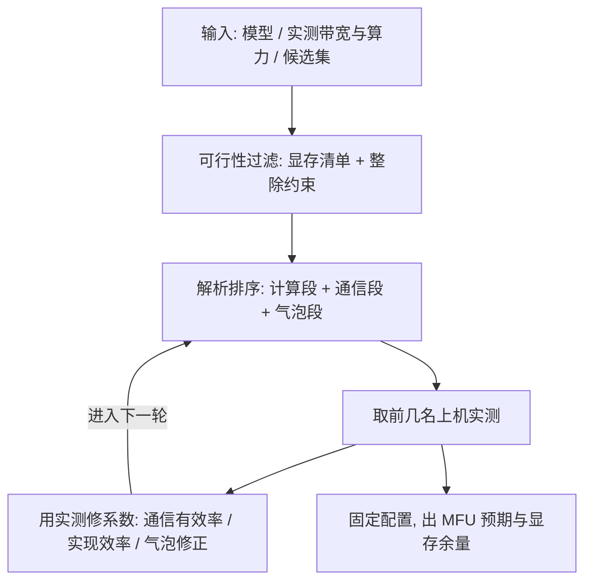

# 性能建模

性能建模的用处是在开机之前排除一半的配置；模型不必准到预测，够到排序就行。

<footer>—— 据 Huang 等 2019 与 Narayanan 等 2021 的分析口径整理</footer>

[上一课](/llm/dist-debugging)管跑起来之后的事；本课管开跑之前。前面各课给了单项机制——四轴的通信账、重叠的收益式、拓扑的链路容量、显存的三栏清单——本课把它们合成一个能算的模型：给定模型、集群与并行配置，在开跑之前估计 step time 与显存峰值，用它做配置搜索。

## 问题

没有模型时，配置选择靠网格试跑，每次试跑是小时级到天级的成本，而候选配置的空间是各维并行度的乘积，动辄上千。模型的价值是把空间先除以十：解析式排掉明显劣的与明显不可行的，剩下的交给实测。难点是「够准」：气泡、重叠、峰值三项要有解析式，实现效率类系数允许误差，识别哪些项必须准、哪些项可以糊，是建模的第一判断。

### 三段式

计算段：每层 FLOPs 约为参数量乘批乘序列的两倍量级，GEMM 时间按峰值算力乘一个实现效率系数折算，系数用一两次小规模实测拟合。通信段：按第一课对照表的原语体积，乘第 4 课的重叠结构（可遮的进 max，不可遮的进和），除以第 5 课的链路有效带宽，加 $\alpha$ 启动项。气泡段：PP 的气泡占比按 $(P-1)/(M+P-1)$ 的 GPipe 口径起算，1F1B 与交错调度的修正见[1F1B 与交错流水](/llm/1f1b-interleaved)；TP 的不可遮层内交换单列，不混进气泡。三段合成 step time，显存峰值直接复用上一课的清单——两张表一次出。

排序为什么比预测稳：实现效率这类系数在配置之间近似共享，做比较时分子分母同时出现，误差约掉大半。所以模型输出「配置 A 比配置 B 快三成」可信，「配置 A 绝对 380 毫秒」要打折。

## 方法

工作流四步：第一步输入固化——模型结构、卡型实测带宽与算力（不抄规格表）、并行候选集；第二步可行性过滤——显存清单过一遍，整除约束过一遍，斩掉大半；第三步解析排序——剩余配置按模型 step time 排序，取前几名；第四步实测校准——前几名上机，用实测回头修系数（通信有效率、实现效率、气泡修正），模型进入下一轮更准。MoE 配置在计算段加专家负载项：按路由统计的热度分布算最忙专家的时间，不用均值。跨 DC 或广域项按第 7 课的结构单独成段。

## 机制

为什么解析式能先于实测给出排序：step time 的主导项由「哪一段不可遮、不可并行」决定，主导项的量级由体积公式与链路带宽决定，两者都可以纸面算出；实现细节只修正常数，不改变量级序。模型什么时候失效：瓶颈落在解析式没建模的地方——数据管道、落后者尾延迟、故障恢复期、MoE 负载漂移；失效的信号是「实测与模型差出常数倍」，这时先补建模项而不是调系数。扩展律视角：固定其余维缩一维，从公式里读出每维的饱和点（TP 撞 NVLink 域、PP 撞气泡下限、DP 撞全局 batch），与第一课的缩放极限对照——模型把极限从口诀变成数字。

## 边界

模型不含故障与恢复的折损（容错课的账），不含损失质量（MFU 课的边界重申）；跨代硬件外推要重标带宽与算力比，异构集群按第 6 课分账后逐设备建小模型再取 max。经验值（MFU 高位、气泡修正）当先验不当定理。模型是文档资产：与显存清单同库维护，集群拓扑一变，通信段重标。最后一条边界：模型替你排除，不替你决定——最终配置仍要一次真实试跑验证 loss 与吞吐同对。

## 小结

- 建模的价值是排序与排除，不是绝对预测；实现效率系数共享使排序比数字稳。
- 三段式：计算（FLOPs 乘实现效率）、通信（体积乘重叠结构除链路带宽加启动项）、气泡（PP 口径加 TP 单列）。
- 工作流：固化输入、可行性过滤、解析排序、实测校准，系数随实测迭代。
- 失效信号是实测差出常数倍：先补建模项（数据、尾延迟、负载漂移）再调系数。
- 出处：Huang 等，GPipe，2019 的气泡口径；Narayanan 等 2021 的并行分析；显存清单与本课程前课联动。
