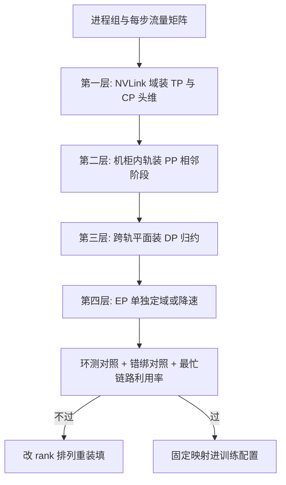

# 拓扑感知的并行

逻辑网格写在进程组里，物理网格写在交换机里；两个网格对不上，带宽表全部作废。

<footer>—— 据 DGX SuperPOD 一类参考架构与 Jiang 等 2024 整理</footer>

[上一课](/llm/dist-comm-overlap)把通信排进时间线；这些交换能不能按计划走完，取决于它们落在哪条物理链路。主干课的 [rail-optimized 拓扑](/llm/rail-optimized-topology)给了 rail 的定义，[拓扑感知放置](/llm/topology-aware-placement)给了放置的验收口径；本课深钻映射本身：进程组到链路的映射为什么是个约束满足问题、三类典型错法、以及映射的验证。不重讲 Clos 结构。

## 问题

同一份并行配置，映射不同，利用率可以差出两位数百分比。映射的本质是把「通信最密的组」放进「最密的子图」，同时不让任何一条链路的聚合流量超过它的物理上限。它难在约束互相咬：TP 要 NVLink 域、PP 想要跨节点均匀摊、EP 的 All-to-All 压根没有可聚合结构、DP 又想把尽量多的卡拉进同一个归约组。三类高频错法：把 TP 组绑到跨轨（配置写了 NVLink 域，启动脚本把 rank 顺序排错）；多个作业共享同一 rail 平面（各自的带宽模型都按独占算，跑起来互相拖）；EP 的 All-to-All 铺满跨节点（置换流量把轨的假设打穿）。

### 映射的次序

映射按通信密度从高到低装填。第一层，NVLink 域：TP 组整组落在单机八卡内，开了 CP 的头维组同样处理。第二层，机柜内轨：PP 的相邻阶段优先同轨相邻节点，让点对点只走一跳。第三层，跨轨平面：DP 组沿轨展开，让 rail-optimized 的同号对齐结构服务梯度归约；层次化的节点内先归约、节点间再归约，跨段只走每节点一份的体积。第四层，EP 单独算账：换头方案把 All-to-All 压进 NVLink 域，代价是头数要能整除；Ring 方案沿轨走跨节点，代价是时延。绑定、NUMA 与 GPU Direct 是映射的一部分：绑核错一档，等于没做 rail 优化。

映射验证的一条硬规则：启动后用与真实消息大小相同的微基准跑一遍环测，把 busbw 和物理上限对照；再用一次「故意错绑」的对照跑，确认错绑确实变慢——变慢不了，说明你的测量没接住映射，MFU 差异另有原因。

## 方法

把映射写成流量矩阵上的问题：每类进程组给出一组「谁和谁、每步多少字节」的边，链路给容量，目标是存在一种 rank 到设备的排列，使每条链路的利用率都不超过一。精确求解不现实也不必要，工程上按次序贪心装填再校验：装填完算最忙链路的利用率，它决定 step 的尾；利用率接近一的链路是下一步优化的靶子。多租户场景把「共享的轨」标成降容链路，带宽模型按共享比例打折——独占假设在共享平面上的误差不是小量。

## 机制

rail 为什么对归约友好：同号 GPU 对齐到同一上行平面，DP 组内任意成员间最多两跳，且每条上行链路只承载自己这一组的流量；层次化归约把这个性质用满。All-to-All 为什么打穿 rail：置换没有中间聚合点，$N$ 份流量各自去不同的目的地，轨的「同号对齐」帮不上忙，所以 EP 的放置要么整组进 NVLink 域，要么接受跨段降速。最忙链路决定 step 尾的机制与落后者同构：归约是全组合同，最慢的那条边把全组按住，平均利用率救不了尾。

## 边界

Clos 与轨的物理定义见 [rail-optimized 拓扑](/llm/rail-optimized-topology)及其前一课；NCCL 如何自行发现拓扑见[上一课](/llm/pretrain-comm)——注意库的发现只保证「走对链路」，不保证「排对 rank」，排 rank 是用户侧映射的责任。云上同型号实例不保证同拓扑，跨实例迁移后映射要重验。弹性事件后世界大小变了，映射作废、按新网格重放，这根线接到后课的容错链路。映射不是一次性的配置，是随拓扑与并行配置联动的资产。

## 小结

- 映射是约束满足：最密的组进最密的子图，任何链路利用率不超过一。
- 装填次序：NVLink 域收 TP 与 CP 头维，机柜内轨收 PP，跨轨平面收 DP，EP 单独定域。
- All-to-All 是置换，打穿 rail 假设；EP 要么进 NVLink 域，要么接受跨段降速。
- 最忙链路决定 step 尾；共享平面按比例降容，不信独占假设。
- 验证靠环测加错绑对照；映射随拓扑、配置与弹性事件重放。
- 出处：DGX SuperPOD 一类 rail-optimized 参考架构；Jiang 等，MegaScale，2024 的放置实践。
