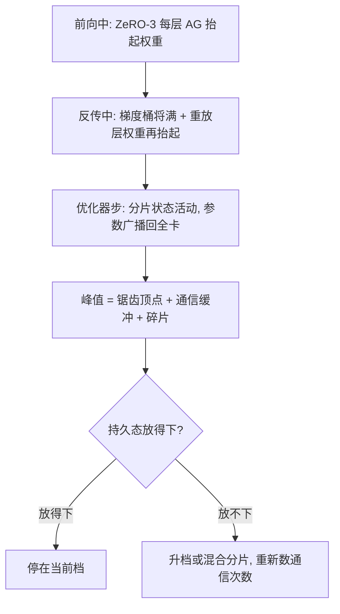

# ZeRO 的各阶段

档位是显存与通信时序的合同：第一刀几乎免费，第三刀开始为每一次前向付聚集税。

<footer>—— Rajbhandari 等，ZeRO 与 DeepSpeed 系列</footer>

[上一课](/llm/dist-parallel-deep-comparison)把四轴摆进一张对照表，DP 轴的冗余——参数、梯度、优化器状态全复制——被标成最便宜的优化起点。主干课的 [ZeRO-1 / 2 / 3](/llm/zero-stages) 给了三档的内存公式与通信模式；本课深钻公式之外的部分：峰值水位怎么随时刻涨落、档与档之间的过渡带、以及跨轴叠加时「参数在哪」的多套下标怎么读。不重推公式。

## 问题

公式给的是持久状态的稳态近似，训练真死在瞬时峰值：某层权重被 All-Gather 齐的那一瞬、梯度桶将满未满的一瞬，加上 NCCL 通道缓冲与分配碎片，都不在公式里。第二类缺口是叠加语义：ZeRO-3 聚集「逻辑完整层」时如果 TP 同时开着，聚集的是当前 TP 分片需要的那一块，不是整层；PP 叠上后，DP 分片组只在同阶段内成立。第三类是选档次序：什么时候停在 2、什么时候必须进 3，公式回答不了，要看通信时序。

### 按时刻记账

step 内取三个采样点：前向中、反传中、优化器步。ZeRO-1 与 2 的水位平缓——参数与梯度全程在卡上，优化器分片只在步末活动；ZeRO-3 的水位是锯齿——每层权重被抬起再放下，wrap 粒度决定齿距，prefetch 把整条基线抬高一点。把峰值读成「锯齿顶点加固定项」，比读 $16\Phi/N$ 更接近真实余量。

梯度累积场景里，ZeRO-2 的分片缓冲必须从第一个 microbatch 就按分片累积；先在完整缓冲里攒再分片，第二档的显存收益整段消失。这是「公式对、实现亏」的高频案例。

## 方法

过渡带的代价表：1 到 2，换来 Reduce-Scatter 的时序约束——反传一结束就散，不许攒整份 $\bar g$；2 到 3，每层 All-Gather 进关键路径，深而窄的模型先撞延迟区，再宽的层才开始被带宽区接管。3 之上的旋钮都是峰值与通信的交换：wrap 细则峰值低、次数多；前向权重留给反传用省一次通信、多占一份显存；prefetch 掩盖延迟、抬高水位。2 与 3 之间还有过渡档：节点内分片到第三档、节点间保持复制的混合分片，FSDP 的 HYBRID_SHARD 是这一档的现成接口，跨机聚集组被缩小，代价是单机容量成为下界。

## 机制

为什么三档的通信是阶跃而不是线性：第一档通信体积不变，只是更新顺手分了片；第二档起通信拆成 Reduce-Scatter 加参数 All-Gather 两笔，体积仍与 All-Reduce 同阶；第三档起每层前向、反传都要聚集，次数正比于层数乘 wrap 数——延迟项从这一档开始收税，这就是小模型上第三档反而慢的机制。跨轴下标是第三档的真实复杂度：检查点必须同时记录 DP 片与 TP 片；全局梯度范数跨分片归约，漏一次归约，等效裁剪阈值随卡数漂移；改卡数不是改配置，是按新 $N'$ 重切再恢复。这些约束与档位绑定，与框架名字无关。

## 边界

不重讲三档公式与 FSDP 档位对照（见 [FSDP](/llm/fsdp)）；offload 是第三档向存储层级的延长，不是第四种语义，见 [ZeRO-Offload](/llm/zero-offload) 与 [ZeRO-Infinity](/llm/zero-infinity)。ZeRO 切的是参数侧：激活的墙不归它管，序列并行与重计算是另一条轴，下一课接手激活侧。选档口诀不变：先看哪块显存先爆，再看增加的通信次数能否被计算盖住；两个条件都过了，才值得把刀切深一档。

## 小结

- 公式给持久态，训练死在峰值；按前向、反传、优化器步三个时刻记水位。
- 档间是阶跃：第二档改通信结构，第三档把聚集放进关键路径，延迟项从第三档收税。
- 混合分片（节点内深切、节点间复制）是 2 与 3 的过渡档，跨机聚集组缩小。
- 跨轴叠加时多套分片下标共存：检查点、梯度范数、重切分都要按两套下标对账。
- 出处：Rajbhandari 等，ZeRO / DeepSpeed 系列；PyTorch FSDP 的档位对照与混合分片口径。
