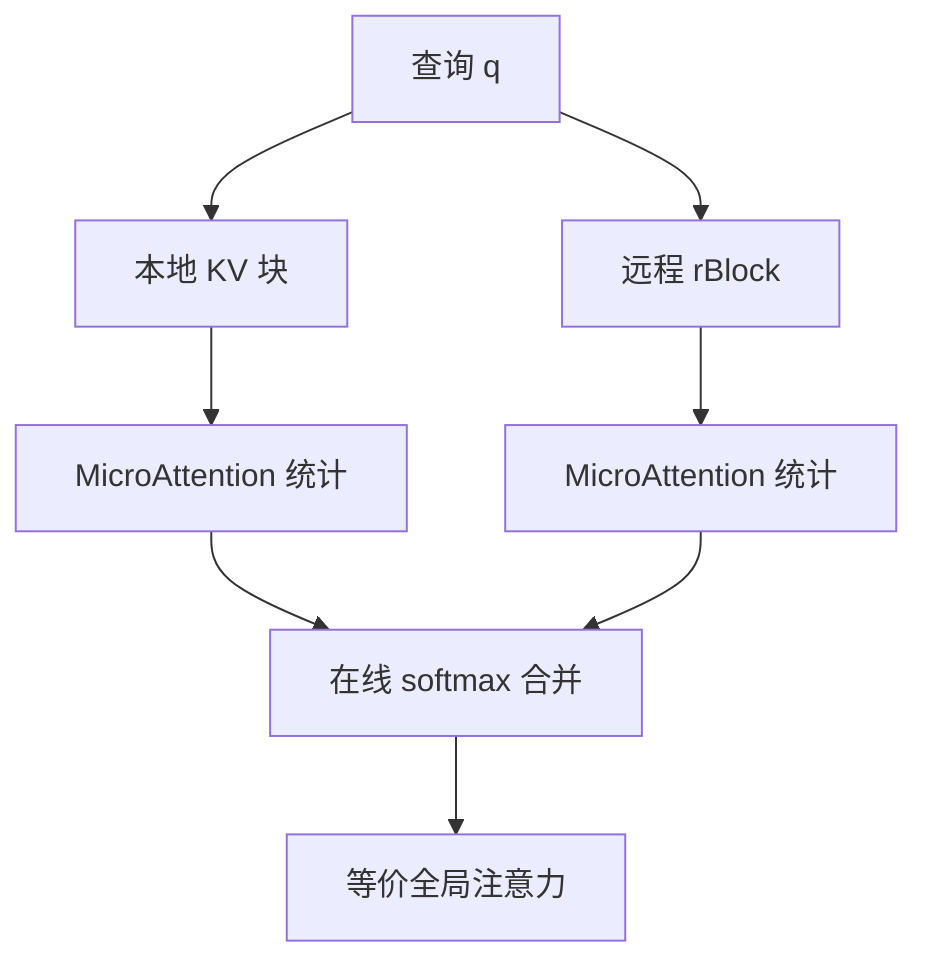

# DistAttention

    
沿动态序列维切开 KV，用在线 softmax 把局部 MicroAttention 合成全局注意力；解码时传的是查询和两个统计量，而不是整段 KV。

    <footer>—— Lin et al., Infinite-LLM: Efficient LLM Service for Long Context with DistAttention and Distributed KVCache, 2024</footer>

[Ring Attention](/llm/ring-attention) 为了精确全局注意力，让 KV 块在设备环上转；训练与超长 prefill 合适，逐步解码时每步都转 KV，通信体积是 MB 到 GB。阿里云 Lin 等人 2024 年的 Infinite-LLM 把问题换成**在线服务**：上下文从几千到近两百万 token，实例间负载和显存高度动态。他们提出 DistAttention：把 KV 缓存切成固定粒度的子块（rBlock），沿序列维把注意力算子拆到多实例上；每个实例只对本地 KV 做 MicroAttention，用在线 softmax 的代数把局部最大值与求和并回全局。解码阶段远程实例需要的是查询向量外加两个浮点统计，而不是把 KV 搬回来。其上的 DistKV-LLM / 调度器用 gManager 与各实例 rManager 在集群里租借显存。本篇写 DistAttention 这条等价变换与服务语义，不把整份集群调度论文的所有策略细节当作层定义。

## 问题

LLM 服务里注意力层与非注意力层的资源画像随自回归长度剧烈变化：MLP、LN 对已生成长度几乎常数，注意力的 KV 线性涨、逐步 GEMM 形状也变。静态张量并行按头切，能把一层拆开，但 KV 仍绑在持有该头的实例上，超长请求会把单实例 HBM 打满，同时短请求吃不满。序列并行 / Ring Attention 能切序列，解码却往往要移动大块 KV。

需要一种切分：粒度是序列上的任意长度片段，而不是整请求；数学上等于 MHA / MQA / GQA；增量解码时不要为了「看见远端 KV」而把远端 KV 拉回本地。在线 softmax 已经证明：全局 softmax 可以由分块的 $(m,\ell,O)$ 合并得到。DistAttention 把这条代数从单机 Flash 搬到跨实例，并让通信对象变成 $Q$ 与标量统计。切的是 KV 的序列维，不是模型权重。权重仍可按原 TP/PP 放置；注意力计算可以「借」别的实例上的空闲 HBM 来放 KV 子块。

## 方法

### MicroAttention 与统计合并

将请求的 KV 划成若干块 $\{\mathrm{KV}_p\}$，块可以驻留在不同实例。对当前查询 $q$（decode 时长度为 1，prefill 时为一段），实例 $p$ 计算局部

$$
m_p=\max_j(q^\top k_j^{(p)}),\quad
\ell_p=\sum_j e^{q^\top k_j^{(p)}-m_p},\quad
O_p=\sum_j e^{q^\top k_j^{(p)}-m_p}v_j^{(p)}.
$$

这就是 MicroAttention。全局

$$
m=\max_p m_p,\qquad
O=\sum_p e^{m_p-m}O_p,\qquad
\ell=\sum_p e^{m_p-m}\ell_p,\qquad
y=O/\ell.
$$

与单机分块 softmax 相同。跨实例时，远端不必回传 $\mathrm{KV}_p$，只回传 $(m_p,\ell_p,O_p)$；本地把 $q$ 发给持有该块的实例（decode 下 $q$ 是 KB 级）。论文强调：相对 Ring Attention 传整块 KV（MB–GB），这里通信小一到两个数量级，测得在 4K–256K、LLaMA2-13B、四卡设定上可比 Ring 快数倍到一个数量级，并略快于按头切的 TP（头切仍要为注意力同步较大激活）。

等价性覆盖 MHA、MQA、GQA：切的是序列，头的布局可以仍按原模型；MQA 的共享 KV 只是块更瘦。新生成的 token 作为新的小块追加、调度，而不必重分整段缓存。

### 与非注意力层解耦

Infinite-LLM 进一步把注意力层与 MLP 等从调度上拆开：KV 子块可以离开「跑 MLP 的那个实例」，注意力与非注意力用不同并行度。这不是改变 Transformer 公式，而是允许集群级的显存池化。短请求的实例若 HBM 有余，可以当 creditor 承接长请求 debtor 的 KV 块；debtor 本地仍算一部分 MicroAttention，使远端计算与传输尽量被本地算力盖住——调度目标明确写成「远程 MA 不要让 debtor 空等」。

### DistKV 与管理平面

gManager 维护全局视图：谁是 debtor/creditor、各实例显存与 batch。rManager 在实例内做块的分配、迁移、与心跳。迁移 KV 发生在调度决策时（相对低频），与逐步 decode 的 $q$ 传输分开：前者走大块 DMA 并与计算重叠，后者每步都发生但体积小。系统在 32×A100、上下文到约 1900K–2000K 的评测里给出相对当时服务系统 1.03–2.4× 吞吐、以及 2–19× 可服务上下文长度一类数字。这些倍数是整系统的，含调度与池化，不是单独把 DistAttention 核换进 vLLM 就自动获得。算法贡献是「序列维可切且 decode 不搬 KV」；倍数还依赖租借策略是否把远程 MA 压在本地计算阴影里。

## 机制

公式层面 DistAttention 不发明新的相似度，只发明**分布式归约方案**。在线 softmax 的可结合性让「先局部再全局」合法；若直接切序列却在每块上独立 softmax 再加权，结果不等于全局注意力——那是近似。必须传 $m_p$ 与 $\ell_p$，不能只传 $O_p$。

Decode 传 $q$ 而不传 KV，是因为 KV 已经在远端，算子是 $q$ 去就数据。Prefill 若 $Q$ 也很长，把整段 $Q$ 广播到所有 KV 持有者会贵，需要按块调度 $Q$ 或让 $Q$ 与对应 KV 共址。论文的服务场景以decode 拉长上下文为主，prefill 仍可能走实例内或有限并行。

与 Ring Attention 的机制差在遍历方向：环让每个 $Q$ 块看见流动的 KV，通信对象是 KV；DistAttention 让每个 KV 块看见送来的 $q$，通信对象是 $q$ 与统计。训练也可以用后者，但原文是服务系统，没有把大规模预训练当作主实验。

## 边界与工程取舍

网络延迟若大于本地注意力时间，debtor 仍会空等，收益被吃掉。creditor 接过多远程 MA，自己的 batch 会掉——论文用贪心配对限制远程块大小。故障时 KV 块跨机，恢复比单实例分页更难，需要复制或重计算策略，原文的重点在吞吐与长度，不是容错完备性。

不要在单机、短上下文上用 DistAttention：多一次 RPC 没有 KV 压力可抵。与分页注意力正交：本地仍应用 [PagedAttention](/llm/paged-attention) 管块；DistAttention 管块驻留在哪台设备。与 PD 分离也可叠加：prefill 实例把 KV 块登记进池，decode 实例按 DistAttention 去拉统计，而不是把整段 KV 迁到 decode 引擎——具体能否重叠取决于实现。

评测数字绑定在 2024 年对照系统与 32 卡集群；今日应在目标互连上重测「传 $q$+统计」对「传 KV」的交叉点。数学等价在 FP 上有归约顺序差异，极端长序列要用足够精度存 $m,\ell$。DistAttention 解决的是服务期动态长度与集群显存碎片，不是降低注意力 FLOP。超长请求的二次计算仍在，只是可以摊到闲卡上，并避免 decode 搬运 KV。

## 小结

- DistAttention 沿序列维把 KV 切成 rBlock，用在线 softmax 合并 MicroAttention，等价于 MHA/MQA/GQA。
- 解码通信以查询与 $(m,\ell,O)$ 为主，避免逐步搬运 KV；这是相对 Ring Attention 的服务向差异。
- 注意力与非注意力可分调度，KV 可租借到空闲实例，形成集群显存池。
- 收益取决于远程 MA 能否被本地计算掩盖，以及迁移 KV 的频率。
- 短上下文、单机、高延迟互连上不值得启用。
- 与分页、张量并行正交；总 FLOP 仍随上下文二次增长。
- 出处：Lin et al., *Infinite-LLM: Efficient LLM Service for Long Context with DistAttention and Distributed KVCache*, 2024。
