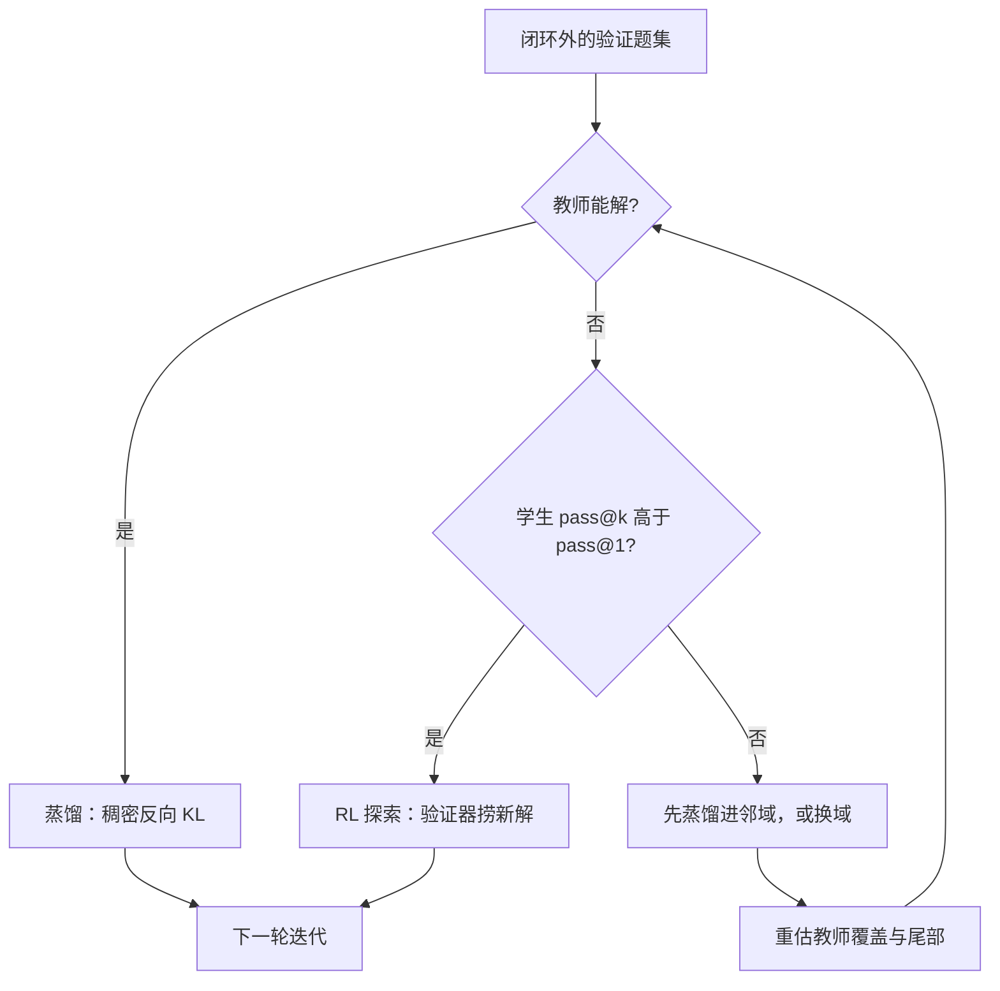

# 蒸馏保底与探索上限

蒸馏搬运教师分布里已有的东西，探索购买分布外的新解；把两者混为一谈的闭环，要么把重复当进步，要么把浪费当探索。

<footer>—— Agarwal 等, On-Policy Distillation of Language Models（2023）；Qwen3 Technical Report</footer>

[上一课](/llm/weak-to-strong-closure)说弱奖励能激发强先验，但那是监督侧的故事；闭环里还有一个更日常的分叉：每轮迭代的能力增量，该走蒸馏还是走探索。蒸馏把教师分布搬进学生——[on-policy 蒸馏](/llm/on-policy-distillation)以学生自己的 rollout 为底、逐步反向 KL 当稠密奖励，代价约为 RL 的十分之一；探索用验证器在学生自己的分布里找教师没有的解。本课写两者的分工边界与判据，不重写 [RLVR](/llm/rlvr) 的机制。

## 问题

失效各有对称面。只蒸馏的闭环安全、便宜、可复现，但天花板是教师的支撑集：教师没走过的分叉，学生一步也学不到；若目标能力是「解决教师也解不出的题」，蒸馏在结构上不可能。只探索的闭环相反：稀疏的 0/1 奖励在能力不足的学生上几乎是噪声，格式与基本推理会被探索噪声打碎，训练成本高出一个量级。常见的两个错：把前者当进步——每轮指标都在涨，涨的全是教师会的东西；或把后者当算力问题，以为探索不足用更大的批量就能砸出来，实际上学生支撑里根本没有可捞的解。

## 方法

分工的判据用两个数：教师覆盖与 pass@$k$。对一批闭环外的验证题，先看教师能否解，再看学生 pass@$k$ 相对 pass@1 的尾部。教师解得出、需求只是把行为对齐到学生——纯蒸馏：能力已在分布内，on-policy 蒸馏的稠密信号最省，Qwen3 的账是 1,800 GPU 小时到 AIME 74.4%，而 RL 花 17,920 小时只到 67.6%。教师解不出、但 pass@$k$ 明显高于 pass@1——探索有真实空间：学生偶尔摸到验证器接受的解，策略梯度能把它从尾部捞成主流，此时蒸馏无货可搬。两头都低——先蒸馏拉进邻域或换域，空支撑上的探索是纯噪声。

## 机制

上限差异来自信号结构。蒸馏的每 token 梯度都钉在教师的条件分布上，信息密、方差小，但目标函数的极值在教师分布之内——反向 KL 的模式寻求也只是在教师支撑里挑学生能到的模式。探索的信号在序列末尾只有一个比特，可它由环境真值签发：一个教师从未产出的新解法，只要过验证器就有正梯度。这是自训练闭环里唯一结构性地超越教师的通道，也是弱到强问题的可验证解法。代价在方差与越界：奖励稀疏时优势估计噪声大，验证器有缝时探索会优先钻缝——过优化与奖励黑客是探索税，[RLVR](/llm/rlvr) 的过优化记录就是账单。

pass@$k$（Chen 等 2021）是 $k$ 条采样至少一条通过的比例。pass@$k$ 高而 pass@1 低，说明解已在学生分布的支撑里、只是排序不行——这正是 RL 的领地；蒸馏对这种「会而不稳」也有效，区别是它只能搬教师已有的排序。

## 边界

蒸馏就够的情形比想象多：风格与格式对齐、把已验证行为迁到更小的模型、以及验证器太弱不敢让探索跑的域——最后一条是防奖励黑客的保守选择。必须探索的情形：教师覆盖不到的前沿题型，以及 [推理蒸馏到小模型](/llm/reasoning-distill-small)说过的处境——学生学的是文本痕迹，不是产出痕迹的搜索能力。最常见的谎报是拿蒸馏学生的涨分当探索成果；审计办法是查训练数据来源：每条有效梯度是否都来自教师签发的分布，还是至少有一部分来自验证器对新解的判定。

## 小结

- 蒸馏的上限是教师支撑集；探索是闭环里唯一结构性的超越通道。
- 判据看教师覆盖与 pass@$k$：能力在分布内时蒸馏便宜一个量级。
- 教师解不出且 pass@$k$ 有尾部，才值得开探索。
- 弱验证器下的探索先学会钻缝，探索税要用验证器审计来付。
- 出处：Agarwal 等（2023）与 Qwen3 报告的成本对照；pass@$k$ 出自 Chen 等 2021。
