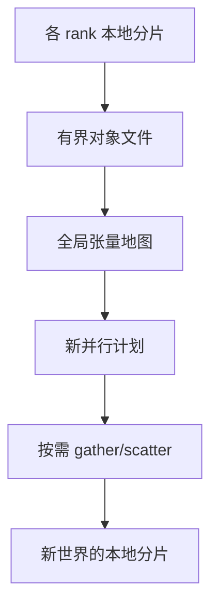

# 分布式检查点格式

每个 rank 只写自己持有的参数分片，读的时候按新的 TP/PP/EP 度重新切块；检查点是一张可重切的张量地图，不是一份绑死进程数的 pickle。

<footer>—— 据 PyTorch Distributed Checkpoint 与 Megatron 分布式保存的设计整理</footer>

[上一课](/llm/async-checkpointing)让 writer 在后台落盘。若格式是「rank i 的 state_dict 整包」，恢复时世界大小一变就读不出来，弹性训练无从做起。本课不重讲异步拷贝。缺口是分片元数据：每块张量的全局形状、沿哪一维切、当前分片偏移，使加载器能把磁盘上的碎片拼成任意并行拓扑下的本地分片。掉卡后的弹性、换机型续训，都吃这张地图。

## 问题

TP 列切的权重、PP 不同阶段、EP 不同专家、ZeRO 切的优化器状态，四套切分可能同时存在。同步 gather 成完整模型再存，体积与带宽都不可接受，也破坏异步。必须分布式写。读侧却经常换拓扑：调试用更小 TP，生产用更大 EP。格式若把 rank 号写死，等于把并行策略焊进磁盘。

元数据还要版本化：字段增删、dtype（BF16 参数 + FP32 矩）、MoE 专家数变化，都要能拒绝加载或做声明过的转换，而不是静默 reshape 成功。

### 与词表、数据游标

嵌入矩阵随词表扩展加行，检查点必须记录 $|V|$ 与 id 契约。数据游标、RNG、累积进度、退火阶段号，与权重同一清单发布。缺一项，训练重放课无法对齐。

「每个 rank 一个文件」在百万文件的并行文件系统上会崩溃。应聚合成有界数量的分片文件，由元数据索引，而不是进程数等于文件数。

## 方法

采用显式的 tensor-shard 表：逻辑名、全局 shape、切分轴、dtype、校验和、文件偏移。PyTorch DCP、Megatron dist-ckpt 走这一路。写时只写本地分片；读时根据当前并行计划计算需要的字节范围，可能从多个文件 gather 再 scatter 到本地。改 PP 度等于按层边界重新分组，不改权重数值。改 TP 度等于沿隐藏维重切。改 EP 度等于专家列表重分配。

发布过程：所有 writer 完成后写一份不可变的 metadata.json（或等价），再用原子替换更新「latest」指针。异步课的全局 AND 完成标志，指的就是这份 metadata 的发布。

### 校验与部分加载

允许只加载模型不加载优化器（推理或换优化器），但必须显式。部分专家缺失应失败。嵌入行数与当前词表不一致应失败或走扩展课的加行协议，禁止截断静默发生。

跨精度续训（FP8 权重如何还原）要有文档化的反量化，不属于本课发明格式，但元数据必须标注量化方案。

## 机制

检查点是参数张量在存储上的另一种并行布局。训练时的布局为计算与通信优化；存储布局为持久化与重切优化。两者通过元数据同构。弹性训练改变的是计算布局，不改变逻辑张量；格式是同构的见证。

## 边界

格式不提高保存带宽；异步与并行文件系统仍然决定墙钟。它也不能把不兼容的结构（层数变了）变兼容。下一课在这张可重切地图上做世界大小变化：掉卡后少几台机器继续训，或加机器加速，而不从头读一个假想的完整权重。

## 小结

- 本课不重讲异步 IO；只补可重切的分片元数据。
- 逻辑张量 + 切分轴 + 有界文件 + 原子 metadata 发布。
- 改 TP/PP/EP 是重切不是换模型；词表行数与游标必须同清单。
- rank 号不得焊进唯一可读路径。
- 出处：PyTorch Distributed Checkpoint；Megatron 分布式检查点；对照 ZeRO 分片状态。
