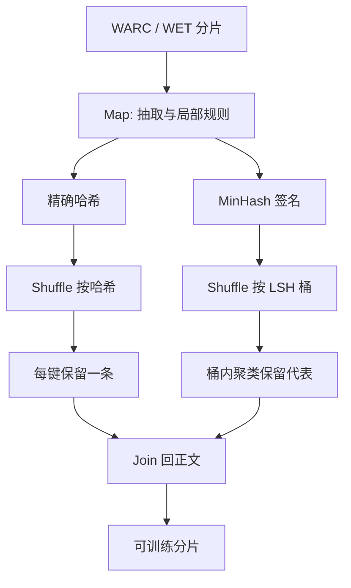

# 分布式清洗

网页清洗的规则并不难写；难的是让过滤、哈希与近重复检测在 PB 级抓取上以可复现的 shuffle 完成，并且不在全局去重时把集群打满。

<footer>—— 综合 CCNet、C4、Dolma 与 FineWeb 的规模化实践</footer>

单机脚本足以讲清「去标签、丢脏行、算哈希」。预训练语料却来自 Common Crawl 量级的 WARC 与衍生文本，单机既装不下，也无法做全局近重复。分布式清洗把同一条启发式与去重管道铺到 MapReduce / Spark / Ray 一类引擎上：局部能做的过滤尽量不做 shuffle，必须全局可见的指纹再集中。本篇写这条工程约束，以及它如何决定 [网页清洗](/llm/web-clean-dedup) 与 [MinHash 去重](/llm/minhash-dedup) 在集群上的切分方式。规则内容仍归那些篇章；这里管的是数据如何动。

## 问题

清洗管道通常是：解析 → 正文抽取 → 语言识别 → 启发式 → 精确去重 → 近重复去重 → 写出分片。前几步对单文档封闭，天然 map：每个 worker 读一段 WARC 或一批 HTML，写合格文本。精确去重需要「这个哈希全世界见过没有」，近重复需要「这些 MinHash 桶里谁和谁过阈值」。后者强迫一次或多次按键重分区。PB 级 shuffle 的网络、磁盘与倾斜（热点域名、模板页产生相同指纹）才是墙钟与失败率的来源。

可复现性是第二约束。随机丢弃、依赖 worker 本地缓存「我见过这个哈希」、或按到达顺序保留第一份，都会让同一份抓取在不同集群上得到不同语料。预训练要能回答：这个 checkpoint 对应哪一次清洗的哪一版阈值。分布式系统默认的「尽力去重」不够；需要定义全局顺序（例如按 URL、记录 ID 或内容哈希排序后保留一条）以及把配置与代码版本打进清单。

### 局部过滤与全局指纹

把工作分成两类。第一类：行级规则、长度、语言、安全分数、PII 正则，输入是一篇文档，输出是保留或丢弃（或改写）。这类应在 map 端做完，失败可重试单分片。第二类：精确哈希集合、MinHash LSH 桶、跨文档的子串索引，输出依赖其他文档。第二类必须 shuffle。过早把第一类也做成全局任务（例如为了「统计词频再过滤」而全表聚合），会把简单规则变成一次额外的全量作业。CCNet 一类管道的经验是：语言模型质量过滤可以按语言分桶后在桶内做，但仍尽量避免无意义的跨语言大 shuffle。

「我们用了 Spark」不等于做了全局去重。若只在 partition 内 drop_duplicates，跨分片的镜像页会留下。报告去重必须写清楚键的作用域：分片内、按域名、还是全集。Lee 等人的记忆与泄漏结论，默认假设的是语料级去重。

## 方法

实现上常见三层作业。作业 A：扫描 WARC / WET，抽取文本，打语言与启发式标签，写出「通过的文档 + 精确哈希 + MinHash 签名」，分区键用哈希，避免按 URL 主机倾斜。作业 B：按精确哈希聚合，定义保留规则（最短 URL、最早 crawl date、或字典序最小记录 ID），广播或 join 回文档表，丢掉重复。作业 C：按 LSH 桶号 shuffle，桶内两两或并查集聚类，再按簇保留代表。桶大小要可控：band 太多，shuffle 键爆炸；band 太少，漏检上升。倾斜桶（极常见的导航模板）需要单独限额或先按精确哈希杀掉。

编排可用 Spark、Beam、Ray Data 或自管的文件级 map。关键不是品牌，而是：中间格式列式且可分片（Parquet / Arrow）、作业幂等、检查点落在对象存储。失败重跑不得改变保留集，因此排序键必须是数据内字段，而不是 `first()` 碰上的非确定顺序。小语种分片可能极不均匀，语言识别之后按语言再分区，能让后续分类器与词表规则在合理的文件大小上运行。

### shuffle 的预算与近似

全局精确去重的 shuffle 量大约是「每篇一个哈希」，相对正文已经很小。MinHash 每篇 $k$ 个签名再切成 $b$ 个 band，shuffle 记录数是 $b$ 倍文档数；签名本身很短，但仍可能压过抽取作业的输出。可以先在 mapper 做局部 combine（同一分片内先并掉相同 band 键），减少网络行数。若集群预算不够，退化为「先按域名近重、再对抽样做全集 MinHash」会改变质量，必须当作不同配方记录，而不是同一管道的静默降级。

## 机制

分布式清洗的正确性机制是「键的语义 = 去重的语义」。精确哈希键相等当且仅当规范化后的字节（或规范化文本）相等；LSH 键相等只表示「有机会相似」，桶内还要算 Jaccard 或核对原文。把 LSH 键误当成精确键，会误杀主题相近的独立文章。保留代表的机制则是全序：所有 worker 对同一键选出同一个赢家，作业才可复现。

性能机制是减少跨机移动的字节。正文应尽量留在对象存储的列式文件里，shuffle 只移动指纹与文档 ID，最后用 ID join 回正文。这与数据库里「先滤键再回表」相同。倾斜机制要用加盐或对超大桶改策略：模板页若进入同一 MinHash 桶，单一 reducer 会 OOM；先用精确去重与启发式切掉模板，是在保护后面的近重作业。

质量分类器若要全局校准阈值，需要一份持有分数的样本分布。用单个 worker 的局部百分位当阈值，等于每分片一套质量定义。应先对抽样算全局分位数，再广播阈值做第二遍 map。省掉这一步会在「好像过滤了」的同时让各语言、各 dump 月度不可比。

### 与单机管道的语义对齐

研究脚本用 Python 循环实现的规则，搬到集群时最常见的漂移是：Unicode 规范化不一致、HTML 抽取器版本不同、换行与空白折叠不同，导致精确哈希对不齐。分布式作业应把规范化函数与抽取器版本钉死在镜像里，并用一小份金标准分片做回归：单机与集群的保留集合应对齐。不能对齐时，以集群为准并记录差异，而不是混用两套语料却共用同一个数据卡。

## 边界与工程取舍

不是每一步都该分布式。十 TB 以下、迭代规则频繁时，单机或多机文件级 map 更便宜。集群的价值在全局去重与每月增量抓取的增量指纹表。增量清洗要维护「历史哈希集」：只对新区做抽取，但去重键仍相对全集，否则每月 dump 会把旧新闻再喂进去。隐私与安全过滤的模型若很大，可以先抽特征再集中推理，或用批推理服务，避免在每个 mapper 里各加载一份 7B 分类器。

失败模式包括：静默跳过坏 WARC 记录导致召回下降、对象存储列表截断、以及「作业成功但输出分区数为 0」。需要行数、字节、语言直方图、去重前后计数的作业级指标。没有这些计数，分布式清洗只是一次昂贵的复制。

去重过猛会伤害长尾语言与论坛对话：同一模板问候语被当成近重。阈值与簇保留策略应按语言分桶，并在下游探针上看是记忆下降还是能力下降。集群效率优化不得偷偷收紧阈值。

## 小结

- 分布式清洗把封闭过滤放在 map，把精确与近重复放到有全序保留规则的 shuffle。
- 可复现性依赖数据内排序键与钉死的抽取 / 规范化版本，而不是 `first()`。
- Shuffle 只移动指纹与 ID，正文回表；倾斜桶要先被启发式与精确去重削掉。
- 分区内去重不是语料级去重；报告时必须写作用域。
- 增量 dump 仍应对历史指纹集去重，否则时间维复制会回来。
- 单机与集群语义要用金标准分片对齐。
- 出处：Wenzek et al., CCNet；Raffel et al., C4；Soldaini et al., Dolma；Penedo et al., FineWeb / RefinedWeb。
