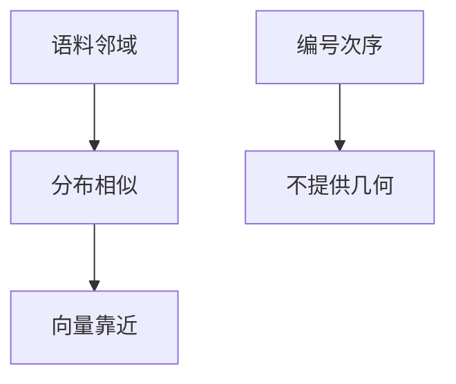

# 词向量与分布假设

词的意义不能从字母形状读出，而要从它出现在何种邻域读出；把邻域统计收成向量，相似的分布就变成相近的点。

<footer>—— 据 Harris, Distributional Structure, Word, 1954；Firth, A Synopsis of Linguistic Theory, 1957 整理</footer>

[Dropout 直觉](/llm/dropout-intuition)收束了前馈单元。本课起进入「序列与注意力之前」，不重写 MLP。缺口是：符号本身没有欧氏几何，而矩阵乘与余弦都需要向量。方法是分布假设——邻域相似则意义相似——把离散词收成 $\mathbb{R}^d$ 里的点。skip-gram 的具体损失是下一课；词表怎么切是更后面。本课只把「为何向量化」钉住。

## 问题

上一单元的对象是 $\mathbb{R}^d$ 里已经存在的 $x$。自然语言给出的是符号 $w\in V$。one-hot 有几何，但是正交的：任意两词内积为 $0$，范数全 $1$，上一课的余弦没有东西可学。缺口不是再加一层 ReLU，而是承认意义来自用法：若两个词能出现在相近的上下文里，它们在表示里应当靠近。Harris 与 Firth 把这写成语言学命题；本课把它收成后课词向量的公理。

分布假设不指定窗口大小，不指定是预测上下文还是预测中心词，不指定向量是稠密还是稀疏计数。那些是估计方法。本课禁止的是另一条路：用字母编辑距离或用本体图谱的边来当默认度量——可以当辅助，不能替代「看邻域」。

### 分布相近不是「同义词」

「银行」的金融义与河岸义邻域不同，一个符号会对应多个分布，因而一个向量会混合。反义词常出现在同一模板里（「好」与「坏」），分布可以很近。假设保证的是**用法**相近，不是辞典里的同义。后课评价词向量若只用同义词表，会把这项错位当成模型失败。本课把评价对象说清：邻域预测，不是词典对齐。

计数矩阵（词—上下文共现）已经是一种分布表示，行向量可以做 SVD。神经网络词向量是同一假设的参数化估计，便于接到非线性与反向传播里。本课两者都算「分布表示」，下一课才专讲预测式目标。

## 方法

为每个 $w\in V$ 分配 $e_w\in\mathbb{R}^d$。相似性用余弦（见[范数、余弦与投影](/llm/norm-cosine-projection)）。训练信号来自语料里的邻域：窗口内共现为正例。本课不写 softmax 公式。只需规定：几何由数据里的共现塑造，不由编号次序塑造——id 相邻不提供归纳偏置。这与嵌入查找课将要强调的「编号无度量」是同一句话，放在基础课的两端。窗口是否跨过句号或段落边界，会改变「邻域」的定义，必须在数据流程里声明，不在向量公式里偷偷改。

## 机制

一旦词是向量，上一单元的全部算子都能作用：矩阵乘混合坐标，余弦检索近邻，softmax 把「哪个词该出现在窗口里」变成分类。语言模型稍后会把「窗口」拉成「整个左侧上下文」，但公理不变：符号的内容来自它参与过的条件分布。没有这条，后课 Word2Vec 只是又一次分类，看不出为何输入是词而不是像素。

维数 $d$ 是容量：太小则许多用法挤在同一方向上，余弦分辨不开；太大则稀有词的坐标几乎由噪声决定。本课不选 $d$，只要求承认几何的轴来自估计，不来自字母表顺序。停用词几乎出现在所有邻域，会把许多向量拉向同一「语法背景」方向，实践中往往下采样——这是数据侧对假设的修正，不是推翻假设。

多义词、反义词、稀有词，都是这条公理的边界现象，不是推翻。稀有词邻域少，向量靠近初始化——与长尾梯度稀疏是同一统计。跨语言的「同一指称」不必靠近，除非平行语料把它们放进可对齐的邻域；单语分布假设不自动给出翻译几何。

## 边界

本课不写 skip-gram 的 $U,V$ 两张表，不写负采样。下一课[Word2Vec skip-gram](/llm/word2vec-skipgram)才把「用中心词预测窗口」写成可训目标。后课默认：词的可学习向量来自分布假设；比较两词先看余弦，且不把同义词表当成唯一金标准。也不从像素或语音波形另起一套「分布」，本课的邻域是符号串上的窗口。

## 小结

- 符号 one-hot 正交，没有可用的余弦几何。
- 分布假设：邻域相似则向量应靠近；几何来自共现，不来自 id。
- 用法相近不等于辞典同义；多义与反义是预期现象。
- 计数分解与预测式词向量是同一假设的两种估计。
- 几何的轴来自共现估计，不来自字母表或 id 次序。
- 出处：Harris, 1954；Firth, 1957。
