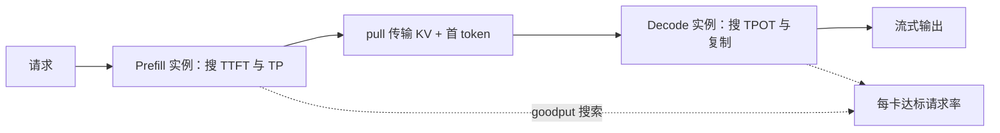

# DistServe PD 分离论文

    
Prefill 偏计算、decode 偏带宽，绑在同一张 GPU 上会互相抢时间和并行策略；拆到不同实例，才能各自满足 TTFT 与 TPOT，并按阶段搜资源。

    <footer>—— Zhong et al., DistServe: Disaggregating Prefill and Decoding for Goodput-optimized Large Language Model Serving, OSDI 2024</footer>

Zhong、Liu、Chen、Hu、Zhu、Liu、Jin、Zhang 的 DistServe 把「前填与解码该不该拆开」写成一篇 goodput 论文，而不是一篇异构硬件论文。一次生成先算完整提示、写出 KV、得到首 token（TTFT），再逐步吐后续 token（TPOT / TBT）。Colocate 系统把两阶段编进同一连续批：长前填插入时解码步被拉长，解码占着 HBM 时前填又凑不齐算力。并行策略也被耦合：为 TTFT 加的张量并行可能伤害解码的 All-Reduce 账，为吞吐加的流水线可能伤害单请求延迟。DistServe 拆到不同 GPU 实例，按 TTFT 与 TPOT **同时**达标来搜每阶段的卡数与并行，优化的是满足双 SLO 的最大请求率。概念综述见 [PD 分离](/llm/pd-disaggregation)，KV 怎么搬见 [KV 传输](/llm/pd-kv-transfer)。本篇钉 OSDI 论文的指标、搜索与数字。

## 问题

两阶段的屋顶线不同。前填在提示不算极短时接近 compute-bound：序列长，GEMM 能喂饱 Tensor Core。解码每步一个新 token，却要读全部权重与日益增长的 KV，接近 memory-bound。两者的最优 batch、最优并行、甚至最优复制因子都不同。绑在一起时，调度只能优先其中一个 SLO，或靠超配同时满足两个。

[Chunked prefill](/llm/chunked-prefill) 加 piggyback 能减轻解码被单次长前填堵住，但 DistServe 指出干扰并未消除。块太小则前填自己不饱和且与解码争用；块大到饱和则几乎拼不进解码；前填还会重复扫 KV，多付内存访问。并行耦合是第二层：intra-op 降执行时间、要 NVLink；inter-op 扩速率、少降延迟。Colocate 实例只能选一套。拆开之后，前填实例可以按紧 TTFT 走更大 TP，解码实例按 TPOT 与 KV 容量走复制或不同的 PP。

### Goodput 不是吞吐

吞吐可以靠牺牲延迟堆上去。DistServe 优化的是在 TTFT 与 TPOT **同时**满足（评测里对 $>90\%$ 请求达标）时，每 GPU 能吃的请求率。这个指标让「拆开之后多复制了一份权重」的代价可见：权重多占卡，但若干扰消失、并行更贴合，达标速率仍可升。只报吞吐，分离看起来永远赢，因为可以把延迟藏在队列里。

实例（instance）在 DistServe 里是「一份完整模型权重对应的资源」，内部可以有多卡模型并行。拆分后有 prefill 实例与 decoding 实例，权重至少两份。不要把「一张卡既做 P 又做 D」还叫做这篇论文里的分离。

## 方法

请求进入 prefill 实例，只算提示、产首 token 与 KV，再把中间状态交给 decode 实例继续生成。Decode 计算利用率低时，可以多个 prefill 实例对应一个 decode 实例，让 decode 侧堆起更大的连续批，把带宽墙推向计算墙。资源搜索分两层：先在单副本上为两阶段分别选 GPU 数与并行策略，使每卡 goodput 最大；再用复制把该配比扩到目标流量。

放置还要看集群带宽。OPT-66B、512 token 的 KV 约 1.13GB；若平均 10 请求/秒，需要约 11.3GB/s（约 90Gbps）才能让传输在流水线里「看不见」。跨节点 InfiniBand 足够时 P/D 可任意节点对；节点内 NVLink 强、跨节点弱时，要把对应层段放进同一节点，让 KV 走 NVLink。传输采用 pull：decode 按需来取，P 侧 GPU 内存当队列缓冲，两边各按自己的节奏跑。突发时压力表现为 P 侧缓冲涨，而不是 D 侧立刻 OOM。

### 和同期分离工作的分工

正文把 Splitwise、TetriInfer、DéjàVu 列为同期。DistServe 的差异是：指标用双 SLO 下的 goodput，方法用带宽感知的实例放置与并行搜索，而不是先讲异构卡代数或功耗帽。Splitwise 可以读成「表征 + 异构池」；DistServe 读成「同构集群上如何把拆分搜到最优」。两者互补，不要合成一篇虚构的「PD 分离原论文」。

论文报告在多种模型与聊天、编程助手、摘要负载上，相对当时 colocate SOTA 可达约 7.4 倍请求率，或在同等速率下约 12.6 倍更紧的 SLO。数字钉在他们的引擎与负载上。模拟器先搜配置，再上真实运行时验证，避免把笛卡尔积全跑在 GPU 上。

TTFT 在分离后包含排队、prefill 执行与 KV 传输。若把传输算到 TPOT 里，SLO 归属会错，搜索机会往错误的池加卡。评测定义要在论文实验节里对拍，不能沿用 colocate 的计时切法。

## 机制

机制是消除时间轴上的互抢，以及解开并行搜索的笛卡尔积。Colocate 的每一步 iteration 里，prefill token 与 decode token 争 SM、争 HBM 带宽、争调度槽。拆开后，P 实例的迭代全是高算术强度，D 实例的迭代全是逐步 decode，CUDA Graph、并行度都可以按阶段固定。代价是 KV 必须在阶段边界移动，且权重复制。当传输时间小于从前干扰造成的等待，goodput 上升；当传输是墙，分离失败——所以放置算法是方法的一部分，不是运维附属。

Pull 队列是突发阀。大量 KV 同时涌向 decode 会打满 D 侧显存；让 D 按需来取，P 侧做缓冲，两边节奏解耦。没有这类阀门，分离系统会在峰值上比 colocate 更脆——colocate 至少「慢在同一张卡上」，分离会「D 侧 OOM、P 侧还在狂写」。

### 切块为什么不能替代拆分

Sarathi 一类切块把 stall 的上界钉在 $\tau$ 上，但每一拍仍是混合作业：前填要为 TBT 让路，解码要为前填的算力作业付等待。要同时拉满前填 MFU 与解码 TBT，colocate 的可行域可能是空的。DistServe 的实验对比包含这类基线：在他们的 SLO 下，拆开之后的达标速率仍然更高。这不是否定切块——分离后的前填池内部仍可用切块平滑作业尺寸——而是否定「切块已经把阶段干扰解决完」。

90Gbps 是 OPT-66B、512 token、10 rps 的例子，不是分离门槛。换 GQA、FP8 KV、更长提示，公式线性变。规划用实测拷贝带宽，不用宣传页上的 NVLink 峰值。

## 边界与工程取舍

分离增加运维维度：两套扩缩、两套并行、一套传输、一套失败恢复。小流量、短提示、松 SLO 的服务，colocate 更简单，未必值得拆。KV 极大（超长上下文、未压缩 MHA）且互连弱时，传输税会吃掉干扰收益，应先压缩 KV 或同节点放置，再谈拆。权重复制让小模型的卡数翻倍更疼；大模型反正已经多卡，增量相对小。

连续批、PagedAttention、GQA 在分离之后仍然需要：分离解决的是阶段干扰与并行耦合，不解决 KV 碎片或头数。投机解码打在 decode 池上；prefill 池一般不跑草稿树。MoE 上 P/D 可取不同专家并行度，这是分离送给稀疏模型的额外自由度，原文没有把这条写成主贡献。

不要伪造第三篇「PD 分离原论文」的 arXiv。可引用的就是 DistServe（arXiv:2401.09670）与 Splitwise（arXiv:2311.18677）。后续生产框架的实现以各自文档为准，性能数字随版本变。

出处钉 Zhong 等 *DistServe: Disaggregating Prefill and Decoding for Goodput-optimized Large Language Model Serving*，OSDI 2024，arXiv:2401.09670。7.4× / 12.6× 必须带着「$>90\%$ 双 SLO 达标」一起抄，去掉约束就不是这篇的指标。

## 小结

- DistServe 把前填与解码拆到不同实例，按双 SLO 下的 goodput 分阶段搜并行与复制。
- 权重复制与 KV 传输是代价；带宽感知放置与 pull 队列是方法。
- 相对当时 colocate，报告约 7.4× 达标请求率或约 12.6× 更紧 SLO。
- chunked prefill 减轻 stall，但不能解开并行耦合，也不能同时拉满两阶段的屋顶线。
- 小流量或弱互连上分离可能不划算；评测必须同时报达标率、TTFT、TPOT、每 GPU 请求率。
- 出处：Zhong et al., *DistServe*，OSDI 2024，arXiv:2401.09670。
