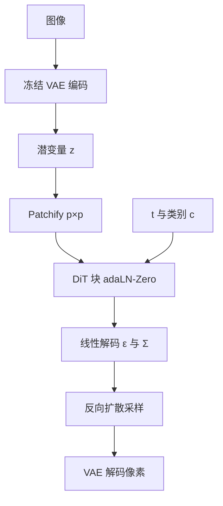

# DiT 架构

    
更高 Gflops 的 DiT——加深度/宽度或加 token 数——FID 一贯更低；最大的 XL/2 在 ImageNet 256 上达到 2.27。

    <footer>—— Peebles & Xie, Scalable Diffusion Models with Transformers, ICCV 2023</footer>

扩散模型长期把 U-Net 当默认骨干：ResNet 块、多尺度跳连、低分辨率再插自注意力。Peebles 与 Xie 在潜空间扩散里把骨干换成 Vision Transformer：潜变量切成 patch，用 Transformer 块去噪。他们不把参数量当复杂度主指标，而用一次前向的 Gflops。Gflops 升，FID 降——哪怕参数几乎不变、只把 patch 变小、token 变多。最大配置 DiT-XL/2 在类别条件 ImageNet $256\times 256$ 上 FID $2.27$，并超过先前 U-Net 扩散。论文 ICCV 2023 Oral，arXiv:2212.09748。后来 [Sora](/llm/sora) 把同一思路延到时空 patch；[MDLM](/llm/mdlm) 借用 DiT 块做语言去噪。本篇只写图像潜空间这篇。

## 问题

U-Net 从 PixelCNN++ 与 Ho 等人的 DDPM 继承而来，Dhariwal 与 Nichol 的 ADM 改过自适应归一化与通道数，但整体仍是卷积多尺度。Transformer 已在语言、识别、自回归像素上显示缩放，扩散却仍是架构局外人。若 U-Net 的归纳偏置并非生成质量的必要条件，扩散就能接过 ViT 的训练配方与缩放曲线。

参数量会骗人：分辨率与 token 数强烈影响计算，却几乎不改参数。ADM 已经用 Gflops 看 U-Net；DiT 把同一尺子拿到 Transformer 类，问：深度、宽度、patch 大小，谁在驱动 FID。

### 潜空间是为了算力，不是为了换问题

像素空间高分辨率扩散极贵。LDM 先用冻结 VAE 把图压到潜变量，再在 $z$ 上扩散。本文用 Stable Diffusion 的现成 VAE，下采样 $8$：$256\times 256\times 3$ 的图对应 $32\times 32\times 4$ 的 $z$。DiT 也可直接打像素，作者为效率选潜空间。混合管线：卷积 VAE + Transformer DDPM，不要画成纯 Transformer 编解码器。

DiT-XL/2 的 $118.6$ Gflops 是潜空间、$I=32$、$p=2$ 的前向。把它和像素空间 ADM 的 Gflops 比，要记得 VAE 编解码另计。FID-50K 用 $250$ 步 DDPM、ADM 的 TensorFlow 评测套件；实现细节会动 FID，跨论文比较应跟同一套导出。

## 方法

Patchify：潜变量 $I\times I\times C$ 切成 $p\times p$ 块，得到 $T=(I/p)^2$ 个 token，线性映到隐维 $d$，加正弦位置编码。$p$ 减半，$T$ 乘四，Gflops 至少乘四，参数几乎不变。设计空间含 $p\in\{2,4,8\}$。

条件（时间步 $t$、类别 $c$）试了四种块：上下文 token（把 $t,c$ 当额外 token）、交叉注意力、adaLN（从 $t+c$ 回归 $\gamma,\beta$ 替代 LayerNorm 仿射）、adaLN-Zero（再回归残差前的 $\alpha$，初始化为 $0$，使整块起步为恒等）。adaLN-Zero 计算最轻、FID 最好。其后固定用它。模型档 S/B/L/XL 对齐 ViT：XL 为 $28$ 层、宽 $1152$、$16$ 头。解码：末层自适应 LN 后线性映回 $p\times p\times 2C$，拆成噪声与对角协方差，再折回空间布局。

### 训练配方几乎原样来自 ADM

ImageNet 类别条件，$256$ 与 $512$。AdamW，学习率 $10^{-4}$ 恒定，无权重衰减，batch $256$，仅水平翻转。无 warmup、无 ViT 常用强正则，作者称训练稳定、无 loss spike。EMA $0.9999$。扩散：$T=1000$ 线性方差，$10^{-4}$ 到 $2\times 10^{-2}$，协方差参数化跟 ADM，时间与标签嵌入也跟 ADM。$\epsilon$-预测用 $\mathcal{L}_{\mathrm{simple}}$，协方差用完整 VLBO。分类器自由引导：训练时随机丢掉 $c$，采样 $\hat\epsilon=\epsilon_\emptyset+s(\epsilon_c-\epsilon_\emptyset)$。

## 机制

四百 K 步时，十二个模型（四档 × 三 patch）的 FID 与 Gflops 强负相关：S/2 与 B/4 等 Gflops 接近则 FID 接近。固定 patch 加宽加深，或固定档减小 $p$，全程 FID 都更好。XL/8 参数不比 XL/2 少，Gflops 少很多，样本差——关键是计算，不是参数。训练总计算（Gflops × batch × 步 × 约 $3$）对 FID：小模型即使多训，也会被大模型少步超过；仅差 $p$ 的 XL/4 与 XL/2 在相同训练 Gflops 下曲线也不同。

块设计：四百 K 步时 adaLN-Zero 的 FID 约是 in-context 的一半。恒等初始化（$\alpha=0$）明显优于普通 adaLN。交叉注意力约加 $15\%$ Gflops，仍不如 adaLN-Zero。分类器自由引导下 XL/2 超过先前扩散 SOTA。$512$ 分辨率同样成立。同一噪声与类别可视化：Gflops 升则细节与结构同步变好。

「更大模型更省训练计算」指达到同一 FID 所需的训练 Gflops，不是单步更快。XL/2 在 TPU v3-256、全局 batch $256$ 上约 $5.7$ iter/s。不要把 ImageNet FID 写成通用视觉生成的唯一尺子，也不要把 adaLN-Zero 写成所有条件注入的唯一解——它是这条设计空间里的赢家。

### 对视频与语言骨干的含义

Sora 技术博客把扩散 Transformer 接到时空 latent patch：2D patchify 变成 3D。MDLM 用 DiT 块加时间条件做离散去噪，任务是 token 而不是图像噪声。两边借的是「标准 Transformer + 条件归一化 + 用计算量缩放」，不是 ImageNet 的 $2.27$。读架构论文时把设计空间（patch、块、档）与 LDM 设定分开；换 VAE 或改像素空间，Gflops–FID 斜率要重测。

## 边界与工程取舍

实验是类别条件 ImageNet，不是文生图。文本条件要另接，LDM 交叉注意力不是本篇最优块。VAE 压缩损失与扩散损失叠加；潜空间伪影会进样本。FID 对评测实现敏感。设计空间未穷尽：例如窗口注意力、混合卷积。U-Net 的多尺度跳连被扔掉，极高分辨率是否还要层次结构，本篇用潜空间回避了像素级答案。

不要把 DiT 写成「第一个用注意力的扩散」——U-Net 低分辨率早有自注意力。贡献是纯 Transformer 骨干 + 用 Gflops 证明可缩放。权重与代码在 facebookresearch/DiT；JAX 训练细节以论文为准。

分类器自由引导在 DiT 上同样显著抬 FID，说明骨干替换没有取消这条采样技术。引导把每次采样变成两次前向（有条件与空条件），Gflops 账要乘上；论文主缩放图的无引导 FID 与带引导的 SOTA 表必须分开引用。$256$ 上继续把最高 Gflop 的 XL/2 训到约 $7$M 步再比 ADM、LDM 等。协方差头与 $\epsilon$ 头共享骨干、在 token 上拆 $2C$ 通道：这是 ADM 的训练分工，不是 Transformer 独有。若有人把 DiT 当 ViT 分类器微调，那是另一条工作，本文只有生成。位置编码是固定正弦，作者未把可学习位置当成必要；patch 大小变化时正弦网格跟着 $T$ 变，这与「分辨率外推」不是同一实验。

出处：William Peebles, Saining Xie，*Scalable Diffusion Models with Transformers*，ICCV 2023（arXiv:2212.09748）。LDM 引用 Rombach et al. 2022；U-Net 扩散对照 ADM（Dhariwal & Nichol）与 Ho et al.。条件归一化传统来自 GAN 的自适应归一化。

## 小结

- DiT 用 ViT 式 patch Transformer 替换潜空间扩散的 U-Net，条件以 adaLN-Zero 最好。
- 前向 Gflops（深度/宽度或 token 数）与 FID 强相关，参数量不是充分统计。
- DiT-XL/2 在 ImageNet $256$ 类别条件上 FID $2.27$，并显示大模型更会用训练计算。
- 管线是冻结 VAE + Transformer 去噪；不要画成端到端纯 Transformer 编解码。
- 后续视频与语言扩散借用块设计，评测不能直接搬 ImageNet 表。
- 出处：Peebles & Xie，ICCV 2023（arXiv:2212.09748）。
