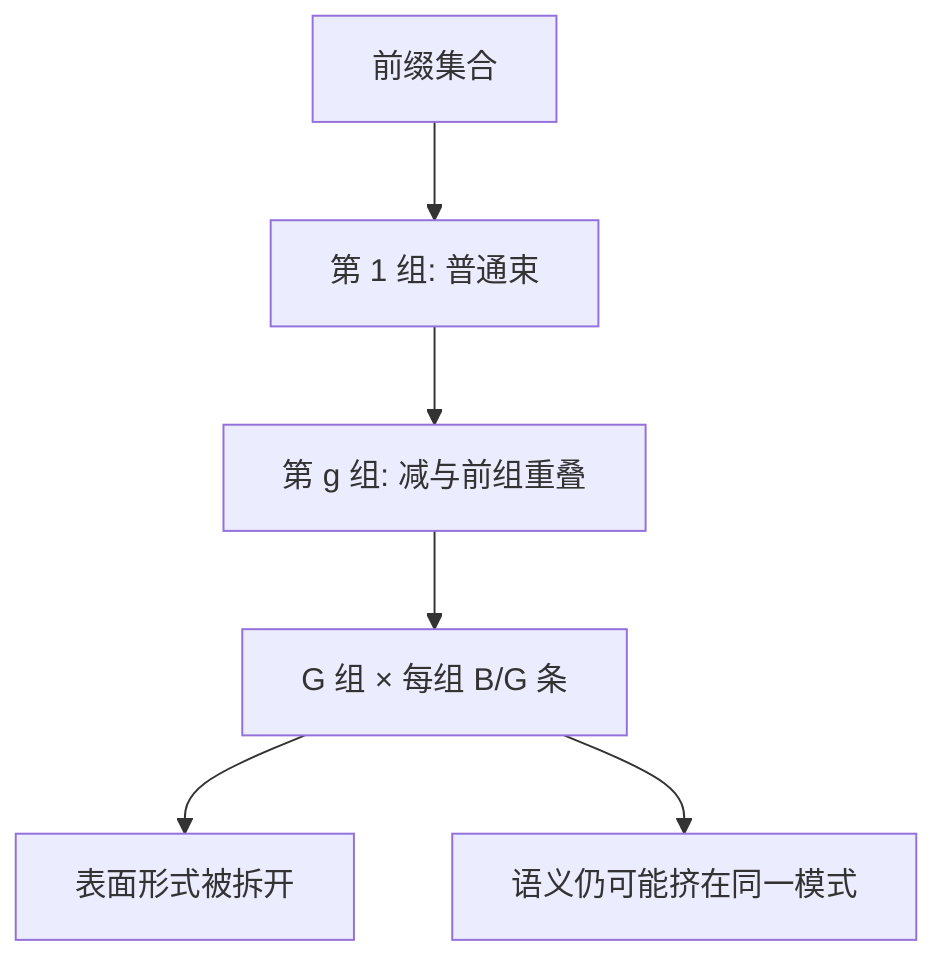

# 多样束搜索

普通束里的邻居共享前缀，看起来像 $B$ 条假设，实际是同一条脊上的微扰；分组并惩罚组间重叠，才能把宽度花在真正不同的续写上。

<footer>—— Vijayakumar et al., Diverse Beam Search: Decoding Diverse Solutions from Neural Sequence Models, AAAI 2018</footer>

[上一课](/llm/length-penalty-degeneration)说明长度惩罚改的是束内排序，挡不住整束一起滑进同一短循环。本课补宽度怎么用：普通束的 $B$ 条高度相关，把 $B$ 从 4 加到 16 往往只是同一句话的标点差。Vijayakumar 等人的 Diverse Beam Search（DBS）把束分成若干组，组内仍按对数概率进，组间用多样性项互斥。它仍是确定性搜索，不是 [温度 / top-p](/llm/sampling-temperature-topp) 的随机核。后课的 MBR 要一堆 *彼此不像* 的候选，先修这一刀。

## 问题

束在每一步扩展所有存活前缀，再按累计 $\log\pi$ 留 $B$ 条。因为早期 token 决定了大部分质量，存活条很快共享长前缀，后期只在同义词上分叉。图像描述、对话回复、问题的多种解法，要的是语义多样，不是编辑距离 1 的 $B$ 份。加大 $B$ 会线性增加 KV 与逐步扩展成本，多样性却饱和——这是「用束冒充 Best-of-N」失败的原因：[BoN](/llm/best-of-n) 的独立样本不共享解码前缀，束共享。

缺口因此不是再写一遍束算法，而是：在仍想要近似 MAP 的框架里，如何把组间不相似度写进逐步选择，使 $B$ 条覆盖多种模式。DBS 的多样性项是工程可算的代理（n-gram 重叠、Hamming），不是语义嵌入；它能拆开表面形式，不保证拆开语义。

DBS 不改变 $\pi$。被惩罚的是 *相对其他组已经选中的 token*，不是词表上的绝对禁令。一组若全体走低概率岔路，多样性赢了、任务可能输了。

## 方法

将 $B$ 条分成 $G$ 组，每组宽度 $B/G$。第 1 组按普通束走；第 $g$ 组在逐步打分上减去与前 $g-1$ 组已选 token 的重叠惩罚（原文用 Hamming diversity：同位不同 token 给奖励）。组间顺序是课程式的：先占高概率模式，后组被赶到次优模式。惩罚系数 $\lambda$ 过大，后组会变成胡话；过小则退回普通束。

实现上每步仍要对词表打分，只是各组成员的有效得分不同。KV 仍按 $B$ 条前缀各存一份，前缀共享只能发生在同组内部早期。服务侧若用分页 KV，组间分叉后必须 copy-on-write，多样性的显存账单与普通束同阶。不要指望 DBS 比独立采样更省：它省的是「随机性」，不是字节。

## 机制

普通束的选择是全局 Top-$B$；DBS 的选择是 *条件于已占模式* 的 Top。多样性项把搜索从「一条脊」掰成「若干条脊」，每条脊上仍然是贪心的局部 MAP。因此 DBS 产出的集合适合作为下游重排或 MBR 的提案集：覆盖比普通束宽，又比温度采样可控。它与 nucleus 的差别：nucleus 每步随机，DBS 每步确定；重复跑 DBS 得到同一集合，重复采样不会。

图像描述是 DBS 的原评测域：同一张图需要多个不同的句子。开放聊天把 DBS 当「更有创意」会失望——组间惩罚不懂幽默，只懂 n-gram 不重复。

## 边界与工程取舍

代码与 JSON 上，多样性项会拆开本该重复的结构（相同的键名、循环体）。应关 DBS，把合法集合交给[约束解码](/llm/constrained-decoding)。数学题上，多种正确写法有用，但错误模式也被拆开，组数变成错误放大器——此时应用采样 + 答案聚合，而不是 DBS。$\lambda$ 与 $G$ 必须当超参扫，不能从 AAAI 2018 的图像描述默认值抄到 70B 对话。

出处以 Vijayakumar et al. AAAI 2018 为准。后续的 diverse decoding、contrastive decoding 是不同目标，不要写进本课公式。

## 小结

- 普通束的 $B$ 条共享前缀，宽度浪费在微扰上。
- DBS 分组并用组间重叠惩罚，把搜索掰到多条脊。
- 多样性是表面形式代理，不是语义保证。
- 显存与逐步成本仍按 $B$ 走；分页只解决共享前缀，不消灭分叉后的 KV。
- 结构输出与必须重复的文本应关 DBS。
- 提案集可交给后课 MBR；需要随机覆盖时用采样。
- 出处：Vijayakumar et al., AAAI 2018。
