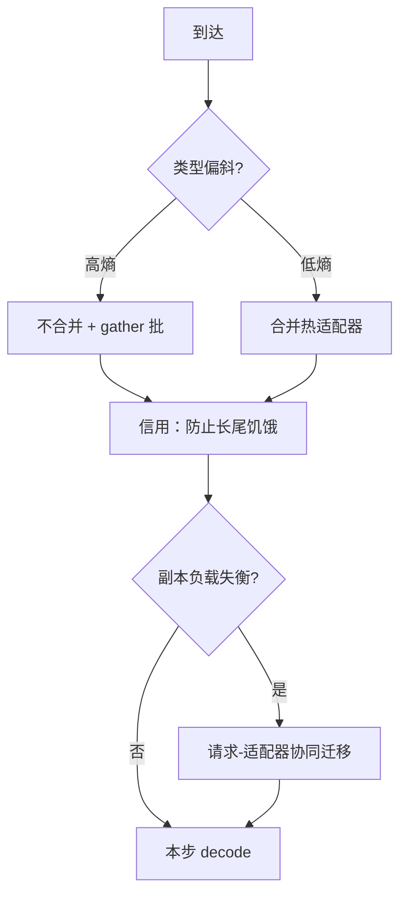

# dLoRA 动态加载

    
不合并能把不同适配器拼进同一批，但流量一旦偏斜，把热适配器焊进基座更便宜；加载与迁移必须和请求绑在一起搬，否则 KV 在一张卡、权重在另一张卡。

    <footer>—— Wu et al., dLoRA: Dynamically Orchestrating Requests and Adapters for LoRA LLM Serving, OSDI 2024</footer>

[Punica](/llm/punica) 证明：基座可跨租户批，低秩增量用 gather 核即可。这条路默认**不合并**——$W_0$ 保持一份，$BA$ 永远外挂。Wu 等人 2024 年的 dLoRA 指出，不合并不是永远最优：请求类型一旦偏斜到少数热适配器，反复付 SGMV 的小矩阵税，不如把 $\Delta W$ 加回 $W_0$，让热路径退回普通 GEMM。他们把服务写成两层编排：副本内在合并 / 不合并之间切换，并按需把适配器装进或卸出 HBM；副本间把**请求与适配器一起迁**，避免自回归变长把负载打歪。本篇写这条动态加载与编排，不把 S-LoRA 分页或 [LoRAX](/llm/lorax-serving) 产品栈展开成全文。

## 问题

LoRA 推理有两种极端。合并：每个热适配器一份 $W_0+BA$，decode 最快，但一份满秩权重只能服务一种适配器，偏斜一变就要解合并、再合并，切换开销可以大过一步 decode。不合并：一份基座服务所有类型，[背景批](/llm/punica) 友好，但每步多两次低秩乘；当运行集几乎是同一租户，这笔税纯亏。HuggingFace PEFT 式「一次只挂一个适配器、整批同类型」更糟：类型一换就同步换权重，空窗里 GPU 闲着。

集群侧还有第二层。自回归的输入/输出长度事先未知，均匀把请求洒到副本，KV 与剩余步数仍会失衡。[连续批](/llm/continuous-batching) 在单卡内能填空洞，填不了「这张卡上的适配器工作集和那张卡上的请求队列对不上」。只迁请求、不迁 $A,B$，目标卡要冷加载；只迁适配器、不迁进行中的序列，KV 作废，等于重做前填。

### 偏斜让「永远不合并」变成错误的常数

设到达过程在适配器上的熵为 $H$。$H$ 高（类型均匀）时，不合并能把不同类型拼进同一迭代，排队短。$H$ 低（少数类型占满）时，合并去掉 LoRA 核，单步墙钟下降，吞吐上升。真实流量在两种制度之间滑动：白天一个内部工具打满，夜里长尾租户散开。系统若在启动时钉死一种模式，就在另一段制度里违约。动态加载要回答的不是「能不能换适配器」，而是「何时把哪一块 $BA$ 焊进去、何时卸下来、卸的时候进行中的请求怎么办」。

加载（把 $A,B$ 从 CPU/盘搬进 HBM）与合并（把 $BA$ 加进 $W_0$）不是同一件事。加载决定「这个适配器此刻能不能被 gather 核看见」；合并决定「背景 GEMM 的权重是不是已经含它」。dLoRA 两条都动；只做加载的产品仍可能永远付不合并税。

## 方法

副本内，dLoRA 在两种前向之间切换。不合并时，基座 GEMM 一次，按请求 gather $A,B$，与 Punica 同类。合并时，选定适配器 $k$ 满足 $W\leftarrow W_0+B_kA_k$，此后该类型请求走纯基座路径，其它类型要么等待、要么仍走未合并旁路——具体能否混批取决于当时权重是否仍是一份 $W_0$。切换阈值不固定：用到达偏斜、当前批组成、排队时延和**切换本身的墙钟**一起估计下一次迭代的期望完成时间，只有收益盖过合并/解合并开销才切换。合并是对 $W_0$ 的原地写，解合并要能恢复 $W_0$，因此要么另留一份基座，要么保存 $\Delta W$ 再减回去；显存账必须把这条备份算进去。

### 信用批：切换不得饿死长尾

若调度总挑「当前已合并的那个类型」或「队列最长的热适配器」，长尾请求的 TTFT 会烂掉。dLoRA 给每个适配器一笔信用。按 FCFS 本该服务却被插队的类型，把信用转给被耽误的一方；信用超过饥饿阈值时，强制先跑这些请求，并禁止在信用不足时把热适配器合并进基座——否则合并会把整卡锁死在热类型上。这是公平与吞吐的显式旋钮，不是内核细节。

副本间，主动派发看两件事：目标卡加载该适配器要多久，以及排队时延。被动侧把失衡写成整数规划：迁哪些进行中的请求、复制或移动哪些适配器，使各副本的 KV 与剩余工作量更齐。ILP 太贵，于是降频求解，并把问题放松成选择性迁移——只对越界的少数对象动刀。迁移单位必须是「请求 + 其适配器 + 其 KV」的捆绑：丢掉任一项都等于在目标卡上冷启动。

## 机制

合并的收益来自屋顶线。热适配器占满运行集时，SGMV 的 gather 不规则性变成纯开销，背景 GEMM 已经够厚；$W_0+BA$ 之后少两次低秩访存，步延迟下降。切换成本来自写权重：解合并期间通常不能用旧 $W$ 服务另一种类型，空窗至少一步、常常数步。因此算法用「阈值 + 迟滞」而不是每步贪心，避免振荡：刚合并完立刻解合并，会把切换税付两次。论文用请求模式去调阈值，本质是在估计偏斜的持续期。

### 协同迁移针对的是状态耦合

LLM 副本的负载不是连接数，是 KV 字节与剩余 decode 步。适配器又是第二类状态：HBM 里没有 $A,B$，请求就无法在该卡继续。只做请求迁移的负载均衡，会在目标卡上制造加载尖刺，尾延迟比不迁更差。只做适配器复制、请求仍按轮询洒，热适配器会在所有卡上各留一份，把「一份基座」的密度优势吃掉。协同迁移把复制适配器当成给未来请求买的期权，把迁正在跑的序列当成给当前 KV 买的再平衡；期权有容量成本，必须限频率。

评测里相对当时 vLLM「每 LoRA 当完整模型」、PEFT「整批换适配器」的吞吐倍数（文中至多约 57.9× 与 26.0×）高度依赖基线有多傻。相对同期 S-LoRA 的延迟数字（至多约 1.8×）同样绑在他们的轨迹与硬件上。写进容量规划要重测，不要当常数。

## 边界与工程取舍

动态合并与 [适配器热更新](/llm/adapter-hot-swap) 冲突点很具体：合并态下热更新必须先解合并或写一份新的 $W_0+B'A'$，进行中的 decode 仍应钉住旧 $\Delta W$。不合并态下热更新是换页，但仍不能让同一步的 $A$ 与 $B$ 来自两个版本。跨卡迁移时，KV 布局、[分页](/llm/paged-attention) 块大小、精度必须一致，否则迁移退化成重前填。

不是所有 LoRA 都能合并进同一份 $W_0$：插层集合不同、秩不同、缩放不同。dLoRA 的「一份基座」假定同一结构。多模态只训视觉投影、或与基座量化方案纠缠时，合并的数值与核都要另测。信用阈值调得太狠，热适配器永远合并不进去，退回永远不合并；调得太松，长尾 SLO 先炸。应与 [优先级](/llm/priority-sla) 共用类别，而不是再发明一套租户公平。

dLoRA 的「动态加载」包含三件可分开上线的能力：冷 $A,B$ 进 HBM、合并/解合并、跨副本捆绑迁移。产品往往只做了第一件，就宣称动态 LoRA。缺后两件时，偏斜与集群失衡仍按 Punica 原始调度暴露。

## 小结

- dLoRA 在不合并的跨适配器批与合并后的纯基座路径之间按偏斜切换，加载与合并是两层决策。
- 信用批防止热类型合并后饿死长尾；切换要覆盖写权重的空窗，用迟滞避免振荡。
- 副本间必须请求-适配器-KV 协同迁移，否则再平衡制造冷加载或重前填。
- 永远不合并在高偏斜下亏核时间；永远合并在高熵下亏显存与切换。
- 吞吐倍数相对弱基线很大，相对 S-LoRA 是同设定比较；上线要按自己的轨迹重测。
- 出处：Wu, Zhu, Zhang, Sun, Liu, Jin，*dLoRA: Dynamically Orchestrating Requests and Adapters for LoRA LLM Serving*，OSDI 2024。
