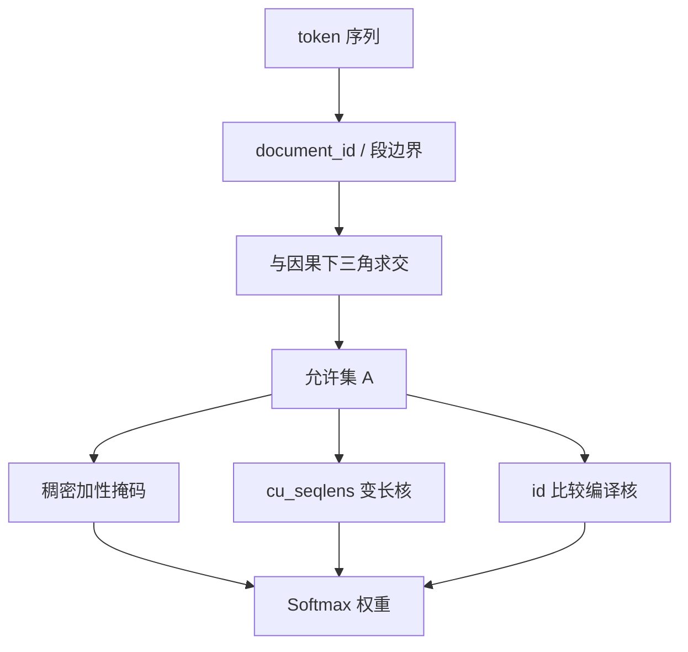

# Document attention mask

把「这篇与那篇不可见」写成注意力在 softmax 之前的结构：块内因果或双向，块间为零。它是一张图，不是一个分隔符。

<footer>—— 工程对象：块对角掩码；形式化与等价性见 Krell et al., arXiv:2107.02027；融合核见 Dao et al. FlashAttention 变长接口</footer>

因果掩码回答「未来不可见」。**Document attention mask** 再加一条：即便在时间上靠前，若所属文档不同，也不可见。它出现在 packing、多文档 batch、以及「同一请求里拼了系统提示 + 多段检索」的服务侧。数学上是块对角（再与因果下三角求交）；工程上可以是稠密 $n\times n$ 布尔、FlexAttention 的 `document_id`、或 `cu_seqlens` 把每篇当成独立变长序列。本篇把掩码当一等公民写清形状、与 RoPE、与 KV 缓存的交叉；装箱算法与填充率见 [跨文档 packing 掩码](/llm/packing-cross-doc-mask) 与 [packing](/llm/sequence-packing)。

## 问题

令序列 $x_{1:n}$ 来自文档 $d(t)\in\{1,\ldots,M\}$。标准因果注意力的允许集是 $\{(t,s):s\le t\}$。文档掩码的允许集是

$$
\mathcal{A}=\bigl\{(t,s): s\le t,\ d(t)=d(s)\bigr\}
$$

（编码器双向则去掉 $s\le t$，只保留 $d(t)=d(s)$）。$\mathcal{A}$ 的补集在 softmax 前设为 $-\infty$。没有这张图，模型没有「文档」概念，只有「更早的 token」。分隔符可以出现在嵌入里，但嵌入不能删掉一条已经算出来的边。

服务侧同样有文档：系统提示、工具结果、多文件上下文若共享因果窗，后文件可以抄前文件机密或检索碎片。训练用了 document mask、推理不用，或反过来，都是分布偏移。问题是把 $d(t)$ 从数据管道传到注意力核，且与 GQA、滑窗、块稀疏兼容。

### 块对角不是滑窗

滑窗限制的是距离 $|t-s|\le w$，与文档无关。文档掩码限制的是等价类 $d$。两者可叠加：篇内滑窗、篇间仍全断。Longformer / BigBird 的全局 token 若跨篇共享，会重新打通块对角，必须规定全局点只属于一篇或禁止跨篇全局。不要把「局部注意力」当成已经做了文档隔离。

Padding 掩码切断 pad 位置；文档掩码切断不同 $d$。实现里常或成一张加法掩码。漏掉 pad 会让 pad 嵌入污染；漏掉 $d$ 会让上一篇污染。日志应分开统计两种无效边的数量，而不是只报「用了 attention mask」。

## 方法

数据侧输出 `document_ids` 或 `cu_seqlens`。核侧三条路径：

**稠密加性掩码。** 构造 $M\in\mathbb{R}^{n\times n}$，$M_{ts}=0$ 若 $(t,s)\in\mathcal{A}$，否则 $-10^4$ 量级。与 $QK^\top/\sqrt{d_k}$ 相加。实现简单，FlashAttention 原初接口不完全吃任意加性掩码，可能回退，内存 $O(n^2)$。

**变长分段。** 把每篇当成独立序列，累积长度 `cu_seqlens`，核在段内做因果 SDPA，段间无边。这是 document mask 的零物化实现，复杂度 $\sum_m n_m^2$。要求同一 batch 的段能拼成核所支持的布局（如 THD）。

**文档 id 比较。** FlexAttention 等把 `d[t]==d[s] & causal` 编译进核。适合不规则块（一篇被切断成两段但共享 id 的情况要先定义：通常切断后视为两篇，除非显式续段）。

### 与位置、与 KV

RoPE 相位按位置下标。文档掩码不自动重置位置：若下标跨篇连续，篇首仍带大相位，即使看不见上一篇。等价训练通常**按篇重置位置**，与掩码是两件套。KV 缓存按物理下标存；decode 时新 token 的 $d$ 若仍是当前篇，只应 vis 本篇已缓存键，或在分页里把上一篇的页标为不可见。连续批处理中不同请求本就是不同文档，请求间隔离是调度器的 mask，请求内多文档才是本篇对象。

BERT 式 NSP 需要两句可见性与文档掩码同时存在：句子 A/B 在同一包内可能同 id 或不同 id，Krell 等为此改了按序列计的损失。因果 LM 没有 NSP，文档掩码就是块内下三角。混合窗口（Gemma 式局部+全局层）时，全局层若看满 $L$，跨篇边会在全局层重现——要在全局层也应用同一 $\mathcal{A}$，或接受「只有全局层泄漏」。这是架构级选择，应写入报告。

## 机制

softmax 行归一化只在 $\mathcal{A}$ 的行支撑上发生。切断跨篇边后，质量不会分给另一篇，梯度也不会从另一篇的键流过来。这恢复「文档是独立抽样」的近似，使 packing 的硬件收益不改任务定义。与因果掩码求交保证自回归仍成立：篇内不能看未来。两者缺一，要么泄漏未来，要么泄漏邻篇。

可视化注意力时，若绘制了跨篇高权重，先查 mask 是否坏，再解释「模型学会了跨文档推理」。训练若声称 document-masked，图上不应出现块外质量。

### 和前缀掩码、和检索拼接

前缀 LM（T5 一部分设定、UL2）允许前缀双向、后缀因果，那是另一张图。文档掩码可以叠在前缀 LM 上：每篇内部前缀双向，篇间仍断。检索增强把多段 hit 拼进上下文，若不做 document mask，模型把 hit 当连续章节；若做，则每段独立，更像「多段只读记忆」。产品要的是哪一种，不能从训练 packing 默认值推断。

## 边界与工程取舍

任意加性掩码与高度融合的 FA2/FA3 核不总兼容，团队用 `cu_seqlens` 换速度时，必须保证切段与 $d(t)$ 一致，否则静默跨篇。GQA 下掩码按查询行定义，KV 头共享不改变 $\mathcal{A}$。滑窗 + 文档 + 因果 三条件求交后，有效键更少，MFU 上升、长程依赖下降，是刻意的。

不要用 BOS/EOS 替换 $\mathcal{A}$。不要假设推理框架默认 document mask：多数 chat 模板只有因果。训练用了、服务没用，表现为「喜欢把上一轮用户话当成本轮文档内上下文」——若上一轮本应隔离，这是 bug。评测长上下文 NIAH 若在单文档上做，与多文档 mask 无关；多针多文档测试才考这张图。

出处：Krell et al., arXiv:2107.02027（块对角以实现无污染 packing）；Vaswani et al. 2017（因果掩码作为前驱）；Dao et al. FlashAttention 变长 `cu_seqlens`；FlexAttention 文档 id 接口为工程实现。T5 / PaLM 的拼接是否带块对角，以各自报告为准，不可一律假定。

## 小结

- Document attention mask 是允许集 $\{(t,s):d(t)=d(s)\}$ 与因果约束的交，加在 softmax 前。
- 实现可以是稠密矩阵、`cu_seqlens` 分段、或 document_id 比较；语义相同，复杂度不同。
- 位置重置、KV 可见页、全局注意力层是否遵守 $\mathcal{A}$，都要单独规定。
- 分隔 token 不删除边；滑窗切断的是距离不是文档。
- 训练与推理必须同一张图，否则 packing 等价性在服务端失效。
- 出处：Krell et al., arXiv:2107.02027；FlashAttention varlen；Vaswani 因果掩码。
