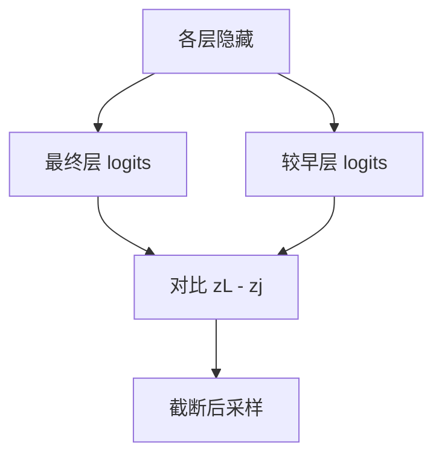

# DoLa 层对比

较晚的层更像在说事实，较早的层更像在说统计先验；把两者的 logits 对比后再采样，可以把「听起来对」从「有依据」里分开一点。

<footer>—— Chuang et al., DoLa: Decoding by Contrasting Layers Improves Factuality in Large Language Models, ICLR 2024</footer>

[上一课](/llm/mbr-decoding)在序列级用期望效用重排，前提是已经生成 $N$ 条、还养得起度量。本课回到 *逐步*：一次前向里模型已经算完所有层，最后一层的 softmax 混着事实回忆与语言先验。Chuang 等人的 DoLa（Decoding by Contrasting Layers）用较晚层减去较早层的 logits，再在对比分布上解码，试图压低幻觉。它不改权重，也不做 MBR 的 $N$ 次生成。后课的上下文感知解码把对比对象从「浅层」换成「无上下文的条件」。

## 问题

幻觉经常不是词表随机噪声，而是先验太强：模型在看见实体名时，写出训练里更常见的属性，而不是当前层已经读到的事实。最后一层 logits 把「流畅续写」和「知识回忆」加在同一向量里。MBR 能在事后用度量挑，但延迟不可接受；需要一种 *同一次前向* 里的校正。缺口是：浅层与深层的信息差能否当作逐步的对比信号，而不另训模型。

DoLa 的假设是：早期层更接近下一 token 的语言统计，较晚层才把事实写入。对比 $z^{(L)}-z^{(j)}$ 会放大两层不一致的方向。若假设失败——事实在中层已经写完、深层只做风格——对比会伤害流畅。本课只把这套对比写成解码算子，不把「哪一层存储事实」做成普遍神经科学结论。

对比发生在 logits 上，不是把两层的隐藏状态做差再投影。实现必须能取出中间层的 lm_head 投影（或预计算的层输出经同一 unembed）。没有这一钩子的服务引擎接不进 DoLa。

## 方法

对当前前缀跑一遍 Transformer，记下最终层 logits $z^{(L)}$ 与候选早层 $z^{(j)}$。$j$ 可以静态取，或按层间 Jensen–Shannon 一类动态选「差得最多」的那层（DoLa 文中的动态策略）。对比分布

$$
p_{\mathrm{DoLa}}(x_t)\propto \mathrm{softmax}\big(F(z^{(L)}-z^{(j)})\big),
$$

其中 $F$ 是对过小logit 的截断，避免把两边都极低的噪声方向放大。然后按普通采样或贪心从 $p_{\mathrm{DoLa}}$ 取 token。温度、top-p 应作用在对比之后的分布上，顺序与[核采样](/llm/sampling-temperature-topp)相同。

动态选层有成本：要看多层的分布差，等于多算几次 unembed。静态 $j$ 更便宜，但跨模型和跨层深不迁移。不要把某一 7B 上的 $j=16$ 写成常数。

## 机制

若深层把实体属性从上下文或参数记忆写入、浅层仍倾向高频共现，差值在正确属性 token 上为正、在共现干扰项上为负，逐步事实性可能上升。这与对比解码（Li 等人用 amateur 模型对比）同族，只是 amateur 换成了同一模型的浅层，省掉第二个模型。加速上，DoLa 几乎不增加 decode 步数，只增加取出中间层的带宽——相对 MBR 可忽略，相对纯采样仍有一截钩子开销。

事实性评测（TruthfulQA 一类）上的增益，不能外推到代码与数学：那里「浅层先验」往往是语法，对比可能把括号和关键字打歪。任务要分桶。

## 边界与工程取舍

DoLa 不是校准器：对比不提供置信度，只改排序。它也不替代检索；上下文里的证据若从未被任何层读进，差值帮不上。与[投机解码](/llm/speculative-decoding)叠用时，草稿与目标必须走同一套对比，否则接受规则对的不是用户真正采样的分布。中间层取出与 [KV 布局](/llm/kv-layout)无关，但与检查点是否暴露每层输出有关；张量并行下 unembed 可能切在词表维，对比要在归约之后做。

出处：Chuang et al., ICLR 2024。不要把 Contrastive Decoding（Li et al.）的 amateur 模型公式写进 DoLa。

## 小结

- DoLa 用最终层与较早层的 logits 差作为逐步分布，不改权重、不做 N 次生成。
- 假设是浅层偏先验、深层偏事实；失败时伤害流畅。
- 动态选层更稳、更贵；静态 $j$ 不跨模型迁移。
- 钩子是中间层 unembed；服务引擎默认往往没有。
- 与投机叠用必须两边同一对比，否则无损证明失效。
- 后课把对比对象换成「有无上下文」。
- 出处：Chuang et al., ICLR 2024。
