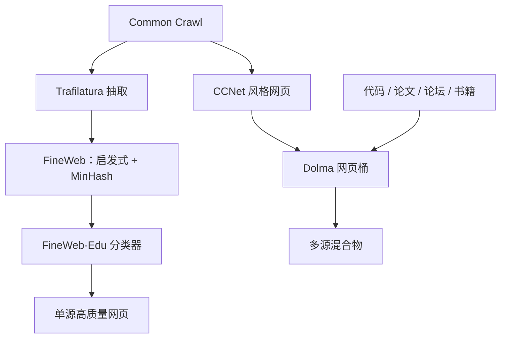

# Dolma / FineWeb 配方

    
把预训练数据写成可复现的配方：来源、抽取、过滤、去重与配比各自成段，换其中一刀就应得到另一个有名字的数据集。

    <footer>—— Soldaini et al., Dolma；Penedo et al., FineWeb</footer>

在 C4 与 CCNet 之后，公开预训练数据的瓶颈不再是「有没有网页」，而是「配方能不能被复现和比较」。Soldaini 等人的 Dolma 把三万亿 token 级的多来源混合物连同工具链一起公开：网页、代码、论文、论坛、书籍与维基各有入口规则。Penedo 等人的 FineWeb 则把单一来源——Common Crawl——做到极致：固定抽取器、扫启发式、比较去重粒度，并用下游探针证明「更好的网页」可以接近甚至超过多源精选。两份工作的共同点不是某种神秘过滤，而是把数据工程从口耳相传改成可消融的配方。

## 问题

实验室内部语料无法审计。只报「用了 Common Crawl 加书籍」，无法知道抽取器、KenLM 切点、MinHash 阈值、是否对评测集去污。模型差异会被误记到架构上。需要一种把数据当代码发布的方式：每一步有版本，每一种消融有名字。Dolma 回答多源混合物如何在开放治理下拼起来；FineWeb 回答在网页这一桶内，哪些步骤真正移动下游分数。二者合起来，才构成今日复现开源基座模型时最常被引用的两条公开基线。

多源与单源是不同的风险。多源配方要处理许可证、领域配比与跨源重复（维基既在网页里也在维基桶里）。单源配方要处理抽取上限与「只有网页是否足够」。RefinedWeb 已经主张仔细过滤的网页可以不要书籍；FineWeb 把这条主张做成可下载的 15T 级语料，并加出 FineWeb-Edu 这一「教育价值」变体。问题变成：你要的是可治理的混合物，还是可消融的网页纯度——两者都需要，但不要混成一个无法解释的大杂烩。

### 配方是版本化的有向图

来源节点指向抽取，抽取指向语言识别，再指向启发式、去重、分类器、配比。Dolma 的工具链让每条边可单独重跑；FineWeb 的技术报告把抽取器选择、Gopher 规则、C4 规则、去重范围做成对照表。没有这张图，所谓「跟随 Dolma」只是复制一个快照文件名。Dolma 的价值有一半在 toolkit：同样的规则可以打在新快照上。只下载预构建子集、不记录规则，下一次 Crawl 到来时你并没有配方，只有过期字节。

跨源去重必须显式。论文 HTML、arXiv、维基、新闻聚合站在网页桶里大量重叠。Dolma 分桶是为了配比可控，若不去掉跨源复制，配比数字是假的：你以为加了 5% 论文，实际网页桶里已经有同一批摘要。FineWeb 不解决这个问题，因为它几乎只有网页——这是单源配方的简洁性，也是它必须把网页抽干净的原因。

## 方法

Dolma 的网页支路继承 Wenzek 的 CCNet 思路：语言识别、质量过滤、去重，再与 The Stack 一类代码、peS2o 论文、Reddit、Gutenberg、维基等合并。每一源有自己的许可与 PII 策略，混合物的 token 比例写在数据卡片里。它不是「最好的网页」，而是「开放、可治理、多源」的参照实现。

FineWeb 的方法更像把 RefinedWeb 做透。HTML 用 Trafilatura 抽取（与 Resiliparse 对照后选定），URL 与语言过滤之后，套用并比较 C4 / Gopher / RefinedWeb 启发式，再做快照内与全局的 MinHash 去重。关键消融是：在固定计算预算下，哪一版过滤训出的模型在阅读与知识探针上更好。FineWeb-Edu 再加一层：用大模型给网页打教育价值，蒸馏成分类器，保留高分文档——质量定义从「像维基」改成「像能学到东西的页面」。

### 消融单位要小到能归因

FineWeb 证明抽取器、启发式集合、去重是全局还是按快照，三者都会单独移动结果。把它们一次全换，你不知道是 Trafilatura 赢了还是 MinHash 赢了。Dolma 的归因单位是来源桶：拿掉 Reddit 或拿掉代码，下游哪类能力掉。两种消融不要互相替代。网页纯度实验应用 FineWeb 式单源；能力覆盖实验应用 Dolma 式多源。用 Dolma 的混合物去评价一种新的网页启发式，会被其他桶的方差淹没。

FineWeb-Edu 的教育分与 Gopher 质量分不是同一轴。一篇高教育价值的习题页可能很短、很列表化，会被 C4 式「必须像句子」的规则误杀。配方里每一刀的目标函数要写清楚：通顺、像维基、像教材、还是像代码。叠太多头而不声明优先级，等于让最后一道阈值随便决定数据。

## 机制

配方改变的是采样测度的可解释性。Dolma 的训练分布是若干源分布的加权和 $\sum_i w_i p_i$，每个 $p_i$ 有独立的过滤算子。调整 $w_i$ 是配比；调整 $p_i$ 内部的过滤器是桶内质量。FineWeb 近似单源，$p_{\mathrm{web}}$ 由抽取与过滤算子决定，$w_{\mathrm{web}}\approx 1$。Penedo 等人表明，把 $p_{\mathrm{web}}$ 做干净之后，不必靠书籍这种小众 $p_i$ 来「救」网页。这与 Dolma 不矛盾：书籍与论文仍提供网页抽不干净的公式、证明与长篇论述，只是它们的必要性要从「网页太脏」里剥离出来，变成真正的领域补丁。

去重在两种配方里的语义不同。FineWeb 的全局 MinHash 决定网页桶的有效频率。Dolma 还要处理源间近重复，否则维基被计两次。Soldaini 等人把治理（许可、隐私、可撤回）写进配方，是因为多源数据的法律风险不是过滤超参能表达的。网页抓取的风险画像与 GitHub 仓库、论坛帖不同，不能共用一个免责声明。

### 公开基线如何被后来者替换

Li 等人的 DCLM 把 FineWeb / RefinedWeb 一类池子当成竞赛的数据池，替换的是过滤函数，而不是再发明一套来源故事。这只有在 FineWeb 把池子和启发式写清楚之后才可能。Dolma 则成为 OLMo 一类完全开放模型的训练底盘：模型、数据、工具同开。配方的意义在于让下一刀有地方插——换分类器、换 SemDeDup、换数学抽取——而不是让每个实验室从 WARC 重新口述一遍。

## 边界与工程取舍

FineWeb 的主结果以英语为中心；把同一套启发式搬到多语言，标点与教育分类器都会偏置。Dolma 含多源，但各源的语言覆盖极不均衡，配比数字按 token 计会掩盖低资源语种。两者都不是「世界语料」。生成式垃圾在 2024 年后的 Crawl 上更密，FineWeb 当时的启发式会过时，需要像 DCLM 那样更新正负例。

存储与计算是配方的隐藏超参。全局 MinHash、全文抽取、大模型打教育分，成本可以接近训练本身。Dolma 选择可在学术预算下复现的工具；FineWeb-Edu 把贵的标注蒸馏成便宜分类器。复现时若省略蒸馏步骤、直接用启发式冒充 Edu 子集，下游不可比。

不要把 Dolma 快照与 FineWeb 快照在 token 数上直接比谁「更大」。来源、过滤、重复率不同，有效信息量不是磁盘上的 token。比较应在固定模型与固定 token 预算下看探针，这正是两篇论文自己采用的方式。

## 小结

- Dolma 是可治理的多源开放配方；FineWeb 是把 Crawl 网页做透的单源配方。
- 二者都把抽取、过滤、去重写成可消融步骤，而不是「用了网页」。
- FineWeb 选定 Trafilatura，并表明网页质量可以承担过去由精选源扮演的角色。
- FineWeb-Edu 把质量定义改成教育价值；与「像维基」不是同一把尺子。
- 跨源重复会让 Dolma 的配比作假，必须单独去重。
- 后来的 DCLM 能做成过滤竞赛，前提是这些配方已经把数据池公开。
- 出处：Soldaini et al.，*Dolma*；Penedo et al.，FineWeb / RefinedWeb；骨架对照 Wenzek CCNet。
