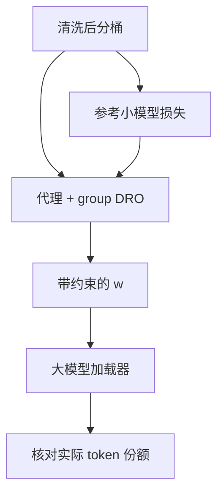

# DoReMi

先在小模型上用分组分布鲁棒优化把领域权重调到最差桶也不至于崩，再把这组权重接到大模型的数据加载器上。

<footer>—— Xie et al., DoReMi, NeurIPS 2023</footer>

[上一课](/llm/glitch-tokens)把词表快照上的欠训符号清掉或钉住。切分函数从此冻结。预训练工程的下一问不是「一个符号长什么样」，而是「下一微批从哪个桶来」。主干课 [配比定律](/llm/data-mixture-laws) 已经引入领域权重 $w$；本课不重讲「要不要配比」。缺口是：在词表与清洗都已固定之后，如何把 DoReMi 真正跑成一套可复现的工程步骤，而不是把论文公式抄进配置文件。后课 RegMix 用回归替代 DRO；本课先把 DRO 这条路走完。

## 问题

词表 fertility 让「同样 10% 中文 token」不等于同样 10% 中文句子。桶若仍按来源粗切（CC、维基、GitHub），DoReMi 优化的是这个粗分辨率上的最差超额损失。分辨率选错，权重再漂亮也只是把垃圾网页与优质网页捆在一起抬价。Xie 等人的方法假定桶标签干净、参考模型与代理模型吃同一套切分。缺的是：参考损失、代理 DRO、大模型消费这三步如何与 [清洗去重](/llm/web-clean-dedup) 后的真实 token 会计对齐。

小模型最优 $w$ 不必等于大模型最优 $w$。这是主干已经警告过的尺度缺口。工程上要决定：代理用多大、训多久、DRO 的步长与平滑如何防止 $w$ 在两三个桶之间振荡，以及人工约束（代码不少于某比例）写在哪一层。

### 最差桶可能是标注错误

若某个桶混进了大量模板，代理会把权重推向它——因为它相对参考更难。DoReMi 不能代替把桶滤干净。应先保证桶内质量，再跑 DRO；否则优化目标是「多喂最脏的那个标签」。

参考模型必须用与大模型相同的词表。换词表等于换离散测度，超额损失不可比。

## 方法

步骤固定为：在最终可训练集合上定义 $k$ 个桶；训参考小模型，记录各桶损失 $L_i(\theta_{\mathrm{ref}})$；再训代理，用 group DRO 更新 $w$，目标是压低 $\sum_i w_i(L_i(\theta)-L_i(\theta_{\mathrm{ref}}))$；把收敛的 $w$ 写进大模型加载器，并在日志里核对实际消费 token 份额。实现上 $w$ 的更新要有温度或移动平均，避免一步把某桶打到零。可行集加上盒约束，例如 $w_{\mathrm{code}}\ge 0.1$。

代理的深度与宽度应足以区分桶，而不必追上目标模型。预算不够时，减少 DRO 步数、收紧 $k$，比假装跑完更重要。产出不是一个点，而是 $w$ 加上约束敏感度：把代码下限从 10% 改到 15% 时，其他桶怎么让。

### 与人工配比衔接

Gopher、Llama 的公开比例是人工的。DoReMi 的位置是：在人工可行集里找更不崩的点，或解释人工点离 DRO 解有多远。不要把一次代理运行的 $w$ 当成新的宗教比例。尺度确认跑仍要在目标附近做。

验证集若取自网页桶内部，DRO 会看起来很成功，下游代码却掉。探针必须覆盖阅读、代码、数学、多语言，与主干课的帕累托要求一致。

## 机制

DRO 改变的是每个优化步里各桶梯度的混合系数。超额损失减去参考，是为了不把「天生更难的桶」（长书、低资源语言）无脑抬到 1。fertility 高的语言在按 token 分桶时已经吃亏，若再按 token 损失比较，会双重征税；必要时在桶定义上用字符或句子做辅助轴，或把语言与来源做成层次权重。

## 边界

DoReMi 优化桶权重，不挑选桶内文档——那是影响函数课。它也不回答动态课程：原文的 $w$ 是静态的。代理算力不是免费的，总预算很小时，两三次网格可能更划算。下一课 RegMix 把「小模型扫描混合物 → 拟合损失面」写成回归，适合 $k$ 稍大、想外推而不是只跑 DRO 的情况。

## 小结

- 词表冻结之后，本课补的是可复现地跑通 DoReMi，而不是重讲配比必要性。
- 桶要先干净、标签要对；DRO 会把最难的标签抬起来，包括最脏的那种。
- $w$ 必须带约束与敏感度，并用真实 token 会计核对。
- 小模型解要在目标尺度确认；探针不能只用网页验证损失。
- 出处：Xie et al., *DoReMi*, NeurIPS 2023；对照 Gopher / Llama 人工配比。
