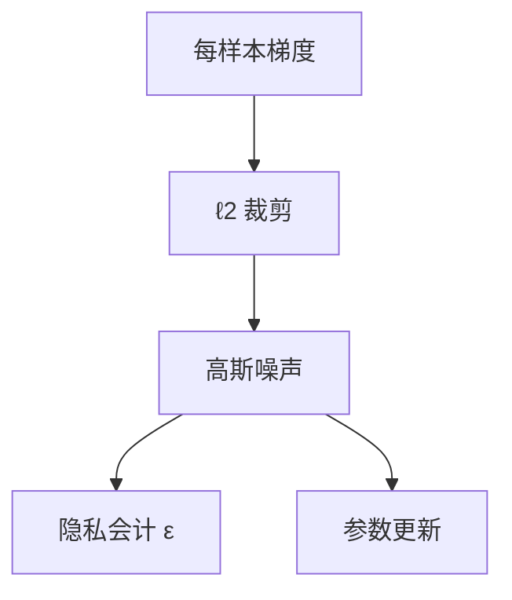

# DP-SGD

裁剪再加噪，换的是对单个训练样本的不可区分。预算花完之前，提取变难；预算不是版权许可证。

<footer>—— Abadi et al., Deep Learning with Differential Privacy；Dwork 差分隐私</footer>

[上一课](/llm/memorization-copyright)给出可提取的记忆。本课补训练期工具：DP-SGD——对每样本（或每微批）梯度裁剪，再加高斯噪声，用会计追踪 $(\varepsilon,\delta)$。缺口不是再讲一遍 AdamW，而是：普通 SGD 对重复样本的梯度可以任意大，DP 把个体影响封顶。后课模型提取是针对已部署接口，不依赖训练是否 DP。

## 问题

[成员推断与提取](/llm/membership-extraction) 利用的是「这个样本把参数拽向自己」。差分隐私要求：换掉任意一个样本，输出分布不可区分到 $\varepsilon$ 级。缺口是把这句话落到大模型微调：全参预训练的 DP 成本极高，实践多在微调、小批次、或 DP-FTRL 变体上。本课只钉 SGD 这一条经典路径。

$\varepsilon$ 小不是「模型不记得语料」。高频模式、公共知识仍在。DP 保护的是个体记录的可证明影响，不是语义遗忘。

## 方法

每步：算每样本梯度（或用泊松采样的批次），$\ell_2$ 裁剪到 $C$，平均后加 $\mathcal{N}(0,\sigma^2 C^2 I)$，再交给优化器。会计（RDP / 经济会计）根据步数、批次、$\sigma$ 给出 $\varepsilon$。超参：过大 $C$ 等于没裁剪；过小 $C$ 加过强噪声，效用崩。语言模型通常先非 DP 预训练，再 DP 微调敏感数据。

## 机制

裁剪限制单个样本对平均梯度的贡献；噪声把剩余贡献淹没到不可区分。组合定理允许很多步，但 $\varepsilon$ 累积。与 [记忆化](/llm/memorization-copyright) 的关系：DP 降低「因这一条记录而可提取」的可能，不阻止模型生成合法的公共短句。

## 边界

DP 不是版权方案，不是对越狱的防御，也不是校准。效用–隐私曲线在 LLM 上很陡，报告必须同时给下游能力与 $\varepsilon$。下一课模型提取假定对手只有 API，即使训练非 DP 也可以蒸馏行为。

## 小结

- DP-SGD：裁剪 + 噪声 + 会计，限制单样本影响。
- 实践多在微调；预训练 DP 贵。
- 不替代许可与去重。
- 出处：Abadi et al. CCS 2016；Dwork 差分隐私。
