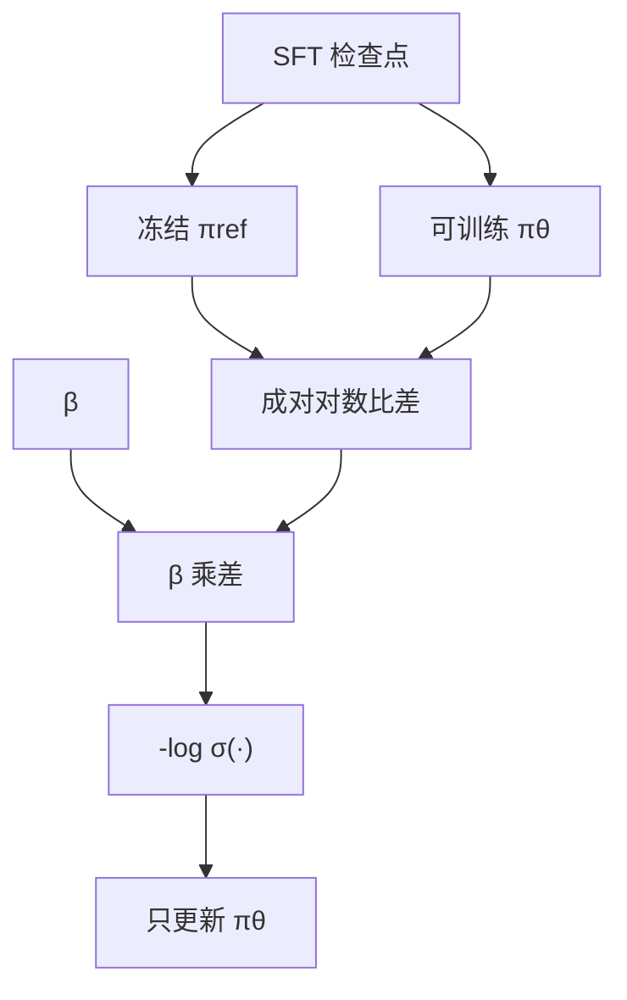

# 参考模型与 β

最优策略正比于参考策略乘上 $\exp(r/\beta)$；$\beta$ 是偏离参考的代价，参考是代价的锚点。把二者当成可有可无的实现细节，等于把 DPO 的推导抽掉。

<footer>—— Rafailov 等，Direct Preference Optimization，NeurIPS 2023；对照后续无参考目标</footer>

把 RLHF 的 KL 约束目标求闭式，再把奖励反解成策略对数比，就得到 DPO。公式里有两个不是数据的东西：冻结的参考策略 $\pi_{\mathrm{ref}}$，以及温度 / KL 系数 $\beta$。现场把它们调乱的方式非常固定：参考用错检查点、训练中更新参考却仍当 DPO 用、$\beta$ 从论文表格抄一个数量级完全不同的任务、以及在无参考方法里继续谈论「同一个 $\beta$」。本篇只写这两个对象做什么、如何耦合、与 [KTO](/llm/kto) / [ORPO](/llm/orpo) / [SimPO](/llm/simpo) 的无参考或不同 $\beta$ 语义如何区分。

## 问题

带 KL 惩罚的强化学习目标是

$$
\max_\pi\,\mathbb{E}_{x\sim\mathcal{D},\,y\sim\pi}\bigl[r(x,y)\bigr]-\beta\,\mathrm{KL}\bigl(\pi(\cdot\mid x)\,\|\,\pi_{\mathrm{ref}}(\cdot\mid x)\bigr).
$$

$\beta$ 大，策略必须靠近参考，偏好信号再强也走不远；$\beta$ 小，KL 项变软，策略可以冲向奖励的尖锐模式，幻觉、长度、拒答套话都会被放大。参考若取错——用预训练基座而不是 SFT，或用已经对齐过一轮的旧策略——KL 惩罚的是错误的偏离，优化会把「相对基座的 SFT 风格」当成要付费的动作，或把「已经学掉的有害模式」当成应保持的参考。

DPO 不训练显式 $r$，但这两个对象仍在。忽略它们，只扫学习率，等于在未知约束下做偏好拟合：有时看起来很能打，是因为 $\beta$ 碰巧把步子锁死在 SFT 附近；有时突然崩溃，是因为参考已经与当前策略脱节，对数比失去意义。

### 对数比何时退化成常数

隐含奖励 $r(x,y)=\beta\log\frac{\pi_\theta(y\mid x)}{\pi_{\mathrm{ref}}(y\mid x)}+\beta\log Z(x)$。若让 $\pi_{\mathrm{ref}}\leftarrow\pi_\theta$ 每步同步，分子分母相同，比值为 1，奖励差恒为 0，损失无信息。若参考停在一个远弱于当前策略的检查点，比值整体漂移，$Z(x)$ 的抵消在成对差里成立，但数值动态范围会被 $\beta$ 放大到饱和。参考必须冻结，且与「你允许策略停留的那个分布」一致，通常是 SFT。

无参考方法并不是「$\beta=\infty$」或「$\beta=0$」的极限。ORPO 用 SFT 项当锚，SimPO 用平均对数概率加间隔，KTO 仍保留参考。删掉 $\pi_{\mathrm{ref}}$ 是换正则，不是把 DPO 的 $\beta$ 拧到某个端点。

## 方法

DPO 成对损失为

$$
\mathcal{L}_{\mathrm{DPO}}=-\mathbb{E}\log\sigma\Bigl(\beta\log\frac{\pi_\theta(y_w\mid x)}{\pi_{\mathrm{ref}}(y_w\mid x)}-\beta\log\frac{\pi_\theta(y_l\mid x)}{\pi_{\mathrm{ref}}(y_l\mid x)}\Bigr).
$$

实现清单只有三句。第一，参考是一份冻结权重，前向无梯度；LoRA 时参考应跑裸基座或冻结的 SFT 适配器，禁止与可训练适配器共享同一份正在更新的参数。第二，$\beta$ 乘在成对对数比差上，先定 $\beta$ 再扫学习率，不要两个一起随机搜。第三，序列对数概率的归约（求和还是平均）必须写进配置：求和时 $\beta$ 的有效尺度随长度变，平均时 $\beta$ 更接近 SimPO 里那个温度，但不能把两者的网格混用。

选参考的默认：与偏好数据同分布的 SFT 检查点。偏好数据若在 SFT 之后采集，参考就是那份 SFT；若偏好来自另一个模型的回答，参考仍应是你正在微调的那份 SFT，而不是生成数据的那个教师——否则 KL 约束的是外部分布，当前策略的偏离代价失真。KTO 用同一个 $r_\theta$ 与 $\beta$，另加参考点 $z_0$；调 KTO 的 $\beta$ 仍是在调离参考的步长。

### $\beta$ 与学习率为何不能互相替代

学习率改变每步参数位移的欧氏长度；$\beta$ 改变「多大的对数比差才算拟合了一条偏好」。$\beta$ 大时，很小的策略偏离就能让 $\sigma$ 饱和，梯度变小，看起来像学不动，有人会把学习率加大——于是在饱和区用大步子抖，训练不稳。$\beta$ 小时，同样的偏好要求更大的对数比差，策略走得远，学习率再大就容易毁流畅。应先把 $\beta$ 放到让验证集上 $y_w$ 与 $y_l$ 的隐含奖励差落在 $\sigma$ 的斜坡上，再调学习率让这个差平稳上升，而不是用学习率去补错误的 $\beta$。

## 机制

### 闭式最优策略里 $\beta$ 的位置

对固定 $r$ 与 $\pi_{\mathrm{ref}}$，最优策略满足 $\pi^*(y\mid x)\propto\pi_{\mathrm{ref}}(y\mid x)\exp\bigl(r(x,y)/\beta\bigr)$。$\beta$ 在指数分母上：它是把奖励转换成概率时的温度。温度低（$\beta$ 小），质量差被放大成近 one-hot 的策略，容易模式崩塌；温度高（$\beta$ 大），策略接近参考，偏好几乎改不了解码。DPO 把 $r$ 消掉之后，$\beta$ 仍留在 logistic 里，扮演同一温度。这与 [SDPA](/llm/sdpa) 里除以 $\sqrt{d_k}$、与蒸馏里的 $T$ 是同一类对象：控制 softmax / sigmoid 输入的尺度。不要和生成时的采样温度共用一个配置项。

参考进入 $\pi^*$ 的方式是乘法先验：参考认为不可能的 $y$，策略也难以救回来，除非 $r$ 大到不合理。所以参考必须已经会做任务。用预训练基座当参考，等于先验还在网页续写上，对齐阶段要付巨大 KL 才能学会对话格式；格式本应在 SFT 里免费获得。这是「参考选 SFT」的机制原因，不是习惯。

成对差消掉 $\log Z(x)$，所以 DPO 不需要配分函数。这不表示参考可以随便换：换参考等于换 $r$ 的零点与 KL 几何，已经训好的 $\pi_\theta$ 不能接到另一份 $\pi_{\mathrm{ref}}$ 上继续做同一 $\beta$ 的 DPO。

### 无参考目标各自替代了哪一块

[ORPO](/llm/orpo) 丢掉对数比，用 $y_w$ 上的 NLL 替代「靠近参考」；它替代的是正则，不是 $\beta$ 温度——OR 项的 $\lambda$ 才是对比强度。[SimPO](/llm/simpo) 的 $\beta$ 乘在平均对数概率上，没有 KL，数值不可与 DPO 的 $\beta$ 对照。[SLiC](/llm/slic) 用 $\lambda$ 加权 NLL 正则，间隔是 $\delta$ 不是 $\beta$。只有 KTO 与 DPO 共享「参考 + $\beta$ 缩放对数比」这一块，KTO 再多一个 $z_0$。讨论超参时先说清损失，再写 $\beta$，否则表格不可读。

## 边界与工程取舍

参考多一份前向，显存与步时都贵；这正是无参考方法存在的理由。若显存允许，保留参考能得到更清楚的偏离语义，也便于用 KL 做监控：训练中 $\mathrm{KL}(\pi_\theta\|\pi_{\mathrm{ref}})$ 应随 $\beta$ 反向变化，若不，实现多半写错了停梯度或用了错误检查点。$\beta$ 没有跨宽度、跨数据的万能值；偏好对很吵时应偏大，把步子锁住；对很干净、且 SFT 已经很强时可以偏小。不要在训练中途改 $\beta$ 还不重置优化器状态，尺度突变会让 Adam 的二阶矩失效。

在线迭代（用当前策略重新采样再标偏好）时，参考是否跟着更新是另一条设计：参考仍冻在最初 SFT，约束最强、最稳；参考周期性替换成上一轮策略，更像离线 RL 的旧策略，能继续走但失去「回到 SFT」的锚。后者不要再叫原版 DPO。生成长度、重复、过度拒答是 $\beta$ 过小的常见症状；几乎不变的 SFT 口吻是 $\beta$ 过大或参考过强。

LoRA 微调时，若参考误用带适配器的同一份权重，对数比只反映适配器相对自身的差，接近零，训练会假收敛。参考必须是「适配器为零」的基座，或一份独立的冻结核。

### 何时可以丢掉参考

显存放不下第二份模型、且你接受正则从 KL 换成 SFT 项或间隔，用 ORPO / SimPO。标签不成对，用 KTO，参考仍建议留。需要把偏离写成可报告的 KL、要和 RLHF 论文对照，留参考与 $\beta$。从基座直训偏好、没有可用的 SFT 参考，应先 SFT，而不是发明一份「基座参考的 DPO」。

## 小结

- DPO 来自带 $\beta\,\mathrm{KL}(\pi\|\pi_{\mathrm{ref}})$ 的 RL 目标；$\beta$ 是偏离代价，参考是锚。
- 参考应冻结为与数据匹配的 SFT，禁止与 $\pi_\theta$ 同步，也避免用预训练基座。
- $\beta$ 缩放成对对数比，控制 sigmoid 尺度；不能用学习率代替，也不能与采样温度共用。
- 无参考方法换的是正则，不把 DPO 的 $\beta$ 拧到 0 或无穷。
- 监控 KL、生成长度与偏好差是否落在 sigmoid 斜坡上，判断 $\beta$ 与参考是否配得上。
- LoRA 下参考不得共享正在训练的适配器。
- 出处：Rafailov 等，*Direct Preference Optimization: Your Language Model is Secretly a Reward Model*，NeurIPS 2023。无参考对照见 Hong 等 ORPO、Meng 等 SimPO；KTO 仍保留参考与 $\beta$。
