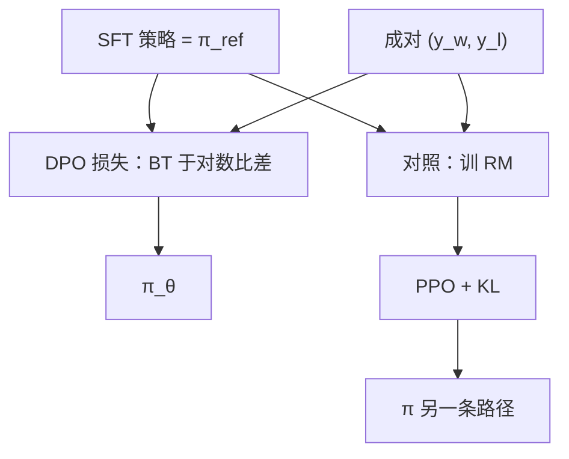

# DPO

在 KL 约束的奖励最大化里，最优策略与奖励一一对应；把奖励换成策略的对数比，成对比较的似然可以直接对策略求导。

<footer>—— Rafailov et al., Direct Preference Optimization, NeurIPS 2023</footer>

InstructGPT 的后半段是显式 [奖励模型](/llm/reward-model) 加 PPO：先拟合 $r_\phi$，再在策略上最大化 $r$、并用 KL 把策略拴在 SFT 参照附近。PPO 对语言模型又贵又脆，要调采样、优势估计、KL 系数。Rafailov 等人 2023 年的 Direct Preference Optimization（DPO）指出，在 KL 正则的奖励最大化这个特定目标下，最优奖励可以写成策略相对参照的对数比，于是 Bradley-Terry 似然里的 $r(y_w)-r(y_l)$ 变成两条回答的对数概率差。损失只涉及 $\pi_\theta$ 与冻结的 $\pi_{\mathrm{ref}}$，不必再训 RM，也不必在训练环里采样。本篇写这条闭式回代、$\beta$ 的含义、以及它相对 RM+PPO 少了什么、多了什么。Azar 等人的 [IPO](/llm/ipo) 针对 DPO 在错指定与过拟合上的问题，留到下一篇。

## 问题

KL 约束的 RLHF 目标可以写成

$$
\max_{\pi}\;\mathbb{E}_{x\sim\mathcal{D},\,y\sim\pi(\cdot\mid x)}\bigl[r(x,y)\bigr]-\beta\,\mathrm{KL}\bigl(\pi(\cdot\mid x)\,\|\,\pi_{\mathrm{ref}}(\cdot\mid x)\bigr).
$$

$\pi_{\mathrm{ref}}$ 通常是 SFT 模型。最优解满足 $r(x,y)=\beta\log\frac{\pi^*(y\mid x)}{\pi_{\mathrm{ref}}(y\mid x)}+Z(x)$，其中 $Z$ 只依赖提示。也就是说，在这个目标类里，奖励与策略不是两个自由对象，而是差一个归一化的同一件事。先拟合任意 $r_\phi$ 再让 $\pi$ 去追，既浪费，也可能追不到与 $r_\phi$ 一致的最优（PPO 近似、早停、采样噪声）。问题是：能否把比较数据上的 BT 似然，直接写成对 $\pi$ 的监督。

比较数据仍是 $(x,y_w,y_l)$。BT 需要的是 $r(x,y_w)-r(x,y_l)$。把最优形式代入，配分 $Z(x)$ 相减消掉，只剩两条回答在 $\pi$ 与 $\pi_{\mathrm{ref}}$ 下的对数比之差。这要求：真正关心的目标确实是上述 KL 正则期望奖励，且人类比较确实由该 $r$ 的 BT 模型生成。两条都是假设，不是数据保证的性质。

### 奖励的解析回代

定义隐含奖励 $\hat r_\theta(x,y)=\beta\log\frac{\pi_\theta(y\mid x)}{\pi_{\mathrm{ref}}(y\mid x)}$。DPO 损失为

$$
\mathcal{L}_{\mathrm{DPO}}=-\mathbb{E}\log\sigma\Bigl(\beta\log\frac{\pi_\theta(y_w\mid x)}{\pi_{\mathrm{ref}}(y_w\mid x)}-\beta\log\frac{\pi_\theta(y_l\mid x)}{\pi_{\mathrm{ref}}(y_l\mid x)}\Bigr).
$$

即 BT 似然，分数差换成 $\beta$ 倍的对数比差。梯度会提高赢回答的相对对数概率、压低输回答的相对对数概率，幅度由 $\sigma$ 的饱和与 $\beta$ 共同决定。参照 $\pi_{\mathrm{ref}}$ 冻结，通常取 SFT；训练开始时 $\pi_\theta=\pi_{\mathrm{ref}}$，损失是 $\log 2$，隐含奖励差为 0，表示「尚未表达偏好」。

DPO 不是无奖励。它把奖励限制在「$\beta\log(\pi/\pi_{\mathrm{ref}})$ 这一函数族」里。族外的 $r$ 无法被表示，PPO 配一个任意 RM 理论上更宽，只是优化更难。

## 方法

数据与 RM 阶段相同：成对偏好。不必为 RM 另存一个头。实现：对 $y_w,y_l$ 分别在 $\pi_\theta$ 与 $\pi_{\mathrm{ref}}$ 下算回答段的 log-prob 和（通常对提示掩码，与 SFT 相同）。$\beta$ 是温度：更小则要求更大的对数比差才能拟合同一胜率，更新更猛；更大则更靠近参照。Rafailov 等人在论文实验里用中等 $\beta$，具体取值随模型与数据变，应扫，不应抄成定律。优化器用 Adam，学习率低于 SFT，因为对数概率差对长序列很敏感。长度：应对回答做平均 log-prob 还是求和，影响长度偏置；求和会偏向改短或改长取决于哪边更容易动，需在验证比较上监视平均长度。

参照必须与策略同词表、同模板。用基座当 $\pi_{\mathrm{ref}}$ 而策略已经 SFT，对数比会把「学会 chat 格式」也当成可优化的奖励，偏好学习与格式学习缠在一起。正确的参照是进入 DPO 之前的那个助手模型。离线数据里的 $y$ 应来自靠近 $\pi_{\mathrm{ref}}$ 的分布；若 $y$ 来自完全不同的教师（ShareGPT 的 ChatGPT），$\pi_{\mathrm{ref}}$ 对 $y_w$ 和 $y_l$ 的概率都极低，比值噪声大。这是用公开偏好集做 DPO 时的常见失效，不是公式错误。

与 RM+PPO 的分工：若需要在线采样、需要奖励用于拒绝采样服务、或需要把有用/安全分成两个可组合标量，显式 RM 仍有用。若只想在固定比较集上把策略推离 SFT，DPO 少一套模型、少一次采样环。Llama 2 当时走 RM+PPO；后来许多开源配方在 SFT 之后接 DPO，是工程替代，不是证明 PPO 被证伪。

### 参照策略与 β

$\beta$ 同时出现在最优形式与损失里。把它理解成「KL 温度」比理解成学习率更准确：学习率改变步长，$\beta$ 改变「多大的概率差才算表达了这一比较」。$\beta$ 过小，模型会为了拉开差而把 $y_l$ 的概率打到近零，甚至损伤 $y_l$ 附近的无害回答，表现像遗忘。$\beta$ 过大，拟合不动比较，策略几乎停在 SFT。应在持有比较准确率（用隐含奖励差预测谁赢）与原能力探针之间扫。这与 [SFT 遗忘](/llm/sft-forgetting) 的诊断表衔接：DPO 步数少，但仍能通过压低大量 $y_l$ 伤害代码与知识，若比较集与那些领域重叠。

## 机制

对单对 $(y_w,y_l)$，令 $\Delta=\beta\bigl(\log\frac{\pi_\theta(y_w)}{\pi_{\mathrm{ref}}(y_w)}-\log\frac{\pi_\theta(y_l)}{\pi_{\mathrm{ref}}(y_l)}\bigr)$，损失为 $-\log\sigma(\Delta)$。梯度把质量从 $y_l$ 的 token 挪向 $y_w$ 的 token，相对参照。因为比较的是两条完整序列的和，模型可以用任意方式拉开 $\Delta$：提高 $y_w$、降低 $y_l$、或两者同时。经验上降低 $y_l$ 往往更容易（把概率从已有序列上拿走），导致「对拒绝样本过抑制」：与 $y_l$ 共享 n-gram 的好回答也被压。这是 DPO 相对「只升赢家」的 SFT 的机制差异。

BT 的 logistic 永不在有限 $\Delta$ 上达到零损失，理论上可以无止境地拉大 $\Delta$。数据有噪声时，模型会为了拟合错误标签或捷径对而把对数比推到极端。这是 Azar 等人批评 DPO、提出 IPO 平方损失的要点：身份映射的偏好目标有一个有限的间隔，而不是越大越好。DPO 在干净、与 $\pi_{\mathrm{ref}}$ 同分布的比较上可以很强；在嘈杂公开偏好上更容易过拟合间隔。

DPO 不在训练中对 $\pi_\theta$ 采样，因此不会自己发现 RM+PPO 在线迭代才能见到的新失败模式。离线比较覆盖到哪，策略就被推到哪。覆盖外的奖励 hacking 换成了「没见过所以没推」，不一定更安全。

### 与 RM+PPO 的差

RM+PPO：奖励模型可以是任意函数，策略用采样逼近期望。优点是可以用 RM 做拒绝采样、可以迭代标新样本、可以把奖励与策略规模解耦。缺点是两阶段误差、PPO 超参、采样成本。DPO：奖励被限制在对数比族，训练是对固定对的分类式损失，稳定、省。缺点是离线、长度与抑制输家的动力学不同、隐含奖励不好单独拿去给别的采样器打分（它依赖 $\pi_\theta$ 自身，随着训练变）。二者用的比较假设都是 BT，捷径问题同源。

## 边界与工程取舍

DPO 不能替代 SFT。比较是「更好」，不是「可接受的绝对示范」。没有 SFT 的参照，chat 格式与基本遵循不稳，$\pi_{\mathrm{ref}}$ 也没有自然选择。Rafailov 等人的设定是在已 SFT 的模型上做偏好。把 DPO 直接接基座，等于用比较去同时学格式，数据效率差，也容易把「像赢家的套话」当成格式。

比较数据的教师分布必须靠近参照。用 GPT-4 对当学生是 7B SFT 的 DPO 数据，对数比处于极低概率区，梯度吵。缓解包括：对学生自己的样本做比较（更贵，更近），或先用 SFT 模仿教师再 DPO。ShareGPT 式对话不是成对偏好，不能直接当 DPO 数据；要另做采样与标注。OpenHermes 是示范不是比较。

把 DPO 准确率（隐含奖励是否排对训练对）当成功标准会保证过拟合。应看持有提示上的人偏好或独立裁判，以及长度、拒答、原能力。训练损失降到很低往往是 $\Delta$ 被拉爆，而不是更对齐。

数学假设（KL 正则期望奖励 + BT）若与真偏好不符，DPO 是错指定下的最大似然。IPO 换 $\Psi$ 与平方损失，就是承认这一点。实践中 DPO 仍然好用，是因为在短日程、中 $\beta$、相对干净的数据上，错指定还没把间隔拉到有害区域。这不是闭式推导保证的。

## 小结

- DPO 利用 KL 正则最优策略与奖励的对应，把 BT 损失写在 $\beta\log(\pi_\theta/\pi_{\mathrm{ref}})$ 的差上，不再训 RM、不在环内采样。
- $\pi_{\mathrm{ref}}$ 应为 SFT 助手；$\beta$ 是 KL 温度，过小会过抑制输家。
- 隐含奖励属于对数比函数族，窄于任意 RM，但优化更直接。
- 离线、会压低 $y_l$、logistic 不饱和故可拉爆间隔；嘈杂数据上需早停或改用 IPO。
- 不替代 SFT；比较分布应靠近参照。公开示范集不是偏好对。
- 与 InstructGPT 的 RM+PPO 是同一比较假设下的另一优化路径，不是另一套人类反馈定义。
- 出处：Rafailov 等，*Direct Preference Optimization*，NeurIPS 2023；流程对照 Ouyang 等 InstructGPT；比较模型见 Bradley-Terry。
