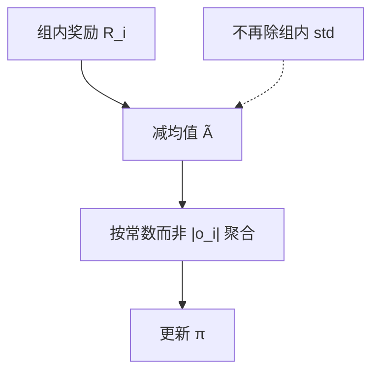

# Dr. GRPO

    
GRPO 目标里的 $1/|o_i|$ 与组内标准差，会给不同长度和不同难度的题重新加权；去掉这两项，才回到与 PPO 代理同类的无偏策略梯度。

    <footer>—— Liu 等，Understanding R1-Zero-Like Training: A Critical Perspective，arXiv:2503.20783</footer>

DeepSeek-[R1-Zero](/llm/deepseek-r1) 把「长度随奖励一起涨」写成涌现。Sea AI Lab 的这篇批判文章问两件事：基座是不是已经会反思；以及 [GRPO](/llm/grpo-paper) 的目标是否**人为**鼓励错误答案变长。**Dr. GRPO**（GRPO Done Right）是他们给第二问的修改：去掉回复级长度归一与题级标准差归一。本篇写偏差怎么来、最小主义配方如何在 7B 上打到 AIME 2024 **43.3%**，不重复 R1 的四阶段产品管线。

## 问题

把语言生成写成 token MDP 后，PPO 的代理目标是对轨迹上每个 token 的 $\min(\rho\hat A,\mathrm{clip}(\rho)\hat A)$ **求和**（或除一个训练期常数）。开源 PPO 实现却经常 `masked_mean` 按**该条回复长度**平均——这项偏差在 GRPO 之前就有。GRPO 再除一次组内 $\mathrm{std}(\mathbf{R})$。于是有效优势变成对无偏中心化奖励 $\tilde A_i=R_i-\mathrm{mean}(\mathbf{R})$ 的再加权。

**长度偏差。** 正优势（答对）时除以 $|o_i|$，短正确回复梯度更大，策略喜欢短对；负优势（答错）时，长错误回复被除得更「轻」，惩罚更小，策略喜欢把错答写长。训练曲线上「平均长度一直涨」因此可以混进**错答变长**，而不只是「学会思考」。

**难度偏差。** 除以组内 std，过易或过难题（奖励几乎全 1 或全 0）std 小，反而在目标里权重大。优势标准化在 RL 里常按**整个 batch** 做；按题做会让不同题的学习率跟着难度抖。

### 基座已经会「Aha」

作者测 Qwen2.5、Llama-3.1、DeepSeek-Math 与自托管的 DeepSeek-V3-Base：模板决定基座是在答题还是在续写；Qwen2.5 **不用模板**时答题率最高，数学平均相对 4-shot 可涨约 60%，他们推测预训练见过拼接的问答。V3-Base 在 R1 模板下已出现 wait / Aha 一类词。R1-Zero 的自检频率更高，但与正确率**无正相关性**。用 Qwen-Math 复现 Zero，要意识到基座不是纯完成模型。

Qwen2.5-Math-7B 加上 R1 模板，表 1 里平均分可以掉到近 0。模板与预训练分布错配会先毁掉推理，再靠 RL 重建。这不是 Dr. GRPO 公式的一部分，却是「Zero 配方」的隐藏超参。

## 方法

Dr. GRPO 的优势只用组内减均值：

$$
\hat A_{i,t}=\tilde A_i=R(q,o_i)-\mathrm{mean}(\{R_j\}).
$$

损失聚合不再除 $|o_i|$，而除训练期常数（例如最大生成长度 $\mathrm{MAX\_TOKENS}$），使不同长度的回复在目标里有可比较的总权重。KL 在可验证奖励设定下取 $\beta=0$，与他们引用的 R1 类实践一致。

**最小主义配方。** 算法 Dr. GRPO；数据 MATH 训练集 **level 3–5**；模板用 Qwen-Math（不是 R1 模板）；基座 Qwen2.5-Math-7B。约 **27 小时、8×A100**。AIME 2024 **43.3%**，当时他们称为该规格上的 SOTA。代码在 `sail-sg/understand-r1-zero`，框架 Oat。对照实验里，GRPO 在奖励已经放缓后仍把错误回复拉长；Dr. GRPO 保持推理分的同时提高 token 效率。

### 开源 PPO 也有同一长度项

作者检查若干流行 PPO 实现，发现都按回复长度做 `masked_mean`，与 Schulman 的求和式不一致。他们推测来自预训练里对固定上下文做 `loss.mean` 的习惯。因此「改 Dr. GRPO」时若底层仍按 $|o|$ 平均，偏差会从聚合层回来。实现要同时改优势与 reduction。

## 机制

无偏策略梯度要求：对同一条轨迹，目标对 $\log\pi$ 的权重不应偷偷依赖 $|o|$ 或该题的 $G$ 样本方差，除非那是你显式想要的先验。减均值已经提供零均值基线，足以在同题上区分相对好坏；再除 std 改变的是**题与题之间**的相对学习率。去掉 $1/|o|$ 之后，错答不能再靠变长来摊薄负梯度，长度增长若还出现，更接近「更长搜索真能提高 $R$」，而不是优化器偏置。

这与 [DAPO](/llm/dapo) 的 token 级损失不同：DAPO 用 $\sum_i|o_i|$ 做分母，长样本在 batch 里**更**有影响力；Dr. GRPO 用全局常数，避免「越长越稀释」但不刻意让长样本主导。两者都在批评 $1/|o_i|$ 的样本级平均，处方相反。R1-Zero 公开曲线里的长度上涨，因此不能自动读成「思考涌现」：至少有一部分可以被目标函数的错答加权解释。作者用同一套评测看 DeepSeek-R1-Zero 的自检词频率，发现它与正确率不对齐，进一步削弱「关键词变多 = 推理变强」的叙事。最小主义配方故意把数据收成 MATH 中高难度、把模板收成与 Qwen-Math 预训练一致，是为了在 7B 预算上隔离算法偏差，而不是声称这就是 671B Zero 的充分统计。

后来有文章证明：在纯结果奖励下，无偏与长度不变性不能同时成立。Dr. GRPO 选无偏，GRPO 选某种长度再加权。Done Right 是作者的命名，不是唯一正确的几何。

## 边界与工程取舍

43.3% 绑定 Qwen2.5-Math-7B、MATH 中高难度切片与 Qwen-Math 模板，不是 671B Zero 的复现。Qwen 基座的「无模板暴涨」意味着部分推理可能来自预训练泄漏式问答，外推到 Llama 纯基座会打折。去掉 std 后，奖励量纲跨题不一致时学习率更敏感；0/1 奖励还好，未标准化的 RM 分可能需要全局 batch 标准化——那已经接近 [REINFORCE++](/llm/reinforce-plusplus)。

负优势不再被长度摊薄，短错答的梯度变大，训练可能更抖，需要梯度裁剪。社区里也有报告称去掉长度归一后出现冗长不稳；若奖励本身不罚长度，无偏更新会让更长轨迹占更多 token 梯度表面积。长度仍要用显式 $r$ 或预算，而不是指望改 reduction 自动变短。

「Aha 已在基座里」不否定 RL 能提高正确率。它否定的是把关键词计数当成 R1 的因果证据。评测自检应与对错交叉，而不是只画 wait 的频率曲线。

### 何时不必改 Dr. GRPO

已经用 batch 级标准化、回复长度几乎常数、且 clip 健康，改动量有限。需要题级 z-score 来对齐 0/1 与连续 RM 的混批，保留 std 可能更省事。要序列级 IS，走 [GSPO](/llm/gspo)，与是否除 $|o|$ 是另一轴。

## 小结

- Dr. GRPO 去掉 GRPO 的 $1/|o_i|$ 与组内 std，优势只减组均值，聚合用常数。
- 旨在消除「错答变长」与「过易/过难题权重反常」两类优化偏差。
- 最小配方：Qwen2.5-Math-7B + MATH 3–5 + Qwen-Math 模板，8×A100 约 27h，AIME 2024 43.3%。
- 多个开源 PPO 实现同样按回复长度平均，修算法要连 reduction 一起改。
- 基座模板与预训练偏差会主导 Zero 复现；V3-Base 已有自检词。
- 出处：Liu、Chen、Li、Qi 等，*Understanding R1-Zero-Like Training*，arXiv:2503.20783；https://github.com/sail-sg/understand-r1-zero 。
