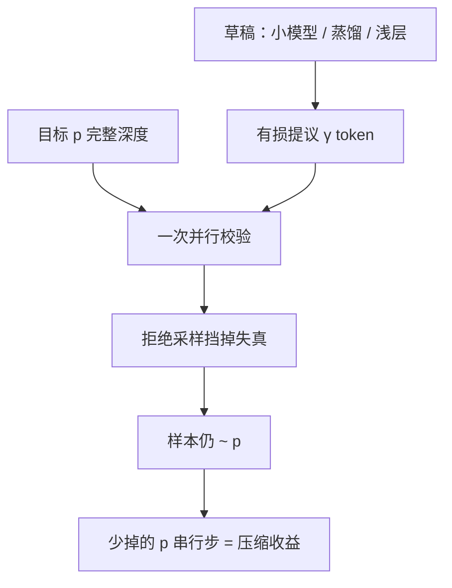

# 投机草稿作为压缩

小草稿是对大模型下一 token 分布的有损压缩；无损的是校验规则，不是草稿本身。压缩比出现在目标模型少走的串行步上。

<footer>—— 对照 Leviathan et al., Fast Inference from Transformers via Speculative Decoding, ICML 2023；Chen et al., Speculative Sampling, 2023</footer>

权重量化、剪枝、层剪压缩的是**同一张网络的存储与每步 FLOPs**。[投机解码](/llm/speculative-decoding) 引入第二张网：草稿 $q$ 提议，目标 $p$ 一次校验。从压缩看，$q$ 是 $p$ 的条件分布的近似码本——参数更少、每步更便宜，信息损失表现为拒绝。Leviathan 等人的接受规则保证最终样本仍来自 $p$，所以产品质量不跟着 $q$ 的有损走；加速来自目标串行步被「一压多」。本篇不重复接受公式与 [草稿怎么选](/llm/draft-model)，只把草稿写成压缩物：压缩的是什么、率失真在哪、以及它和蒸馏小模型、层剪浅子网如何共用同一套账。

## 问题

自回归的不可压缩部分是因果顺序：token $t$ 必须在 $t-1$ 写完之后才能合法查询。量化不能打破这条链，剪枝也不能。能压缩的是「每一步都要跑完整 $p$」这一实现。若存在更便宜的 $q\approx p$，就可以把若干未来位置先编码成草稿 token，再让 $p$ 做一次块校验——用并行换串行。压缩比定义为

$$
\frac{\text{朴素 decode 的目标步数}}{\text{投机过程的目标步数}}\,,
$$

不是 $q$ 与 $p$ 的参数量之比。7B 对 70B 是 10× 存储压缩，若接受率极低，目标步数几乎不降，墙钟压缩可以是 0.8×（变慢）。作为压缩方法，草稿必须同时满足**率**（$c_q$ 低）与**失真**（与 $p$ 的逐位置分歧小）。只满足一条，都不是合格压缩器。

无损承诺容易被误读成「草稿不是压缩、因为质量不变」。质量不变是因为失真被拒绝采样挡在用户可见序列之外；算力账上失真仍然存在，表现为浪费的草稿步与更胖的校验前向。压缩理论里这叫边信息加校验，不是无失真编码。

### 压缩对象不是目标权重

目标 $p$ 的权重可以仍然是 FP16 或 W4A16，投机不替代 GPTQ。草稿才是被压缩的那份「预测工作」。也可以两者都做：4-bit 的 $p$ 配更小的 4-bit $q$。签字要分开：权重量化掉的是 $p$ 的加载；投机掉的是 $p$ 的步数。把投机加速比乘上量化加速比当独立因子，只有在核与 batch 不变时近似成立，校验前向变胖会破坏独立性。

Medusa、EAGLE 把草稿收成头或特征外推，参数增量更小，仍是对未来 token 的有损码。Lookahead 甚至不另存模型，用目标自己的 Jacobi 猜测当草稿。压缩物可以从「独立小网」到「几层头」，本篇的账通用：提议便宜、失真用拒绝消化。

## 方法

标准压缩器：$q$ 取同词表、同模板的小稠密模型，或蒸馏到 $p$ 的输出分布上的专门草稿。蒸馏草稿用 $p$ 的 logits 当老师，直接压的就是投机在乎的那个对象——条件分布——通常比「独立预训练的同尺寸小模型」更低失真，见在线/离线蒸馏专文的同一逻辑。训练草稿是一次性压缩成本；服务期每次请求摊销。

把目标自己的浅前缀当 $q$（只跑前 $L'$ 层再读出）是深度压缩与投机的交集：草稿与目标共享底部权重，缓存可以复用，失真来自少看的上层。LayerDrop 训过的网更适合这种切法。[层剪](/llm/layer-prune) 若直接当唯一模型上线，质量会变；当草稿时质量由 $p$ 兜底，浅子网只需「常猜对高频 token」。同一浅网，当产品模型不合格，当压缩器可能合格。

树状多候选提高同一校验前向里的命中率，等于用更宽的码字表降低失真，校验 FLOPs 上升。是否值得，仍然是率失真：宽树在代码补全这种低熵负载上更划算。

## 机制

逐位置总变差或拒绝率 $\alpha$ 是失真的操作定义。若独立、平稳，期望前进大约是几何级数 $(1-\alpha^{\gamma})/(1-\alpha)$ 一类（实现细节见原理篇），目标每轮仍只付一次前向。压缩比随 $\alpha$ 变差而崩塌，对负载敏感：闲聊功能词上 $q$ 很像 $p$，JSON 括号与罕见 API 上不像。所以草稿压缩是**负载相关编码**，不是与数据无关的权重量化。换领域等于换信源，要重选或重蒸 $q$。

无损规则把用户可见比特的分布钉在 $p$ 上，于是可以安全地用很狠的 $q$（更小、更稀、更低比特）。$q$ 本身尽可以用 W4A16、层剪、甚至非结构化稀疏——那些方法在 $q$ 上失败只表现为变慢，不表现为胡言。这是投机作为压缩框架的组合优势：把有损压缩从产品模型挪到可抛弃的提议器上。

温度升高使 $p$ 变平，$\alpha$ 上升，同一份草稿的压缩比下降。评测必须钉采样。贪心下的 3× 不能写进高温度聊天的 SLA。

### 与蒸馏小模型当唯一系统的差别

把 7B 蒸馏成产品模型，用户吃的是有损分布，SLA 是质量换延迟。投机里 7B 只当 $q$，用户吃的仍是 70B 的 $p$。同样的 7B 检查点，角色从「压缩后的系统」变成「压缩用的编码器」。参数存储可以相同，承诺完全不同。不要把「我们部署了蒸馏 7B」和「我们用 7B 给 70B 做草稿」写成一种压缩。

## 边界与工程取舍

草稿与目标必须共享分词与特殊符号，否则似然比无定义，压缩器坏在接口而不是率失真。两套 KV、两套权重的调度在连续批里更烦：运行集要以投机轮为边界，半轮抢占会破坏无损证明。显存上 $q$ 通常可忽略，但树状验证加长的目标前向会顶 KV。prefill 已经算力打满时，投机压缩比为 1 或更差，不要开。

成本：维护两套模型的版本同步。$p$ 一换，$q$ 要重蒸或至少重测 $\alpha$。把过期草稿留在线上，质量仍由无损兜底，延迟 SLA 会无声恶化——压缩器过期的典型故障模式。

### 何时该用层剪而不是草稿

若可以接受质量下降、且没有第二份模型的运维预算，层剪或宽剪更简单，一份图。若质量必须钉 $p$、decode 又在带宽墙、又能提供对齐的 $q$，投机是把压缩放在时间轴上而不是参数轴上。两者可叠加：$p$ 先 W4A16，再配草稿。叠加时分别测，不要假设因子相乘。

Chen 等人用约 4B 草稿给 70B 级目标，说明跨一个数量级的有损压缩可以工作。再小的草稿不是禁止，而是 $\alpha$ 与 $c_q$ 要重新扫；过小则率很好、失真不可用。

## 小结

- 投机草稿是对目标条件分布的有损压缩；拒绝采样把失真挡在可见序列外，故质量仍属目标。
- 压缩比是目标串行步的减少，不是草稿与目标的参数比；接受率随负载与温度变。
- 蒸馏草稿直接压 logits，通常比独立小模型更低失真；浅层子网是深度压缩当编码器。
- 有损技术（量化、剪枝、层剪）用在草稿上只影响速度，不破坏无损承诺。
- 与「蒸馏小模型当产品」不同：同一小检查点角色不同，SLA 不同。
- 版本同步失败表现为延迟恶化而非胡言；prefill 上不要指望这份压缩。
- 出处：Leviathan et al., *Fast Inference from Transformers via Speculative Decoding*, ICML 2023；Chen et al., *Accelerating Large Language Model Decoding with Speculative Sampling*, 2023。
