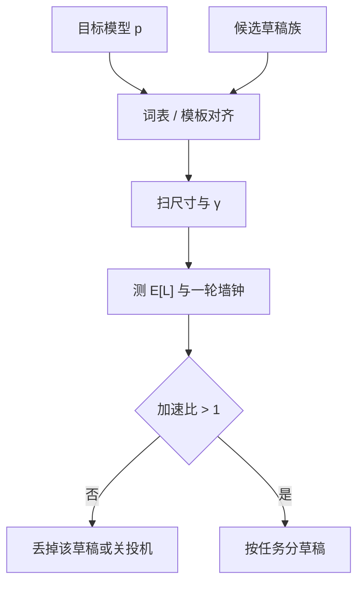

# 草稿模型选择

投机要快，草稿必须既足够便宜、又在目标分布的高频区域足够像；选错尺寸或词表，加速比会先变成减速比。

<footer>—— 对照 Leviathan et al., ICML 2023 中的近似模型角色，以及 Chen et al., 2023 用小模型给 70B 级目标做草稿</footer>

[投机解码](/llm/speculative-decoding) 把墙钟拆成「草稿串行 + 目标一次校验」。算法无损，不负责告诉你草稿是谁。Leviathan 等人把草稿写成任意近似分布 $q$，实验里用更小的 T5；Chen 等人用约 4B 的模型给 Chinchilla 70B 做草稿。生产上 $q$ 还可能是同族蒸馏、层数砍半、甚至目标自己的浅层头。本篇只写选择：要对齐什么、尺寸比怎么权衡、何时宁可不投机。

## 问题

一轮投机的时间是 $\gamma\,c_q + c_p(\gamma)$，前进的期望 token 数 $\mathbb{E}[L]$ 随 $q$ 与 $p$ 的逐位置总变差下降而变差。目标函数是最大化 $\mathbb{E}[L]/(\gamma c_q + c_p(\gamma))$，不是最大化接受率，也不是最小化 $c_q$。极小的草稿 $c_q$ 很低，但 $q$ 与 $p$ 从第二个 token 起就分道， $\mathbb{E}[L]$ 接近 1，还白付一次较胖的目标前向，比朴素 decode 更慢。极大的草稿 $\mathbb{E}[L]$ 好看，但 $c_q$ 接近 $c_p$，串行链没有变便宜。

还要对齐接口。$q$ 与 $p$ 必须在同一词表上给出条件分布，分词器、特殊符号、聊天模板要一致，否则似然比没有定义。同名「Llama-7B 给 Llama-70B 做草稿」若模板或词表版本不同，接受率会静默垮掉，看起来像算法实现错了。

### 像，是像条件分布，不是像参数量

两个模型参数差 10 倍仍可能在「下一个英文功能词」上高度重合，而在代码、少见语言、工具 JSON 上完全不像。接受率是任务相关的。用通用网页语言建模选出来的草稿，接到代码补全上可能立刻亏损。选择草稿等于选择**负载上的 $q\approx p$**，不是选择模型卡上的系列名。

无损保证的是：无论 $q$ 多差，长期样本仍来自 $p$。差草稿不会改质量，只会改速度。这常被误读成「草稿可以随便挂一个小模型」。随便挂的代价是减速，服务质量以延迟违约的形式出现，而不是以胡言的形式出现。

## 方法

先固定目标 $p$、硬件、采样参数，再扫草稿族。同族、同词表、同模板的较小档是默认起点：7B 给 70B、1B 给 8B，工程最少。Chen 等人的 4B→70B 说明跨一到两个数量级可以工作；再跨下去要看任务。蒸馏草稿专门拟合 $p$ 的输出分布，接受率通常高于同等大小的独立预训练小模型，但要付蒸馏数据与训练。独立小模型的优点是现成、可与目标解耦升级。

### 尺寸、$\gamma$ 与任务一起扫

$\gamma$ 不是越大越好。草稿逐步在自己的错误前缀上继续猜，边际接受率下降，而 $c_p(\gamma)$ 缓增。最优 $\gamma$ 随草稿变好而变大。扫描时应画「墙钟 vs $\gamma$」而不是只报最大接受率。温度升高、nucleus 变宽，最优 $\gamma$ 往往要下调。结构化解码（只许某些 token）时，草稿也应在同一约束下采样，否则大部分提议在校验前就该被规则杀掉——那是在付 $c_q$ 产废候选。

### 自草稿与浅层头

不想维护第二份权重时，可以用目标模型自己：提前退出的中间层、额外的小解码头、或稀疏激活的子网络。代价是草稿与目标争同一份权重带宽和 KV，调度更挤；$q$ 与 $p$ 的相关性可能更高。EAGLE、Medusa 一类后续工作把草稿接到目标的特征上，本篇不展开其结构，只指出选择轴变成「独立小模型 vs 寄生在 $p$ 上的头」。独立模型好扩缩、好替换；寄生头好部署、难单独升级。

服务批次里不要默认全员共用一个草稿。代码租户与聊天租户的 $q\approx p$ 区域不同；交互类还要看 [SLA](/llm/priority-sla)：TPOT 已贴线时，宁可关掉草稿，避免校验步把间隔顶破。低优先级离线作业可以用更大的 $\gamma$ 换吞吐。

## 机制

接受一个草稿 token 的概率，在温度 1 的完整词表上，期望上界与 $p,q$ 的逐点 $\min$ 有关：对齐越好，拒绝来得越晚。链式投机的 $\mathbb{E}[L]$ 是前缀全中的概率之和，因此对「前几个位置像不像」极度敏感。功能词、模板、重复的 JSON 键名贡献大量易中位置；突然出现的专名、数字、少见标识符是拒绝点。这解释了为何同族模型当草稿往往赢：它们在模板和高频词上共享偏见。也解释了为何只看平均接受率会漏掉坏负载——平均被聊天里的「的了是」拉高，代码里的标识符把 P95 打穿。

$c_q$ 必须用**同机、同批、同 KV 状态**来量。把草稿放另一张卡，通信可能吃掉尺寸优势；把草稿和目标挤在同一张卡，又可能抢带宽让 $c_p$ 变差。选择草稿因此是系统和模型的联合问题。Leviathan 文中 2–3 倍、Chen 文中 70B 级可加速，都建立在草稿确实明显更快的硬件画像上。

不要用参数量比当加速比。7B/70B 不是 10 倍墙钟差：decode 受 KV 带宽限制，7B 与 70B 的单步延迟差常小于参数比。要用测得的 $c_q/c_p$，再代入 $\mathbb{E}[L]$。

## 边界与工程取舍

词表不一致是硬否决。多语言模型对低资源语言接受率低，不要用英文压测签发全球加速 SLA。目标升级后草稿要重校准，即使仍无损——速度回归属于事故。投机与量化、MLA、分页 KV 叠在一起时，$c_p(\gamma)$ 的形状会变：较胖前向可能从带宽墙走进算力墙，原先最优的大 $\gamma$ 变亏。

没有合格草稿时，正确选择是不投机，而不是挂一个随机小模型「先跑起来」。树状验证可以用分支提高不确定位置的命中，但树更宽，$c_p$ 更胖，对草稿质量的依赖变成对「前几个分支是否覆盖 $p$ 的质量」的依赖，并不能让坏草稿变好。

评测集要含拒绝点密集的任务：代码、数学、工具调用、高温度聊天。只在低温度英文对话上选草稿，等于只在最不像需要投机的区域调参。

## 小结

- 草稿选择最大化每毫秒前进的 token，需同时看 $\mathbb{E}[L]$ 与 $c_q$、$c_p(\gamma)$。
- 词表、分词、模板必须与目标一致；同族较小档是默认起点，蒸馏通常更像。
- 极小或极大都可能亏损；$\gamma$ 与温度、任务一起扫。
- 接受率任务相关，要用坏负载而不是平均聊天做否决。
- 单步延迟比参数量更能预测 $c_q/c_p$；共址与分卡会改这个比。
- 没有加速比大于 1 的草稿时，应关闭投机。
- 出处：Leviathan et al., *Fast Inference from Transformers via Speculative Decoding*, ICML 2023；Chen et al., *Accelerating Large Language Model Decoding with Speculative Sampling*, 2023。树状多候选见 Miao 等 SpecInfer。
