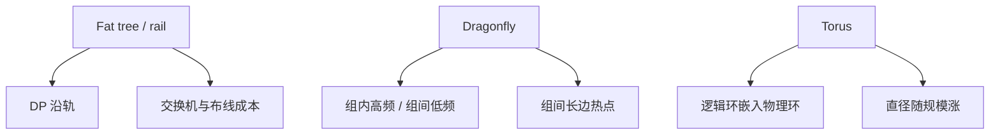

# Dragonfly 与 torus 对照

脂肪树用分层交换机堆端口；Dragonfly 用组间少量长边换直径；环面用规则网格换可预测的邻居。三种图都能跑 NCCL，局部性假设完全不同。

<footer>—— Dragonfly 见 Kim 等 SC 2008；环面见 Blue Gene / Cray 一类 HPC 系统；脂肪树对照 Clos 课</footer>

[上一课](/llm/rail-optimized-topology) 把 GPU 训练网默认画成轨优化脂肪树。本课补对照：HPC 里更常见的 **Dragonfly** 与 **torus（环面）** 仍会出现在部分训练集群与超算上。缺口不是再讲 Clos，而是：集合通信的环邻居、树根、All-to-All 置换，在这三种图上分别踩中什么边。后课拥塞控制会用到「热点在组间链路还是在网格边上」。

## 问题

脂肪树的优点是路径多样、扩展以加脊柱为主，缺点是跳数随层数涨、布线与交换机台数贵。Dragonfly 把端点收成组，组内高带宽，组间少量光学长边；直径小，长边贵且容易成为全局热点。环面（2D/3D torus）每节点度固定，只与网格邻居相连，扩展时直径涨，但布线规则、本地集体很便宜。

若把轨优化那套「同号 GPU 走同一平面」搬到 Dragonfly，组间长边没有「轨」这个编号；All-Reduce 的逻辑环若把逻辑邻居放在不同组，每一步都走长边，$\alpha$ 与争用一起爆。若把环面当成 NVLink 域，会高估非邻居对的带宽——网格上最远一对要多跳转发。问题是：**并行网格的局部性必须匹配图的局部性**，不能只匹配卡数。

Kim 等人提出 Dragonfly 是为了用光学长边降低直径，同时保持组内电互联便宜。后续 Cray / HPE 系统做过产品化。本课不填写未公开的某超算端口表，只对照结构。

## 方法

对照三件事：直径、最小割、集体算法该用哪张调度图。

脂肪树 / 轨优化：DP 沿轨，TP 在节点内，All-to-All 怕叶子上行。Dragonfly：尽量让高频集体（TP、节点内 EP）停在组内；跨组只走 DP 或低频。组间 All-to-All 会打满长边，需要自适应路由或把 EP 度缩进组。环面：让环 All-Reduce 的逻辑环嵌在物理环上（沿一维走），避免对角跳；树可以沿维归约，类似网格上的维序路由。

NCCL 会探到的是点对点可达与带宽档，不会自动「理解 Dragonfly 组」。进程编号若按机架扫描而不是按组扫描，逻辑环会随机切长边。编号纪律与轨优化同样重要，只是对齐的单位从「GPU 号」换成「组号」或「网格坐标」。

## 机制

集合通信的同步波在 Dragonfly 长边上表现为 incast：多个组同时把归约结果打向树根所在组。自适应路由可以把流打散，但会破坏有序与 infiniband 风格的无损假设，以太网实现更常见。环面上，维序路由无死锁，但集体若同时占用同一维的所有边，会出现与 rail 极化类似的「一维打满」。

[带宽模型](/llm/collective-bandwidth-model) 里的 $\beta$ 在这三种图上都不是全局常数：脂肪树是分层 $\beta$，Dragonfly 是组内/组间两档，环面是按跳数乘每跳 $\beta$。套公式必须先问当前进程组的最远一对在哪一档。

超节点 NVLink 域在三种柜外拓扑里都可以当「组内」用。柜外选 Dragonfly 还是脂肪树，是直径、成本与集体热点之间的设施决策，不是模型超参。软件能做的是别把 EP 跨组。

## 边界与工程取舍

不要把 Blue Gene 时代的三维环面延迟数字抄到现代 GPU 以太网环面上。不要在厂商只提供脂肪树参考架构时，自己在图纸上画 Dragonfly 却按轨优化绑定进程。不要假设 NCCL 的 Ring 在环面一定最优——逻辑环与物理环未嵌入时，Ring 是最差之一。

TPU 的 torus / mesh 是加速器片间互连，与数据中心环面不是同一层；TPU 课再写片上 mesh。本课只对照**主机侧 / 柜外**网络。

## 小结

- 脂肪树扩端口；Dragonfly 用组间长边换直径；环面用规则邻居换可预测局部性。
- 集体的逻辑邻居必须嵌进物理局部：组内或一维环，而不是随机编号。
- $\beta$ 分档：组内/组间、或按跳数；禁止用单一网卡标称套全集群。
- All-to-All 打长边与打叶子上行同样致命，减压手段是缩进程组。
- 出处：Kim 等 Dragonfly；HPC 环面系统实践；GPU 侧仍以 NCCL 拓扑探测为准。
