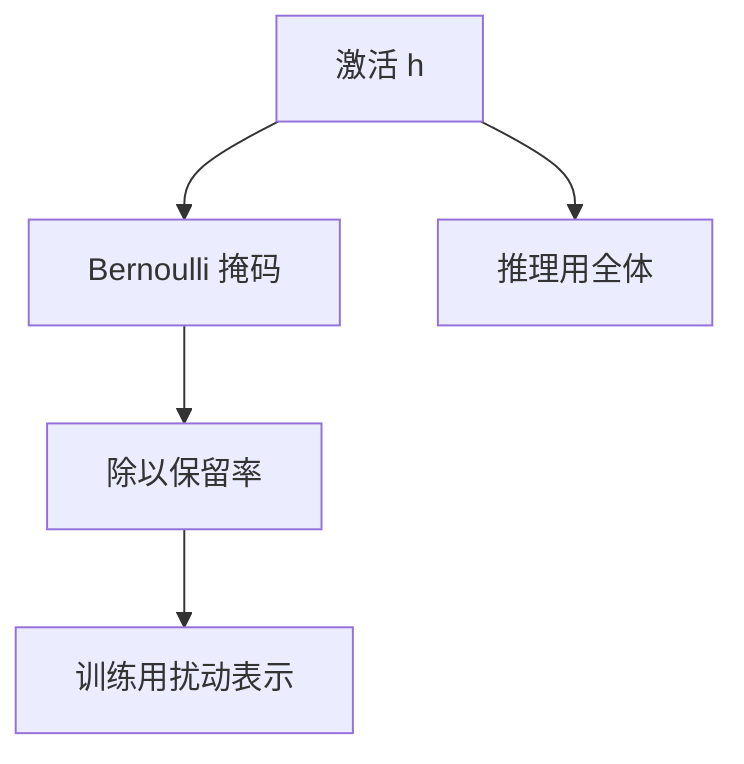

# Dropout 直觉

训练时随机关掉一部分单元，迫使表示不要把预测押在少数共适应的坐标上；推理时用全体，并按保留率缩放。

<footer>—— 据 Srivastava, Hinton, Krizhevsky, Sutskever &amp; Salakhutdinov, Dropout, JMLR 2014 整理</footer>

[LayerNorm 的动机](/llm/why-layernorm)管尺度。本课不重写 $\mu,\sigma$。缺口是：尺度稳定之后，网络仍可把全部容量用来记训练样本。权重衰减拉范数，早停切时间；Dropout 在前向上注入噪声，让单元不能互相绑定成死记硬背的电路。本课只讲直觉与训练 / 推理协议。注意力里的 dropout 是同一算子换位置，不在这里提前写成 SDPA。

## 问题

过拟合课给出 $\lambda$ 与早停。深度网里还有一种共适应：某些单元只有在另一些单元同时开时才有意义，像在记训练集里的特定搭配。验证集上搭配一变，电路失效。缺口是训练期的扰动：以概率 $p$ 把单元置零（保留率 $q=1-p$），其余放大 $1/q$，使期望与推理时全体开启一致。这不是数据增强的同义词——扰动发生在表示上，不发生在输入句子的改写上。

推理必须关掉随机性，否则同一句每次损失不同，也无法部署。inverted dropout 把缩放放在训练侧，推理直接全开。把缩放放在推理侧也可以，但容易忘。本课默认训练缩放。

### Dropout 不是注意力掩码

注意力掩码按位置把非法键的分数打成 $-\infty$，是确定性的结构约束。Dropout 按单元或按注意力权重随机置零，是正则。两者都可以表现为「乘零」，语义完全不同。不要在实现里用同一张 mask 张量既当因果掩码又当 dropout，除非明确是两项相乘。本课的对象是前馈单元与一般激活；序列位置上的 dropout 同理，仍不是因果性。

期望：若训练时 $\tilde h=m\odot h/q$，$\mathbb{E}[m_i]=q$，则 $\mathbb{E}[\tilde h]=h$。推理用 $h$。这是线性期望，对后续非线性只是近似；实践上够用。

## 方法

对激活 $h$，采样 Bernoulli 掩码 $m$，正向 $\tilde h=m\odot h/q$。反向梯度同样乘 $m/q$。嵌入、残差流、MLP 中间层都可以丢；过大的 $p$ 等于减少有效宽度。验证与测试：$p=0$。与 LayerNorm 共存时，通常在 LN 之后、子层内部丢，避免把噪声写进统计量之前——具体顺序随实现，写结构时要固定。

## 机制

Srivastava 等人把 Dropout 解释成指数多种子网络的近似集成：每次随机掩码定义一个瘦网络，参数共享。推理的全开近似几何平均。另一种读法是：噪声让特征必须冗余，单个坐标不能成为唯一线索。两种读法都不需要在本课写成定理。效果上，Dropout 往往抬高训练损失、降低验证缺口，与「更强的优化」方向相反——若训练损失降得很痛快而验证变差，加大 $p$ 是合法杠杆。

与权重衰减不同，Dropout 不直接拉 $\|\theta\|_2$，它改的是前向的有效电路。两者可叠加：衰减约束可达集合，Dropout 约束单次前向能用哪些单元。与小批量噪声也不同：批量噪声在样本维上抖梯度，Dropout 在表示维上抖激活。调 $p$ 时不要把它当成另一种 $\eta$。

小数据、大模型时 $p$ 更大；海量预训练时许多现代网络把 Dropout 降到很小甚至关掉，改用数据本身当正则。本课不把某一 $p$ 奉为常数。残差流上过大的 Dropout 会破坏恒等支路的尺度，实践中常只在 $f$ 内部丢。

## 边界

本课不进入词向量；下一课起是「序列与注意力之前」的第一课[词向量与分布假设](/llm/distributional-hypothesis)。后课默认：训练与推理的 Dropout 开关必须分开；它是正则，不是掩码语义。不要与量化金融或权重量化混淆——本课的「丢」是单元，不是权重比特。DropConnect 改丢权重边，本课不切换。

## 小结

- Dropout 训练时随机置零并缩放，打破共适应；推理全开。
- 它是表示噪声正则，不是注意力的因果掩码。
- 期望在线性上对齐训练与推理；非线性下只是近似。
- 预训练数据极大时可以减弱，小数据过拟合时再加大。
- 它改前向电路，不是另一种学习率，也不是权重衰减。
- 出处：Srivastava et al., JMLR 2014。
