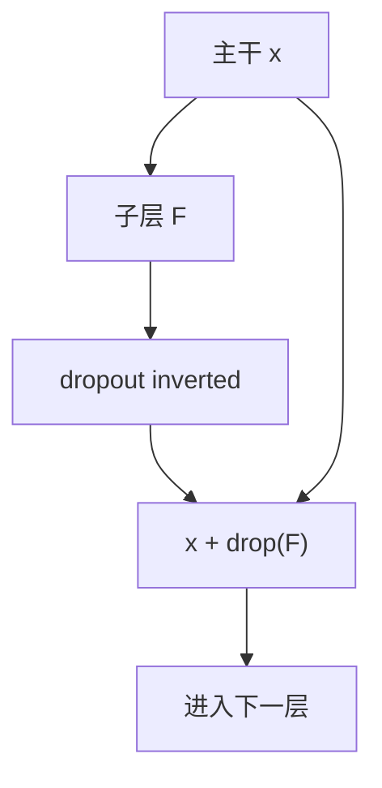

# Dropout 在 Transformer

训练时随机把一部分激活置零并rescale，等于在指数多种子网络上取平均；推理时用全图，权重已经见过噪声。

<footer>—— Srivastava et al., Dropout: A Simple Way to Prevent Neural Networks from Overfitting, JMLR 2014；位置见 Vaswani et al., NeurIPS 2017</footer>

[上一课](/llm/output-init-logit-scale)把第 0 step 的 logit 尺度钉住。缺口从「能不能走第一步」转到「走起来之后如何正则」。Transformer 原论文在残差分支、嵌入与注意力权重上用 dropout；当代大模型预训练常常把比率降到 0 或接近 0，因为数据已远大于参数、欠拟合才是主矛盾。本课写清 **dropout 在块里的位置与缩放**，不把「原论文用了 0.1」写成今天的默认。后课再拆注意力内部的 dropout 与 drop-path，它们不是同一条边。

## 问题

Srivastava 等人把 dropout 写成：以概率 $p$ 把单元置零，其余乘 $1/(1-p)$（inverted dropout），使期望与推理时全开一致。对全连接层，这近似于对权重施加噪声、并在子网络集合上 bagging。Transformer 的残差流不是多层感知机的逐层覆盖：子层输出要加回主干。若在主干上 dropout，等于随机把已经学到的身份通路掐断，深度一大，残差公路名存实亡。若只在 $F(x)$ 上 dropout，噪声进增量、公路仍在。Vaswani 等人的选择是后者，外加嵌入后、位置编码后的 dropout。

当代缺口是：**预训练还要不要它**。数据重复少、token 预算按 Chinchilla 给够时，残差 dropout 往往伤害损失；微调数据小、要防记死时，它又回来。本课不选边，只要求配方写明作用点与 $p$，以及推理必须关闭。

inverted dropout 把 $1/(1-p)$ 放在训练图里。若训练不 rescale、推理再乘 $(1-p)$，检查点与推理代码必须成对。混用两种约定，等于把残差增量整体缩放，深度缩放课刚钉住的 $1/\sqrt{L}$ 会被静默改写。

## 方法

标准解码器块（Pre-LN）里与 dropout 相关的边：

1. 注意力加权之后、输出投影之后：对 $F_{\mathrm{attn}}$ dropout，再加回主干。
2. FFN 输出之后：对 $F_{\mathrm{ffn}}$ dropout，再加回主干。
3. 嵌入 + 位置之后：对进入第一层的表示 dropout。

注意力**分数**上的 dropout（对 $A$ 的元素置零再重新归一化或直接置零）下一课单独写。不要把 (1) 和分数 dropout 用同一个 $p$ 糊成「attention dropout=0.1」。

$p$ 的数量级：原论文 0.1；GPT-2 仍保留；Llama 一类大规模预训练常用 0。微调 / 指令跟随若过拟合训练集，再从 0.0–0.1 扫，不要从预训练检查点的 $p$ 推断微调 $p$。Drop 与学习率耦合：同样 $\eta$，更大的 $p$ 等于更小的有效更新，扫 $\eta$ 时必须固定 $p$。

## 机制

残差上的 dropout 使每次前向的 $F$ 是随机子网络。反向只沿未置零的坐标走，被 drop 的坐标梯度为 0。期望上参数仍收到梯度，但方差增大，与大 batch 降噪对冲。这解释了为何大数据、大 batch 预训练不需要它：噪声已经来自数据，再 drop 只是少算 FLOPs 却加方差。

与权重衰减不同：衰减是确定性地把 $\|W\|$ 往 0 拉；dropout 是激活噪声。两者可叠，但诊断过拟合时应分开关。LN / RMSNorm 通常不 dropout 其 $\gamma,\beta$——对两个向量做 Bernoulli 没有 Srivastava 的平均解释，只会破坏归一化尺度。

推理关闭 dropout 之后，网络是训练时子网络的近似期望。若训练图忘了 rescale，推理会系统性比训练「更大」，表现为 CE 训练/验证差一截却不是泛化，而是尺度 bug。验收应在 $p>0$ 的短训上对比「train 模式 vs eval 模式」的 CE，差应来自噪声而不是整体平移。

## 边界

本课不管 DropConnect、LayerDrop（整层丢掉）和 drop-path；后两者改变深度，下一课。也不把 dropout 当数值稳定工具：它不抑制 logit 增长，有时因噪声让尖峰更密。确定性训练课会要求固定 RNG；这里只要求：同一公式、同一 $p$、同一 inverted 约定。

## 小结

- Transformer 的默认 dropout 打在残差增量 $F$ 与嵌入后，不打在 Pre-LN 主干公路上。
- inverted dropout 的 rescale 必须在训练图里；否则与深度缩放、推理尺度冲突。
- 大规模预训练常取 $p=0$；微调过拟合时再扫，不与预训练共用一个「论文默认 0.1」。
- 分数 dropout、drop-path 不是本课这条边。
- 出处：Srivastava et al., JMLR 2014；Vaswani et al., NeurIPS 2017。
