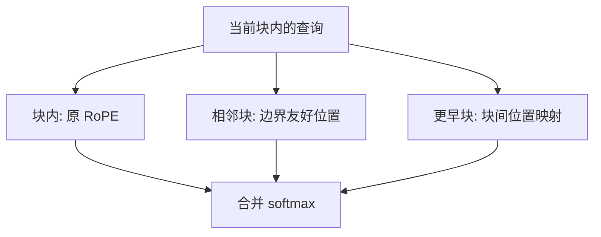

# Dual Chunk Attention

把长序列切成训练长度那么大的块：块内仍用原来的旋转，块间与相邻块另写一套位置，短窗模型不必微调也能做长前向。

<footer>—— An 等，Training-Free Long-Context Scaling of Large Language Models，2024（Qwen 团队；常与 YaRN 配套出现）</footer>

Qwen 系模型在把窗口从训练长度拉到 32k、128k 时，除了 [YaRN](/llm/yarn) 这类频率补丁，还用过一套按块拆注意力的推理方案：Dual Chunk Attention（DCA）。An 等人 2024 年的训练免费长上下文缩放论文把 DCA 写清楚——同一条序列上并存三种边：块内、块间、相邻块。它针对 RoPE 解码器「一次吃完整长文档」的设定，与流式汇点配方不是同一条产品线。本篇写块wise 位置，不把 YaRN 的分段频率再讲一遍；二者在 Qwen2 一类发布里经常一起出现，评测上应能拆开。

## 问题

Self-Extend 用一条全局阶梯把远 $\Delta$ 折回 $L$ 内：简单，但块的内部结构没有被特殊对待——一块 4k 的段落，其内部相对位置也可能被远端的 $g$ 污染，若实现把整段都算作「远处」。更关键的工程观察是：人类文档和代码天然有「当前段 + 更早的段」。若能让**当前块**的注意力与训练时长度为 $L$ 的前向同构，局部质量就有硬保证；块与块之间再单独设计一套仍落在支撑集内的位置关系。这比单一阶梯更接近「短窗训练分布的拼接」。

问题于是变成：如何切块、块内用哪套 $p$、查询如何看见更早的块、相邻块边界会不会因为两套坐标而对不齐。训练免费意味着不能学习块间压缩器，只能重写位置与掩码。块大小应接近原训练长度，而不是接近页面大小。切成 512 再谈 RoPE 支撑没有意义——块内已经不是训练时的窗口。DCA 的「Dual」首先是块内/块间两套几何，相邻块是为边界补的第三套。

## 方法

### 按训练长度切块

令块长 $C\approx L$。序列分成 $M=\lceil n/C\rceil$ 块。对落在第 $i$ 块内的查询，注意力边分成三类。

**块内（intra-chunk）**：键与查询同块。位置使用块内偏移 $0,\ldots,C-1$（或原绝对位置减块起点），RoPE 与训练短窗一致。这是高质量局部注意力，也是 DCA 相对纯分组方案多保住的部分。

**块间（inter-chunk）**：键在更早的块 $j<i-1$。若仍用真实绝对 $\Delta$，必然 OOD。DCA 给这些键指派一套与块下标有关、但相对查询仍落在 $L$ 内的位置，使「很早的一块」在相位上像训练时见过的远距键，而不是随机角。同一早块内的内部结构，用该块自己的局部坐标保留一部分可分辨性，而不是把整块压成一个位置。

**相邻块（successive-chunk）**：键在 $i-1$。边界附近的指代、跨段句子、代码跨函数的局部依赖，最容易被「块间那套较粗的远距位置」伤害。相邻块单独给一套更接近块内的相对位置，让 $C$ 的整数倍处不要出现一条硬裂缝。

三类边的分数进入同一个 softmax，或按实现做成分段再合并；关键是位置编码按边类型切换，而不是训练三套 $W_q$。

$$
s(q,k)=\frac{q^\top R(\phi(q,k))\,k}{\sqrt{d}}
$$

其中 $\phi$ 依 $k$ 所在块相对 $q$ 的关系取 intra / inter / successive 三种映射。

### 训练免费，常与 YaRN 配套

DCA 本身不更新权重。Qwen 团队在把模型声明为长上下文时，往往再叠加 YaRN：频率与温度负责「相位尺度」，DCA 负责「超长序列上的分块几何」。配套不是数学上的必然——DCA 可以单独用于原 $L$ 检查点——而是工程上的叠加：续训预算给 YaRN，推理期再对更极端的 $n$ 启用分块。报告长度时应注明是否同时开了两者。

## 机制

### 三套边如何共用一个 softmax

块内同构是机制的第一支柱。训练时模型见到的最舒适的相对几何，被完整保留给当前 $C$ 个 token。生成或阅读的「当前段落」因此不付插值税。块间映射是第二支柱：它把 $M$ 个块的远距关系嵌入仍小于 $L$ 的位置集合，避免 RoPE 爆炸，同时让不同早块之间仍有可区分的块级坐标——这比「所有远处共享同一个饱和 $\Delta$」细。相邻块是裂缝修补：softmax 在块边界两侧若突然换坐标系，会出现训练从未见过的相位跳变，表现为段落接缝处重复或丢冠词一类的局部故障。

相对 Self-Extend：阶梯函数没有「当前块完整 $L$」的硬保证，除非把 $w$ 设成 $C$ 且不再对 $d<w$ 分组——那其实已经滑向 DCA 的块内特例，却仍缺少显式的块间坐标与相邻块通道。相对 LM-Infinite：DCA 默认仍看更早块的内容，不是 Λ 形丢掉中间。代价是计算仍随可见键数涨；若再对早块做稀疏，就离开了 An 等人的训练免费原方案，变成另一种系统。实现复杂度明显高于改一行 $\Delta'$。FlashAttention 要能按块传入不同位置 id，或拆成几次注意力再对 logits 做数值稳定的合并。合并时若先各自 softmax 再加权，和一次大 softmax 不等价，消融必须写清楚。

## 边界与工程取舍

DCA 不自动给出常数内存。KV 仍按 $n$ 增长，除非另做分页、量化或压缩。块长 $C$ 与 $L$ 错位（例如 $C=L/8$）会让块内几何也偏离训练窗口，局部优势消失。文档切块若切断代码块或表格，相邻块通道只能缓解，不能恢复被切断的标记对——预处理切在空白处仍值得做。

与 YaRN 同开时，顺序要固定：先决定频率缩放用的 $s$，再在缩放后的坐标里切 DCA 的块，或反过来，但不能一层用缩放位置、一层用原始绝对位置。Qwen 发布材料里把长窗口写成一项能力，内部却是补丁叠补丁；复现时应按组件打开消融，否则无法知道 128k NIAH 变绿是 YaRN 的功还是 DCA 的功。

ALiBi 模型没有可切换的 $\phi$ 旋转，DCA 不适用。已经原生按 128k 预训练的模型，再套 DCA 可能把本已正确的绝对 $\Delta$ 改坏，属于负优化。

评测上必须含跨块针：针在第 $j$ 块、问句在最后一块。只测最后一块内的任务，任何块内同构方案都会虚高。RULER 的多跳若跨越多个块，考的正是 inter-chunk 映射有没有把块级坐标弄乱。

## 小结

- Dual Chunk Attention 将序列按约等于训练长度的块切开，块内沿用原 RoPE。
- 块间使用仍落在支撑集内的位置映射，使更早块的内容可被看见且相位不 OOD。
- 相邻块单独处理，减轻块边界上的坐标系裂缝。
- 训练免费；在 Qwen 系长窗口产品中常与 YaRN 配套，但二者应分开消融。
- 不降低 KV 线性增长；块长应贴近 $L$，跨块检索必须进评测。
- 不要对已经按目标长度预训练的模型盲目再套一层分块位置。
- 出处：An 等，*Training-Free Long-Context Scaling of Large Language Models*，2024（Qwen 团队）；配套对照 Peng 等 YaRN（2023）及 Qwen2 技术报告中的长上下文设定。
