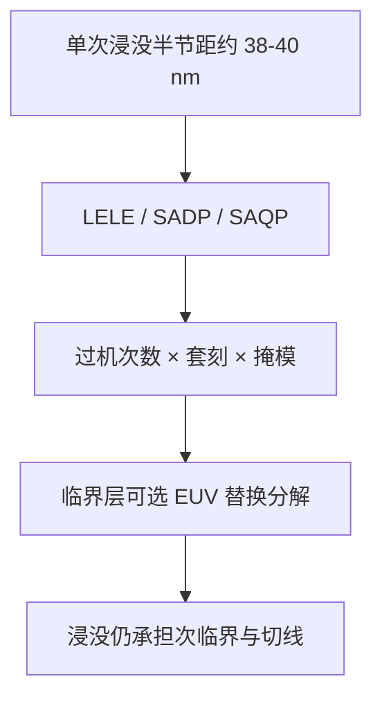

# 浸没 DUV + 多重曝光走到 7/5 nm 的代价

在 $\lambda=193\,\mathrm{nm}$、$\mathrm{NA}=1.35$ 已经用尽之后，继续缩小靠的是把一层拆成多次图形，并用双台浸没机把套刻与产能同时顶住。

<footer>—— 综合 Mack 的单次曝光极限与 ASML 对浸没 NXT、多重图形及 EUV 混跑的公开产品论述</footer>

商品名 7 nm、5 nm 不是曝光波长，也不是单次浸没的半节距。Mack 给出的浸没单次实用半节距约 38–40 nm；ASML 偶极公开分辨率同一量级。走进更密的鳍、金属与孔，193 nm 靠的是 [LELE](/llm/lele-multipattern)、[SADP/SAQP](/llm/sadp-saqp) 以及一层上多张切线掩模。EUV 量产之前，这条路是先进逻辑与存储的主路径；EUV 插入之后，它仍覆盖大量次临界层。本篇只谈代价结构：掩模与过机次数、套刻语义、周期时间、设计规则——不编造任何节点良率百分比。

## 问题

瑞利公式在单次曝光下封顶。$R=k_1\times 193/1.35$ 在 $k_1=0.25$ 时约 36 nm 半节距。7/5 nm 级的鳍节距、金属节距可以明显小于这一单次极限，因此必须节距劈裂或多次分解。每一层临界图形从「一次光刻」变成一条工艺子流程：多次涂胶、多次扫描、多次刻蚀或薄膜。晶圆厂的光刻区从「每层一台次」变成「每层一个小流水线」。问题是这条流水线在成本与风险上换来了什么、在哪里被 EUV 单次曝光替换更划算。

代价不是单一发票。资本是浸没机与刻蚀/薄膜机的数量；运营是轨道化学、掩模张数、计量与返工；设计是一维布局、可染色性与切线栅格；风险是套刻与缺陷机会随步骤数上升。缺任何一项，都会把「DUV 也能做 7 nm」说成免费。

### 商品节点与半节距必须拆开

节点名是密度与标准单元高度的市场语言。同一「7 nm」下，不同厂的金属节距、鳍节距、是否用 EUV，都不相同。讨论光刻代价时应以层类型计：某层金属是 SAQP 还是 LELE 还是 EUV，过机次数差好几倍。把「7 nm 用了浸没」写成整颗芯片只过一次 193 nm，是把后道植入层与临界鳍层混为一谈。

本篇不引用、不编造 7 nm 或 5 nm 的晶圆良率、探针良率或任何百分比成品率。那些数字属于各厂工艺包与财报口径，不能从 $k_1$ 或掩模张数推出。

## 方法

成本账按层累加。对 SADP 鳍：mandrel 浸没光刻 + spacer 模块 + 切线光刻（可能不止一张）+ 转印。对 LELE 金属：两次完整 litho–etch，两次扫描机，两次硬掩模刻蚀，套刻计量加密。对孔层：可能 LELELE。ASML 把 NXT 浸没的高 wph（公开故事中领先平台到 295 wph 量级）与紧 overlay（产品页上 DUV–EUV cross-matching 2.5 nm 量级等）写成多重图形能走下去的设备前提：[双工件台](/llm/twinscan-dual-stage) 让密网格测量不直接打死产能，但同一层仍要过机多次，总机时仍近似相乘。

EUV 插入的经济逻辑是：一张 EUV 掩模替换两张或三张 DUV 分解掩模，并去掉同层 LELE 套刻。ASML 公开产品叙事把浸没机定位为多重图形与次临界层的工作马，把 NXE 定位为临界层。混跑要求 cross-matching，而不是停掉 NXT。7/5 nm 世代常见的是「临界层开始用 EUV，其余仍浸没多重」或「早期 7 nm 全 DUV 多重、后续加 EUV」，具体组合因厂而异，本篇不点名某厂某年的良率。

### 掩模张数与计算光刻

每多一次分解，OPC/SMO 多跑一套，掩模写制与检验多一套。低 $k_1$ 的 MEF 高，掩模 CD 更贵。切线掩模张数随标准单元设计变。这是循环时间里「等掩模」与「改一版要改多张」的来源。ILT 与曲线掩模能救单次窗，救不了 LELE 的第二次过机。代价在掩模厂与晶圆厂同时出现。

## 机制

时间：片在光刻轨道与扫描机上的停留按曝光次数上升；中间刻蚀与薄膜插入使周期变成「天」而不是「班次内一层」。热与应力在多次工艺后累积，产品上套刻变差，需要更多对准采样与校正——双台为此付钱。缺陷：每一步有独立的粒子与残胶机会，缺陷密度不是简单相加，但步骤数上升时机会增加。这与良率的定量关系本篇故意不写公式，避免伪精度。

设计规则：一维鳍 + 切线、金属可染色性、禁止某些拐角，都是把设计空间卖给光刻可制造性。标准单元高度和布线轨道数部分由多重图形拓扑锁定。EUV 放宽二维，是在买回设计自由度，而不只是买分辨率。

wph 是单次过机的设备规格。一层 LELE 的有效层产能大约是 wph 除以过机次数再扣除轨道与刻蚀节拍。用 295 wph 去除以「7 nm 产能」而不除次数，会得到虚假的乐观。

### 何时多重图形比换波长贵

157 nm 被放弃后，工业选择了浸没 + RET + 多重图形，而不是下一档透射波长。代价在 20 nm 以后显著变陡：分解次数从双重走向三重、四重，套刻从层间走向同层相邻。EUV 13.5 nm 把单次 $k_1$ 预算重新拉开，临界层开始值得换栈。浸没并没有在 7/5 nm 「失败」；它把非临界层与尚未迁 EUV 的层继续印下去，并用多重图形补分辨率。代价是步骤与约束，不是水的折射率不够。

## 边界与工程取舍

不要把「DUV 走到 7/5 nm」理解成没有 EUV 也能无限走。单次极限是硬的；再往下不是不能再 SAQP，而是切线、通孔、二维金属与周期时间一起爆炸。也不要把 EUV 理解成关掉所有浸没机：ASML 公开写过，先进芯片上百层里只有少数临界层用最先进工具，其余要靠成熟波长的速度。NXT 干式超过 300 wph 的公开表述，针对的是次临界层价值在速度。

本篇可引用的数字限于：$\mathrm{NA}=1.35$、单次半节距约 38–40 nm、$k_1$ 下限 0.25、ASML 公开的 wph 与 overlay 规格（钉机型）。不可引用的是任何工艺节点良率、每片成本美元、或「多重图形使良率下降 xx%」。那些需要晶圆厂数据，Mack 与 ASML 公开材料都不提供成可抄的宇宙常数。

若需要比较 EUV 与 DUV 多重的片成本，应使用当时 ASML 或晶圆厂公开的层数替换案例，并声明年份与层类型。没有公开来源就不要编一列「7 nm 成本表」。

## 小结

- 7/5 nm 商品节点的密图形超出浸没单次半节距，靠 LELE 与 SADP/SAQP 继续用 193 nm。
- 代价是过机次数、掩模张数、同层套刻、周期时间与更严的设计规则，而不是再加水提高 NA。
- 双台浸没提高单次 wph 与测量密度，不把多次过机合成一次。
- EUV 替换的是部分临界分解层；浸没仍大量服务次临界层。
- 节点名 ≠ 波长 ≠ 单次半节距。
- 不编造、不转述无来源的节点良率或百分比成品率。
- 出处：Mack, *Fundamental Principles of Optical Lithography* 及单次极限讲义；ASML TWINSCAN/NXT 公开故事与产品页。
