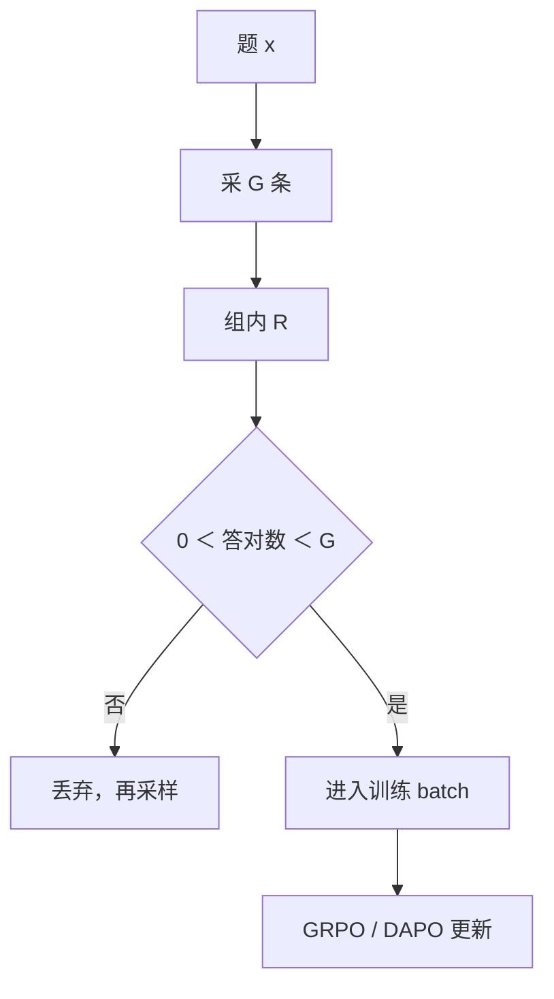

# 动态采样

全对或全错的组没有相对梯度；滤掉它们、过采样直到 batch 有信号，是目标定义的一部分，不是可选技巧。

<footer>—— Yu 等 DAPO 的 Dynamic Sampling；约束写在目标的 s.t. 里</footer>

[上一课](/llm/overlong-filtering)处理截断标签。即使长度健康，[GRPO](/llm/grpo) 仍会在准确率为 0 或 1 的题上得到零优势。缺口是：**有效 batch 随训练变瘦，更新浪费在无信号组上。** DAPO 的动态采样要求 $0\lt |\{o_i:\text{答对}\}|\lt G$，buffer 未满就继续采。本课写这一约束。消融上它把分数从 42 推到 50，是四件套里最大的一块。

## 问题

组内标准化在 $\mathrm{std}=0$ 时要么 NaN，要么 $\hat A=0$。训练后期易题全对、难题全错，两种组变多。继续更新等于空转，还可能被数值噪声推动。静态题库 + 固定 $G$ 无法保证每步都有相对信号。动态采样改变的是**进入梯度的题分布**：变难、变「当前策略仍会分叉」的题。

这不是普通的难度课程（后课）。课程按预设难度排序；动态采样按**当前通过率**过滤，同一题会在策略变好后从有信号变成全对再被滤掉。

### 墙钟直觉经常是反的

多滤几条似乎更贵。DAPO 原文图显示总时间可以下降：少做无效更新，收敛更快。但题库整体过难、通过率长期接近 0 时，会一直采不到满 batch，墙钟爆炸。必须有超时与回退（降低难度、升温、暂时允许部分零梯度）。

$G=1$ 时相对优势未定义，动态采样救不了，应改 PPO 或 REINFORCE++。

## 方法

对每个 prompt 采 $G$ 条、算 $R$。若全 0 或全 1，丢弃该 prompt，从队列再取。凑满训练 batch 再更新。过采样上限要设：同一 prompt 不要无限重采。统计：丢弃率、为满 batch 额外生成的倍数、各难度的存活率。奖励必须是可比较的对错；高噪声 RM 上「全对」没有意义，动态采样会滤掉的是「分数碰巧相同」，可能删掉有用的序信息。

与熵正则正交：有熵仍可能全对（换词同对）。动态采样看的是奖励方差，不是 token 熵。

## 机制

过滤把梯度集中在决策边界附近的题，类似主动学习。策略被推着去啃「刚刚会一点」的题，通过率曲线更陡。副作用：过易与过难题在更新里消失，评测若含这两端，会表现为「训练指标很好、评测两端差」。应保留一份不过滤的评测集。

约束写进目标，复现时关掉动态采样就不是 DAPO。社区 fork 常关它，分数不要写成官方 50。

## 边界与工程取舍

偏好 RM、连续分数很少出现精确全同，动态采样几乎不触发，本课主要服务 [可验证奖励](/llm/verifiable-reward)。代码沙箱贵时，丢弃组的成本更高，要先用便宜的静态过滤（太易太难题移出题库）再动态采。下一课无 KL：动态采样提供的边界题，正是策略需要离开 SFT 的地方。

## 小结

- 全 0 / 全 1 组无相对梯度；动态采样过采样直到组内有分叉。
- 它按当前通过率过滤，不同于预设难度课程。
- 题库过难会采不满 batch；必须有超时回退。
- 主场是可验证 0/1；高噪声 RM 上慎用。
- 出处：Yu 等 DAPO Dynamic Sampling。
