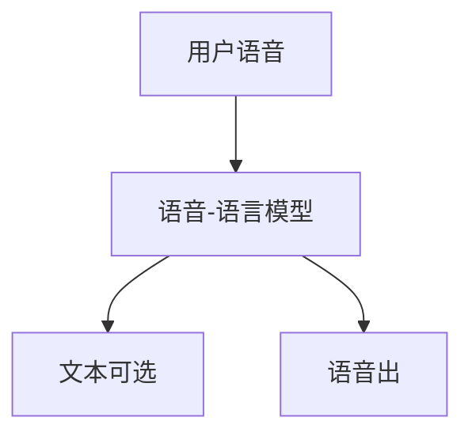

# 端到端语音对话

ASR 与 TTS 把对话钉在转写上。韵律、重叠、笑声过不了文字，延迟却过了三跳。

<footer>—— 对照 SpeechGPT、GPT-4o 语音、Qwen2-Audio 等语音进 / 语音出系统；双工细节见 [Moshi](/llm/full-duplex-speech)</footer>

[上一课](/llm/full-duplex-speech)给出同时听说的栈。缺口是系统切法：要不要以文本为必经接口。级联（ASR–LLM–TTS）可复用文本 LLM 与 [VALL-E](/llm/valle-tts) 式合成；端到端把声学 token 直接送进同一骨干。后课音乐默认：另一条长程音频生成，目标不是对话轮次。

## 问题

级联的好处是文本可审核、可接工具。坏处是：识别错误不可逆、韵律在转写里消失、三模型延迟。端到端把用户 codec 当视觉前缀的音频版——连续或离散声学 token 进 LLM，输出可以是文本、声学码或两者。Qwen2-Audio 等强调语音理解；GPT-4o 类产品强调语音出也走同一模型。Mini-Omni / LLaMA-Omni 探索冻结文本 LLM、加语音头。

与 [LLaVA 投影器](/llm/llava-projector) 同构：浅投影把编码器特征送进词槽，只是编码器从 [ViT](/llm/vit-as-encoder) 换成音频编码器。

没有文本中间层时，安全与工具调用要另接：或并行出文本流（Moshi 内心独白），或对声学做事后 ASR。完全无文本不可审计。

## 方法

选接口：级联、语音-in 文本-out、真语音-in 语音-out。训练混合 ASR、口语指令、语音回答。评测：内容 WER/任务成功率、韵律与打断、延迟分位数。不要只用文本 MMLU 冒充语音对话能力。

## 机制

端到端让韵律条件直达生成，不必从文字恢复。代价是语言能力受语音数据覆盖限制：罕见实体仍常靠内部文本流。因此许多「端到端」实际是多流，而不是消灭文字。

## 边界

对话语音的时长与结构不同于歌曲。下一课用 codec AR 做音乐。

## 小结

- 端到端语音对话去掉必经 ASR/TTS，换延迟与韵律。
- 可审计性通常还要并行文本流。
- 投影音频编码器进 LLM 与 LLaVA 浅桥同构。
- 出处：SpeechGPT；Qwen2-Audio；Moshi；产品侧 GPT-4o 语音。
