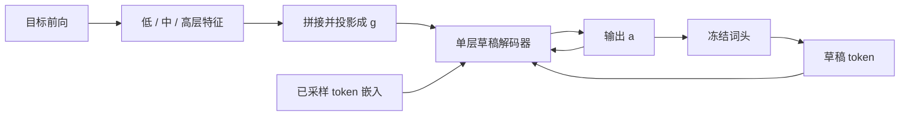

# EAGLE-3

特征预测是额外约束：数据加多了，第一步 token 接受率会涨，第二步却因为预测特征偏离训练集而塌掉；训练时把多步草稿测一遍，才能放开直接预测 token。

<footer>—— Li, Wei, Zhang, Zhang, EAGLE-3: Scaling up Inference Acceleration of Large Language Models via Training-Time Test, NeurIPS 2025</footer>

[EAGLE](/llm/eagle) 在目标模型倒二层特征上做自回归外推，再用冻结词头变成草稿，EAGLE-2 按置信度长动态树。这条路接受率已经高，但 Li、Wei、Zhang、Zhang 观察到：**把草稿训练数据从 ShareGPT 量级往上堆，加速比几乎不涨。** 他们把瓶颈写成特征预测约束：损失里既有 $l_{\mathrm{fea}}$ 又有 $l_{\mathrm{token}}$，草稿被按在「下一特征必须像目标倒二层」上，表达力不够吃数据。EAGLE-3 丢掉特征拟合，改为直接预测 token，并用 **training-time test** 在训练里模拟多步推理输入；输入也不再只用顶层特征，而是融合低、中、高三层。论文报告相对 EAGLE-2 约 1.4× 的延迟加速，峰值加速比约 6.5×；在 SGLang、batch 64 时吞吐约 1.38×。验证仍走拒绝采样，声明无损。本篇写 3 相对 1/2 改了什么，不把 DeepSeek 预训练 [MTP](/llm/mtp) 说成 EAGLE-3。

## 问题

投机解码用便宜草稿猜若干 token，目标模型一次并行校验。[投机解码原理](/llm/speculative-decoding) 保证分布；加速取决于接受长度。EAGLE 用目标模型自己的顶层特征当条件，草稿只需学「特征怎么走一步」，比独立小模型容易。标题里的 feature uncertainty 用错开的 token 嵌入解开。

数据缩放在目标模型上成立：Llama 7B/8B 从 1T 到 15T，架构几乎不动，能力涨。把同一逻辑搬到 EAGLE，作者看到的是平坦曲线。拆开看：去掉 $l_{\mathrm{fea}}$ 之后，**第一步**草稿的 $0$-$\alpha$ 随数据明显上升；但第一步的输出 $\hat a_{t+1}$ 不再贴近真值特征 $f_{t+1}$，第二步的输入分布相对训练偏移，**$1$-$\alpha$ 崩掉**。特征损失本来是在「只训一步」时给多步能力的拐杖；拿掉拐杖却不改训练过程，多步链就断。

### 顶层特征只够预测下一个词

词头若满秩，倒二层与下一 token 的 logits 一一对应，顶层特征是「下一词」的充分统计，不是「下下词」的。EAGLE 与 Medusa 都靠这层，远位置等于在下一词语境里猜更远的词。HASS 仍做特征预测，用训练时模拟来缓解误差累积，输入仍必须是顶层。EAGLE-3 的主张是：一旦不再回归特征，输入就可以换成任意层的融合——浅层位置、中层句法、顶层词表前表征可以一起进草稿。

EAGLE-3 与 EAGLE-2 的动态树兼容，改的是草稿怎么训、吃什么特征，不是另做一套验证。报加速必须带温度、任务与是否树形草稿；不要把 Vicuna-13B、temperature 0 的峰值抄成所有模型的常数。

## 方法

推理仍是草稿–验证交替。Prefill 或上一轮验证时，目标模型前向留下低、中、高层特征 $l,m,h$，拼接后经全连接压回隐空间宽度 $k$，得到融合特征 $g$。草稿是**一层**解码器：把 $g$ 与**已采样 token 的嵌入**再拼、再投影，输出无约束向量 $a$，过目标词头得到草稿分布。第一步还能复用目标算好的 $g$；第二步起，尚未被目标校验的位置没有 $g$，用上一步的 $a$ 顶替，并拼上新采样 token 的嵌入。这与 EAGLE「特征序列 + 错开 token」同构，只是序列里混进了草稿自己的 $a$。

### Training-time test：训练里走第二、第三步

只在真值特征上训一步，推理却要把 $a$ 喂回去，分布必然错位。EAGLE-3 在训练时对同一截数据做原生一步，再把模型自己的预测当后续步的输入，注意力掩码改成树状依赖：第一步是标准下三角；后续步里，草稿 token 作为 query 时，对原始前缀用点积取对应位置，草稿之间按树边可见。HASS 也改掩码，但动机是减轻特征误差累积，仍保留 $l_{\mathrm{fea}}$。EAGLE-3 的动机是去掉约束、放开输入；去掉 $l_{\mathrm{fea}}$ 之后，作者观察到草稿训练数据量与加速比之间出现原先没有的缩放曲线。

实验覆盖 Vicuna-13B、Llama-3.1-Instruct 8B、Llama-3.3-Instruct 70B、DeepSeek-R1-Distill-Llama 8B；任务为 MT-bench、HumanEval、GSM8K、Alpaca、CNN/Daily Mail，同一套草稿权重不按任务微调。Temperature 0 时，Vicuna-13B 上 EAGLE-3 平均加速约 5.51×、平均接受长度 $\tau\approx 6.62$，对照 EAGLE-2 约 4.22× / 4.83；HumanEval 上该档可到约 6.47×。Llama-3.1 8B 平均约 4.44× 对 EAGLE-2 的 3.23×。405B / 671B 因算力未测。草稿数据相对 EAGLE 大约 8×。SGLang 在 batch 64 给出约 40% 吞吐提升，用来反驳「大 batch 上投机一定伤吞吐」。

## 机制

特征回归把草稿的输出空间钉在目标倒二层流形上，数据再多也主要在流形上拟合残差。直接预测 token 把容量还给词表交叉熵；training-time test 则把「推理时输入是 $g$ 与 $a$ 的混合物」写进训练分布，于是第二步不再是域外。多层融合补偿「顶层只有下一词信息」：远草稿步需要的规划信号更多来自中间层。动态树仍用草稿 softmax 置信度当接受率代理，与 EAGLE-2 相同，前提是新草稿仍然校准——论文用接受长度与加速比一起报，而不是只报置信度。

「无损」继承 Leviathan / Chen 的拒绝采样，不继承贪心逐 token 相同。服务端若改 typical decoding、或树先验与训练不一致，要重新论证。Medusa 在非贪心下放宽接受，论文因此不在 temperature=1 与这类方法比。

### 和 EAGLE-1/2、HASS、MTP 的分工

EAGLE-1：特征自回归 + 静态树。EAGLE-2：同一草稿，动态树。EAGLE-3：换训练目标与输入特征，树沿用 2。HASS：仍回归特征。DeepSeek-V3 的 MTP 是预训练期顺序模块、稠密监督，推理可卸；EAGLE-3 是推理插件，目标权重冻结。Gloeckle 的独立多头是训练目标，见 [MTP 训练目标](/llm/multi-token-prediction-training)。不要画成「3 等于预训练 MTP」。

## 边界与工程取舍

草稿仍要为目标模型单独训，层数通常一层，还要接三层特征的挂钩；换 RMSNorm 位置或解绑词头，融合投影要重做。中间层索引是超参，论文用低/中/高三档，不是任意三层可互换。大 batch 下投机的收益来自接受长度与目标前向被拉长后的占用率，框架若不能把树验证融进连续批，数字回不到 SGLang 那张表。

推理模型（R1 蒸馏档）的长思维链改变草稿难度，论文在 GSM8K 上给出该档加速，不能直接当成「所有推理模型 5×」。训练-time test 的掩码实现容易写错成普通因果，表现为一步准、两步崩——这与当年去掉 $l_{\mathrm{fea}}$ 却不做 test 的失败模式同构。部署清单：冻结词头、三层挂钩、拒绝采样、EAGLE-2 树、与目标相同的采样器。

出处：Li et al., *EAGLE-3: Scaling up Inference Acceleration of Large Language Models via Training-Time Test*，NeurIPS 2025，arXiv:2503.01840。前作 EAGLE ICML 2024（arXiv:2401.15077）、EAGLE-2 EMNLP 2024（arXiv:2406.16858）。代码 https://github.com/SafeAILab/EAGLE。HASS 见 Zhang et al. 2024；投机采样见 Leviathan et al. ICML 2023。

## 小结

- EAGLE-3 取消特征回归，直接预测 token，并用 training-time test 对齐多步输入分布。
- 草稿输入改为低/中/高层融合，不再只用倒二层。
- 动态树沿用 EAGLE-2；加速比随草稿数据出现可观察的缩放。
- Vicuna-13B 等设置下相对 EAGLE-2 约 1.4×，峰值约 6.5×；SGLang batch 64 吞吐约 +40%。
- 与预训练 MTP、与仍回归特征的 HASS 不是同一方法。
- 出处：Li, Wei, Zhang, Zhang, NeurIPS 2025，arXiv:2503.01840。
