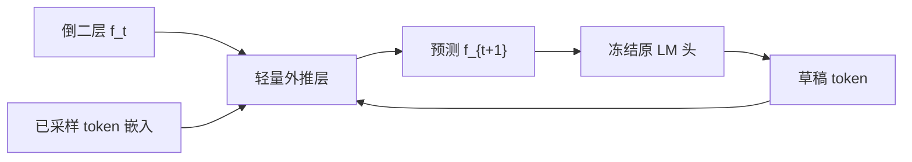

# EAGLE 原文

    
在倒二层特征上做自回归，比在 token 上做草稿更容易；但特征有歧义，必须把已经选定的 token 一并喂进去，才能把不确定性解开。

    <footer>—— Li et al., EAGLE: Speculative Sampling Requires Rethinking Feature Uncertainty, ICML 2024</footer>

Li、Wei、Zhang、Zhang 的 EAGLE（Extrapolation Algorithm for Greater Language-model Efficiency，arXiv:2401.15077，ICML 2024）走第三条投机草稿路：既不是独立小模型，也不是 Medusa 那种条件独立多头，而是在目标模型**进入 LM 头之前的倒二层特征**上做顺序外推。标题里的 feature uncertainty 是全文的轴：同一个 $f_t$ 对应的下一 token 一旦采样不同，后续特征轨迹分叉；只拿 $f_t$ 去预测 $f_{t+1}$，等于对多种未来求平均。解法是把已经采样的 token 嵌进去，保持因果链，再用**冻结的**原 LM 头把预测特征变成词。验证走树注意力与拒绝采样，声明保持原生成分布。概念对照见 [EAGLE / EAGLE-2](/llm/eagle)；本篇钉 ICML 原文，EAGLE-2 的动态树只作为后续边界提及，不把两篇的数字混在一张表里。

## 问题

标准投机采样在 token 层训一个小自回归模型。token 序列离散、高熵，小模型要对齐大模型词表并不容易。作者的第一点观察：倒二层特征比 token 更平滑、更好外推。若能用浅网络从 $f_t$ 预测 $f_{t+1}$，草稿就借用了目标已经学好的词表投影。

第二点观察立刻把这条路卡住。特征层自回归有内在歧义：位置 $t$ 的特征，下一词走「a」还是「always」，后续完全分叉。不把离散选择喂回网络，特征草稿的接受率会先于深度塌掉。这不是调学习率能抹掉的噪声，而是条件缺失。

### 静态树把接受率当成只跟深度有关

即便特征外推可用，验证仍要决定树长什么样。EAGLE 初版与多数方法一样用固定拓扑：默认越深越难接受，于是深度方向收、宽度在浅层铺开。这隐含「接受率只是位置的函数」。原文实验在 Vicuna、LLaMA2-Chat 等模型与对话、代码、数学、指令任务上报告：相对标准投机、PLD、Medusa、Lookahead 等，LLaMA2-Chat 70B 上延迟加速约 2.7×–3.5×、吞吐约翻倍量级。具体表格以论文为准，不要把某一设置的峰值抄成常数。

「倒二层」是进入 LM 头之前的那层表示，不是随便某一层中间激活。换一层当特征，校准与外推难度都要重测。Tied embedding、RMSNorm 位置一变，草稿输入就对不上。

## 方法

草稿模块是轻量自回归头（实现上通常一层 Transformer 量级），输入是当前特征与**时间上错开一拍的 token 嵌入**。预测 $f_{t+1}$ 时看 $f_t$ 与已选的 $x_{t+1}$（或论文图示中等价的移位拼接）。训练时这些 token 来自目标自己的轨迹。预测出的 $\hat f_{t+1}$ 经过冻结原 LM 头得到草稿词分布，再采样或取 top，循环若干步铺成链或树。验证由完整目标模型做一次带树掩码的前向，拒绝采样保证与原分布一致。

没有与目标匹配的轨迹时，得像 Medusa 那样用自生成数据。草稿仍要训，只是比完整小模型轻。树节点进入目标一次验证前向，节点预算受显存与步延迟约束。

### 用错开的 token 解开特征歧义

若只做 $f_t\mapsto f_{t+1}$，条件里没有 $x_{t+1}$，网络只能输出所有可能下一词对应特征的某种混合。把 token 序列相对特征前移一步，网络就知道「这一步走的是哪条离散路径」。这与 Medusa 头「同一 $h_t$、互不看见对方的离散选择」正好相反，也是 DeepSeek-V3 后来写 MTP 时明确对照的「保持完整因果链」原则——但 MTP 的主目的是训练期稠密监督，不是这篇的投机框架。

无损只在拒绝采样、温度与采样器与原模型一致时成立。服务端改 typical acceptance 或改写候选先验，分布保证就要重新论证，不能沿用 EAGLE 论文的无损声明。

## 机制

倒二层已经接近线性可分的词表空间，草稿不必重新学习语言，只需学习特征怎么随已选 token 走一步。不确定性来自离散采样，不来自特征几何本身；把 token 嵌回去，等于在特征轨迹上补了观测。验证阶段目标仍看完整上下文，草稿错了就在第一处分歧截断，并按拒绝采样补一个来自目标分布的 token。

冻结 LM 头是方法而不是省事。头已经把特征空间对齐到词表；若草稿自己再学一个词表投影，既贵又容易漂。EAGLE 把「对齐」从「再训一个语言模型」降级成「训一个浅的特征动力学」，这是加速比来自接受率而不是来自更小草稿前向的原因——草稿前向仍然存在，只是薄。

### 和 Medusa、Lookahead 的对照

Medusa：多头并行、条件独立、可冻骨干只训头。Lookahead：无草稿、Jacobi 迭代在目标自己身上挖 n-gram。EAGLE：顺序特征外推、条件依赖已选 token、借用冻结 LM 头。三套系统不是升级关系。原文评测包含这些对照；加速比随上下文类型变，代码、低熵续写通常更高，开放对话更低。报加速必须带任务名。

EAGLE-2（EMNLP 2024，arXiv:2406.16858）用校准过的草稿置信度近似接受率，按上下文生长动态树，相对 EAGLE-1 再快约 20%–40%。它依赖原文已经把草稿校准做好。本篇不把 2 的数字写进 1 的主结果。

## 边界与工程取舍

MoE 目标上，草稿是否走专家、验证时路由是否与草稿一致，都会影响接受率。原文评了 Mixtral 8x7B Instruct，部署时仍要把路由当成对齐的一部分。静态树可预先编译掩码；动态树是后续工作，连续批里不同请求的树形状可能不一致。工程折中常用置信度只调节深度上限或每层宽度。

特征必须与目标倒二层同形状、同归一化。换 RMSNorm 位置、换 tied embedding，就不再是论文里的 EAGLE。部署清单应写成三件套：冻结 LM 头、对齐倒二层、拒绝采样。缺一件，无损与接受率都不成立。

不要把 DeepSeek 的预训练 MTP 说成 EAGLE 的别名。MTP 可当投机草稿用，但训练目标、是否可丢模块、是否服务默认开启，都不是 ICML 这篇的声称。EAGLE-3 是更后的工作，数字不要和 2024 年两篇混表。

大 batch 下验证树同样会稀释加速，与 Medusa 同一条工程限制。原文主数字多来自偏在线、偏单请求或中小 batch 的设定，抄到高并发 decode 池要重测。

出处钉 Li 等 *EAGLE: Speculative Sampling Requires Rethinking Feature Uncertainty*，ICML 2024，arXiv:2401.15077。作者 Yuhui Li、Fangyun Wei、Chao Zhang、Hongyang Zhang。不要把社区里的「EAGLE 头」口头实现自动等同于这篇的错开 token 条件。

## 小结

- EAGLE 原文的轴是特征不确定性：倒二层外推必须条件于已选 token。
- 草稿借用冻结 LM 头；验证走树注意力与拒绝采样，声明无损。
- 相对独立小模型与 Medusa 独立头，接受率来自保持因果链。
- LLaMA2-Chat 70B 上报告约 2.7×–3.5× 延迟加速、吞吐约翻倍量级，随任务变。
- 动态树、MTP、EAGLE-3 都不是本篇主声称；服务端改接受规则即失去无损保证。
- 出处：Li et al., ICML 2024，arXiv:2401.15077。
