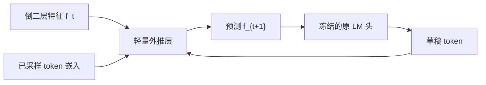

# EAGLE / EAGLE-2

    
在倒二层特征上做自回归，比在 token 上做草稿更容易；但特征有歧义，必须把「已经选定的 token」一并喂进去，才能把不确定性解开。

    <footer>—— Li et al., EAGLE: Speculative Sampling Requires Rethinking Feature Uncertainty, ICML 2024</footer>

[Medusa](/llm/medusa) 用几个条件独立的头从同一 $h_t$ 猜未来位置，远位置看不到近位置实际抽到的 token。[Lookahead](/llm/lookahead-decoding) 甚至不训草稿，靠 Jacobi 迭代在目标模型自己身上挖 n-gram。Li、Wei、Zhang、Zhang 的 EAGLE（Extrapolation Algorithm for Greater Language-model Efficiency）走第三条路：草稿发生在**倒二层特征**上，并且是**顺序**的——每向外推一步，都把已经采样的 token 嵌进去，保持因果链。EAGLE-2 再把静态草稿树换成按置信度生长的动态树。两者都声明用拒绝采样保持生成分布不变。本篇写特征不确定性、顺序外推和动态树，不把 DeepSeek 的预训练 [MTP](/llm/mtp) 说成 EAGLE 的别名。

## 问题

标准投机采样在 token 层训一个小自回归模型。token 序列是离散、高熵的，小模型要对齐大模型的词表分布并不容易。作者的第一点观察是：目标模型倒二层（进入 LM 头之前）的特征，比 token 更平滑、更好外推。若能用一个浅网络从 $f_t$ 预测 $f_{t+1}$，再用**冻结的**原 LM 头把特征变成词，草稿就借用了目标模型已经学好的词表投影。

第二点观察立刻把这条路卡住。特征层的自回归有内在歧义：同一个位置的特征，对应的下一 token 一旦采样不同（「I am」后面接「a」还是「always」），后续特征轨迹完全分叉。只拿 $f_t$ 去预测 $f_{t+1}$，等于要求网络在不知道采样结果的情况下平均掉两种未来。这就是论文标题里的 **feature uncertainty**。不解开它，特征草稿的接受率会先于深度塌掉。

### 静态树把接受率当成只跟深度有关

即便特征外推已经可用，验证阶段仍要决定树长什么样。EAGLE 初版与多数方法一样，用固定拓扑：默认越深的节点越难被接受，于是深度方向收、宽度在浅层铺开。这隐含「接受率只是位置的函数」。EAGLE-2 发现接受率还强烈依赖上下文：有的前缀上草稿很准，树应该往那条枝长；有的前缀上草稿已经慌了，再往下长只是给验证加节点。静态树会在容易的上下文里浪费浅层预算，在困难上下文里把节点浪费在注定被拒的深枝上。

EAGLE 的「倒二层」是目标模型进入 LM 头之前的那层表示，不是随便某一层的中间激活。换一层当特征，校准与外推难度都要重测，不能把论文里的头准确率平移过去。

## 方法

EAGLE 的草稿模块是一个轻量自回归头（实现上通常是一层 Transformer 量级），输入是当前特征与**时间上错开一拍的 token 嵌入**。把已经采样的 token 作为条件喂回去，网络就知道「这一步走的是哪条离散路径」，特征预测不再对多种 token 求平均。预测出的 $\hat f_{t+1}$ 经过冻结的原 LM 头得到草稿词分布，再采样（或取 top）得到下一 token，循环若干步，铺成链或树。验证仍由完整目标模型做一次带树掩码的前向，拒绝采样保证与原分布一致。

### 用错开的 token 解开特征歧义

若只做 $f_t\mapsto f_{t+1}$，条件里没有 $x_{t+1}$，网络只能输出「所有可能下一词对应特征」的某种混合。EAGLE 把 token 序列相对特征前移一步：预测 $f_{t+1}$ 时看 $f_t$ 与 $x_{t+1}$（或论文图示中等价的移位拼接）。训练时这些 token 来自目标模型自己的轨迹，所以草稿与目标对齐的是同一条因果链。这与 Medusa 头「同一 $h_t$、互不看见对方的离散选择」正好相反，也是 DeepSeek-V3 后来写 MTP 时明确对照的「保持完整因果链」原则。

### EAGLE-2：置信度当接受率的代理

EAGLE-2 的关键经验是：EAGLE 草稿的 softmax 置信度与真实接受率误差很小，草稿是校准过的。于是动态树可以在扩展时把节点预算花在「当前置信度最高、因而期望接受最高」的前沿上，而不是按固定深度衰减。上下文简单时树变深，上下文难时树变浅变宽或直接停，验证节点数跟上下文走。论文在 Vicuna、LLaMA2-Chat、LLaMA3-Instruct 与对话、代码、数学、指令等任务上报告：EAGLE-2 加速比约 3.05×–4.26×，比 EAGLE-1 再快约 20%–40%，并保持无损。EAGLE 原文对 LLaMA2-Chat 70B 给出约 2.7×–3.5× 的延迟加速、吞吐约翻倍。对照包括标准投机采样、PLD、Medusa、Lookahead、Hydra 等；具体表格以两篇论文为准，不要把某一设置下的峰值抄成「EAGLE 恒定 4 倍」。

## 机制

特征层外推之所以比 token 层小模型更准，是因为倒二层已经接近线性可分的词表空间，草稿不必重新学习「语言」，只需学习「特征怎么随已选 token 走一步」。不确定性来自离散采样，不来自特征几何本身；把 token 嵌回去，等于在特征 ODE 上补了观测。验证阶段目标模型仍看完整上下文，草稿错了就在第一处分歧截断，并按拒绝采样补一个来自目标分布的 token，因此无损。

动态树把 [接受率](/llm/spec-acceptance-rate) 从「事先假设的深度函数」变成「每步可观测的标量」。静态树的期望接受长度是校准集上的平均；动态树的期望接受长度是上下文条件期望。校准差的草稿不能这么用：置信度高但常被拒，树会往错枝猛长，验证更贵、加速更差。EAGLE-2 能成立，前提是 EAGLE-1 已经把草稿校准做好。

「无损」只在拒绝采样、温度与采样器与原模型一致时成立。若服务端改了 typical acceptance、或草稿树构造改写了候选先验，分布保证就要重新论证，不能沿用 EAGLE 论文的无损声明。

### 和 Medusa、MTP 的分工

Medusa：多头并行、条件独立、可冻骨干只训头。EAGLE：单条（或树上顺序的）特征外推、条件依赖已选 token、借用冻结 LM 头。DeepSeek-V3 的 MTP 在训练期用顺序模块预测额外 token、推理可丢，目标首先是稠密监督；报告写明保持因果链的原则类似 EAGLE，但主目的不是投机。不要把三套系统画成升级关系。EAGLE-3 是后续工作，本篇不展开，以免把 2024 年两篇的数字和后作混在一张表里。

## 边界与工程取舍

草稿仍要训，只是比完整小模型轻。没有与目标匹配的轨迹时，得像 Medusa 那样用自生成数据。树节点会进入目标一次验证前向，节点预算受显存与步延迟约束；动态树还要在 CPU/GPU 上做扩展决策，决策本身要足够便宜。MoE 目标模型上，草稿是否走专家、验证时专家路由是否与草稿一致，都会影响接受率——EAGLE 原文评了 Mixtral 8x7B Instruct，但部署时仍要把路由当成草稿对齐的一部分。

静态树实现简单、可预先编译掩码；动态树每步拓扑不同，注意力掩码要动态生成，连续批处理里不同请求的树形状还可能不一致。工程上常见折中是：用置信度只调节深度上限或每层宽度，而不是完全不规则的逐节点生长。加速比随上下文类型变：代码、低熵续写通常更高；开放对话更低。报加速必须带任务名，不能只报「平均 4 倍」。

特征要和目标的倒二层严格同形状、同归一化。换了 RMSNorm 位置、换了 tied embedding，草稿输入就对不上。部署清单里应把「冻结 LM 头、对齐倒二层、拒绝采样」写成三件套，缺一件就不再是论文里的 EAGLE。

## 小结

- EAGLE 在倒二层特征上做顺序外推，并用错开一拍的 token 解开特征歧义；冻结原 LM 头把特征变成草稿词。
- 验证走树注意力与拒绝采样，声明保持原生成分布。
- EAGLE-2 用校准过的草稿置信度近似接受率，按上下文生长动态树，加速比相对 EAGLE-1 再提高约 20%–40%。
- 与 Medusa 的独立头、Lookahead 的无草稿 Jacobi、DeepSeek MTP 的训练目标都不是同一对象。
- 动态树依赖校准；服务端改接受规则就会失去无损保证。
- 出处：Li et al., *EAGLE: Speculative Sampling Requires Rethinking Feature Uncertainty*，ICML 2024，arXiv:2401.15077；Li et al., *EAGLE-2: Faster Inference of Language Models with Dynamic Draft Trees*，EMNLP 2024，arXiv:2406.16858。
