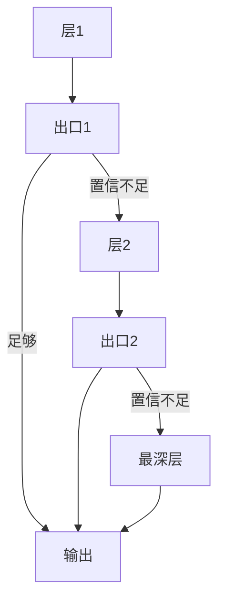

# 早退与自适应计算

简单例子不必走完全深；在中间层接出分类头，用置信度决定是否停止前向。

<footer>—— Xin et al., DeeBERT, ACL 2020；序列生成中的自适应见 Schuster et al., Confident Adaptive Language Modeling, 2022</footer>

[上一课](/llm/looped-transformer)用全局 $T$ 调计算，所有 token、所有样本同深。[Universal Transformer](/llm/universal-transformer-recurrence) 的 ACT 已经按位置停机，但绑在共享块上。本课把早退接到**普通不共享深层栈**：中间层挂出口，推理时按置信度退出。这是部署侧的自适应计算，不必把模型改成循环体。下一课 ALBERT 回到参数共享，不再谈按例停机。

## 问题

加深对难例有用，对易例浪费。语言模型里大量 token 是高频、局部可预测的，少数 token 需要全深。缺口是训练与推理一致的出口：中间表示必须已经能出词表或类别，且退出决策不能系统性地伤害尾部质量。

DeeBERT 对编码器分类在若干层接分类头，用熵或置信阈值早退。CALM 把类似想法接到自回归生成：每个 token 在中间层预测，置信则退出该 token 的剩余层。二者都要解决「出口头怎么训」和「阈值怎么定」。

早退切的是深度，不是序列长度，也不是 KV 是否共享。YOCO、CLA 省的是缓存；早退省的是这一次前向还要不要算后面的 FFN 与注意力。

## 方法

在层集 $\mathcal{L}_{\mathrm{exit}}$ 上接共享或独立的输出头。训练策略两种：所有出口都对真标签算损失（联合训练），或先训满深再冻骨干训出口。联合训练让浅层表示也对齐任务，早退才有东西可用；只训深层则浅出口是后贴的探针，阈值很难稳。

推理：若出口 $k$ 的 $\max p$ 或 $1-H(p)$ 超过阈值则停止，否则继续。阈值可按层设，使浅层更严、深层更松。生成式 CALM 还要处理 KV：早退的 token 若没算深层注意力，深层缓存缺条目，后续 token 读深层时对不齐——必须规定早退 token 仍把某一层的 KV 投影到深层，或禁止在需要满缓存的解码器上按 token 不同深。

### 与 ACT、loop 的关系

ACT 把停机学进共享块内部。早退把停机放在固定层之间的出口，实现简单，和现有检查点兼容。Loop 的 $T$ 是全局预算。三者都是自适应计算族，切的轴分别是共享迭代、层号、全局循环。

## 机制

浅层表示偏词汇与局部，深层偏长程与任务。联合损失迫使浅层也长出一个「够用就走」的决策面。置信校准往往不足：softmax 最大概率不能直接当正确率，阈值要在验证集按代价（延迟对准确）扫。过自信导致系统性早退错误，尤其是罕见格式与否定。

编码器分类没有 KV 对齐问题，早退最干净。自回归解码器的 KV 契约是主要工程边界，也是许多论文只在编码器或非自回归设置里报加速的原因。

投机解码也是「浅网提议、深网验证」，但是两套模型或一套加草稿头，不是同一前向里的中间出口。不要把早退写成投机。

## 边界

加速比等于平均退出层对 $L$ 的比，尾部难 token 仍跑满，延迟分位数改善小于均值。训练多出口会轻微拖累满深准确，这是税。阈值随领域漂，部署要按任务重扫。下一课不再用出口换计算，而用跨层共享换参数量——早退的头在共享层上会变成同一头的多次接入，语义不同。

## 小结

- 早退在固定深层栈的中间出口按置信停机，按例分配深度。
- 联合训练各出口才能让浅层表示可退出；只探针不够。
- 自回归 KV 对齐是解码器早退的硬边界；编码器分类更干净。
- 与 ACT、循环 $T$、投机解码分属不同机制。
- 出处：Xin et al., ACL 2020；Schuster et al., 2022。
